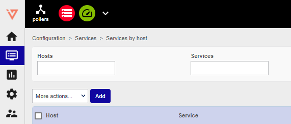
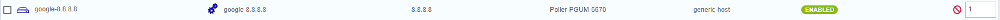
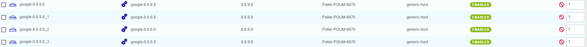
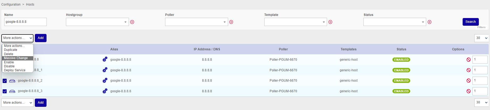
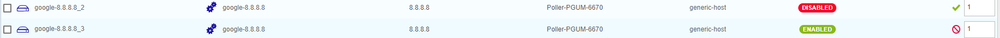

import Tabs from '@theme/Tabs';
import TabItem from '@theme/TabItem';

In the **Configuration** menu it is possible to perform certain “generic” actions on the various objects.

## Adding objects

To create a new object, click the **Add** button next to the **More actions** menu/above the list of objects.

## Duplicating objects

Duplicate an object to re-use its properties for the creation of a new
object. Example: You need to monitor 10 identical web servers:

1. Add the first web server with all the necessary properties.
2. Duplicate this host 9 times.
3. All you have to do now is to change the host names and the IP addresses of each duplication to adapt it to the 9 other web servers to be monitored.

Thanks to this method, it is no longer necessary to create each host individually.

For example, to duplicate a host:

1. Select the host that you want to duplicate.
2. In the **Options** column, enter the number of extra copies that you want to obtain:

    

3. In the **More actions** menu click on **Duplicate**:

    

## Massive Change

Massive change enable you to apply a change to multiple objects.

Example: All the servers previously created change SNMP communities. A massive change enables us to change this
community without it being necessary to change each sheet of each host individually.

To perform a massive change:

1. Select the objects that you want to change.
2. Click the **Massive change** icon above the list of objects: 
3. Confirm the changes.
4. Select the objects you want to change.
5. In the **More actions** menu, click on **Massive Change**.
6. The form for the type of object opens, with 2 options next to each field:

  * **Incremental**: signifies that the change will be added to the existing options
  * **Replacement**: signifies that the change will overwrite the existing options.

## Enabling/disabling objects

The enabling and disabling of objects allows you to take objects into account or not during configuration generation.
The main advantage is to be able to keep the configuration of an object without applying it.

To enable/disable an object:

1. Select the objects you want to change.
2. In the **More actions**  menu, click on **Enable/Disable**.

You can also use the following buttons at the end of the line:

*  **Enable**: 
* **Disable**: 

## Deleting objects

> Deleting an object is final. If you delete an object by accident, you will need to re-create it. In the same way,
> deleting an object automatically deletes all the objects linked to it and which cannot live without it. E.g.:
> Deleting a host results in all the services associated with this host being deleted too.

To delete an object:

1. Select the objects you want to delete.
2. In the **More actions** menu, click on **Delete**.
3. Confirm the action.