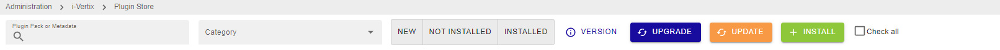

# Plugin Packs

## What is a Plugin Pack?

A Plugin Pack is a downloadable package containing a set of configuration templates that make it fast and easy to
monitor your IT infrastructure.

Applying a template from a Plugin Pack is the easiest way to monitor a host.

Plugin Packs consist of 2 elements, which are installed separately:

- A plugin that executes the monitoring commands from a poller. Plugins can be
  installed using the command line interface, or automatically.

- A pack that contains commands, host templates and service templates.
  Packs are installed via the i-Vertix interface. For each type of equipment,
  the templates determine which indicators will be
  monitored and set default warning and critical thresholds (these may be
  fine-tuned later on).

- Some packs also contain discovery modes.

## Prerequisites for i-Vertix Plugin Pack Manager

### Accessing your Plugin Packs

[Credentials](../../quick-start-guide/how-to-configure-central-and-poller/plugin-store-configuration.md) are required to
access the full Plugin Packs catalog.

Contact the i-Vertix support (support@i-vertix.com) to obtain your access.

---

### Connectors

Some Plugin Packs also require a Connector (e.g. AS400, VMWare) or an agent
(e.g. Windows NRPE). In that case, it is explained in the monitoring procedure for the Plugin Pack. The connectors are
included in the Plugin Packs license.

| Connector       | Description                                                                   |
|-----------------|-------------------------------------------------------------------------------|
| i-Vertix Client | NSClient++, packaged by i-Vertix, ready to use with embedded i-Vertix Plugins |
| VMWare          | Perl daemon using VMware SDK to monitor VMware platforms                      |
| AS400           | Java-based connector allowing you to execute checks on an AS400               |

## Installing a Plugin Pack

Installing a plugin pack is a 4-step process:

1. Accessing the Plugin Packs catalog.
2. Installing the pack.
3. Checking the monitoring procedure.
4. Installing the plugin.

### Installing the pack

You now have access to the Plugin Packs catalog, on page **Configuration > Plugin Packs**:

You can search the plugin pack by type a metadata on **Plugin Pack or Metadata** (in the first image **central**) or by
Category (in the second image **Operating System**)

1) 

2) 

To install a pack, hover over the icon with the mouse and click on the ``+``

You can also click on the **i** of thePlugin Pack to display more details and click on the ``+``

Once the pack is installed, it has a green outline and a green check mark.

| **Before installation**                                                      | **After installation**                                                             |
|------------------------------------------------------------------------------|------------------------------------------------------------------------------------|
|  |  |

### Managing dependencies

During installation, some objects in the pack may not be installed. These objects are often additional configuration
objects and are not required to deploy the configuration templates provided by the pack.

### Checking the monitoring procedure

Some Plugin Packs require extra configuration steps; such as the protocol tha the plugin pack need (Rest API, SNMP, and
so on).

---

## Updating/Upgrading Plugin Store

1) to update the Plugin Store click on **Administration >
   i-Vertix > Plugin Store**

If this orange image (on the left) appears on a Plugin Store it means that an update is available.

If this blue image (on the left) appears on a Plugin Store it means that an update is available.

In some case we can have both.

If you want to see what kind of implementations will be upgraded/updated you can clik on

and on the left side will appear this overview

After an update or an upgrade of the Plugin Store it's a good idea to deploy the configuration to all the
poller/s ([Deploy the configuration](../../monitoring-resources/monitoring-basics/config-deploy.md)).

---

## Re-Install a Plugin Pack

You can re-install a plugin pack (in case of some issue) by clicking the **RE-INSTALL** button.

:::warning
At the moment, the re-install resets **every** template contained in the plugin pack (also the generic-host and generic-service template for
example).

Any custom data or setting of every template which is part of this plugin pack will be removed.
:::

