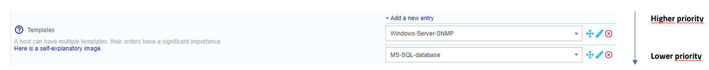

## Definition

A Template is a preset arrangement of object settings that can be employed for its configuration. The primary benefit is the ability to establish default values for specific objects, thereby expediting the creation of comparable objects.

A template can inherit properties from another template.

Templates from Plugin Packs make monitoring hosts easy, because they provide ready-to-use check [commands](../generic-object-actions/commands.md).

## Inheritance

A host or a host template can inherit from one or more host templates. This heritage may be:

  - associative (addition of multiple host templates)
  - parent-child type

### Parent-child type inheritance

This is a predefinition of settings at “n” levels. The object inherits from its Template which can itself inherit from its Template. If the child redefines a setting, this setting overwrites that defined in the higher level templates. Otherwise it is added to the settings.

### Associative type inheritance

This consists of adding together several templates within the same object in order to add together all the settings available. If a host inherits from several host templates and if the same setting is defined on several templates, the host templates situated above the other templates has priority in relation to its ancestors.

### Configuration

To add a host template:

Go into the **Configuration > Hosts > Templates** menu and click on **Add**

> Refer to the chapter covering configuration of
> [hosts](monitoring-host.md) to configure a template because the form
> is identical.

> By default, locked host templates are hidden. Check the "Locked elements" box
> to list all templates.