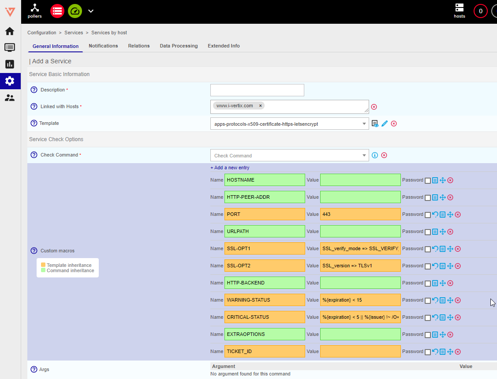

To create a service manually, go to **Configuration \> Services > Services by host** and then click **Add**.

## Configuration of the service

### General information tab

#### Service Basic Information

* **Description**: define the name of the service.
* **Linked with Hosts**: Host(s) to which the service is attached. We recommend that you link a service to only one host.
* **Template**: indicates the service template to which the service is linked.

#### Service Check Options

* **Check Command** indicates the command use to check the availability of the service.

* **Custom Macros**: add customized macros.

   - **macro name** and **macro value** allow to define the name and value of the macro. The **Password** box can be used to hide the value of the macro.

   - To reinitialize to the default value (defined in template) click on 

   - To view the description of the macro, click on 

   - To delete the macro, click on 

   - To change the order of the macros, click on 

* **Args** table defines the arguments given for the check command (the number of arguments varies according to the
  check command chosen).

#### Service Scheduling Options

* **Check Period** defined the time period during which the scheduler checks the status of the service.
* **Max Check Attempts** of the status field defined the number of checks to be carried out to confirm the status of the service. When the status is validated, the notification process is engaged
* **Normal Check Interval** is expressed in minutes. It defined the interval between checks when the service status is OK.
* **Retry Check Interval** is expressed in minutes. It defined the confirmation interval for the Not-OK service status
* **Active Checks Enabled** and **Passive Checks Enabled** enable / disable the type of check on the service.
* **Is Volatile** indicates if the service is volatile or not (normally only passive services are volatile).

### Notifications tab

* **Notification Enabled** allows to enable or disable the notifications for the object.
* If **Inherit only contacts/contact group from host** box is checked, then when generating the configuration, contact and/or host groups of contacts (or the following templates inheritance) will overwrite of the service or its service models. This function disables entering contacts and contact groups for this service.
* **Implied Contacts** indicates the contacts that will receive the notifications.
* In the **Implied Contact Groups** list all the contacts belonging to the contact groups defined will receive the notifications.
  
  If, on page **Administration > Parameters > IT Monitoring UI**, the **Vertical inheritance only** option is enabled, two extra checkboxes appear:

    * If the **Contact additive inheritance** box is checked, i-Vertix does not overwrite the configuration of the parent host template but adds the contacts in addition to the contacts defined in the parent template.
    * If the **Contact group additive inheritance** box is checked, i-Vertix does not overwrite the configuration of the parent host template but adds the contact groups in addition to the contact groups defined in the parent template.

* **Notification Interval** is expressed in minutes. It indicates the time between sending of notifications when the status is Not-OK. If the value is defined as 0 the scheduler sends a single notification per status change.
* **Notification Period** defines the [time period](../generic-object-actions/timeperiods.md) during which notifications will be sent. No notifications will be sent outside this time period.
* **Notification Type** define the statuses for which a notification will be sent.
* **First notification delay** time is expressed in minutes. It refers to the time delay to be respected before sending the first notification when a Not-OK status is validated.
* **Recovery notification delay** is the time that must pass before a recovery notification is sent (when the service goes back to an OK state).

### Relations tab

* **Servicegroups** allows to link the service to one or more service groups.
* **Service Trap Relation** allows to define the SNMP traps that will be able to change the behavior of the service.

### Data processing tab

* If the **Obsess over service** is enabled, the monitoring feedback command of the host will be enabled.
* **Check freshness** allows to enable or disable the check on the freshness of the result.
* **Freshness threshold** is expressed in seconds. If during this period no request for a change in the status of the service (passive command) is received the check command is executed.
* **Flap Detection Enabled** allows to enable or disable the detection of disruption in the statuses (status value changing too often on a given period).
* **Low flap threshold** and **High flap threshold** define the high and low thresholds for the detection of disruption in percentage of status change.
* **Performance data processing** allows to enable or disable performance data processing (and hence the generation of performance graphics). This option is not necessary when Broker is use.
* **Retain status information** and **Retention non status information** indicate if the information concerning or not concerning the status is saved after every time the check command is repeated.
* **Stalking Options** defined the options to be recorded if retention is enabled.
* **Event handler enabled** allows us to enable or disable the events manager.
* **Event handler** defined the command to be executed if the event manager is enabled.
* **Args** defined the arguments of the events handler command.

### Extended Info tab

* **Graph template**: Defines the graphics model to be use to present the performance data linked to the service.
* **Categories**: Defines the category(s) to which the service belongs.

#### Monitoring engine

* **URL** defines a URL that can be used to give more information on the service.
* **Note** permits us to add optional notes concerning the service.
* **Action URL** defines a URL normally used for giving information on actions on the service (maintenance, etc.).
* **Icon** indicates the icon use for the service.
* **Alt icon** is the text use if the icon cannot be Displays.
* **Service severity** indicates the criticality level of the service.
* **Geographic coordinates** defines geographical coordinates used by the IT Monitoring MAP module to position the resource on a map. Define "Latitude,Longitude", for example for Amsterdam coordinates set "52.37,4.89".

#### Additional information

* **Status**  allows to enable or disable the service.
* **Comments** can be used to add a comment or a note.

## Detachment of a service

When a service is connected to multiple hosts, it remains the same for each of them, making it impossible to alter the service of an individual host to modify a specific attribute. Consequently, this is why it becomes feasible to transform this service, which is linked to multiple hosts, into a distinct service for each host:

1. In the list of services, select the service linked to multiple hosts (this service is usually highlighted in orange)
2. In the **More actions...** menu click on **Detach** and confirm

There is now a single service per host.