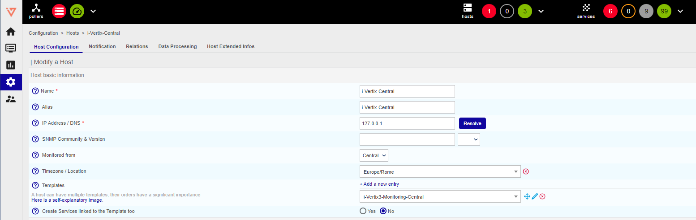
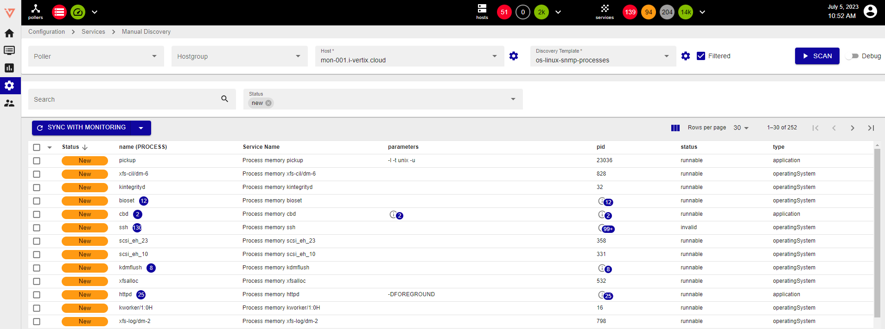

## Monitoring Central

In this example we show how to **manually add** and **monitor** the Central Manager from itself.

:::note

If you already have installed the i-Vertix Monitoring Central plugin pack you can skip step 1 and 2

:::

1. Head over to **Administration -> i-Vertix -> Plugin Store** using the left side-menu
2. Search and install the plugin pack **i-Vertix3 Monitoring Central**

3. After the successful installation of the plugin pack you can head over to **Configuration -> Hosts -> Hosts**
4. To add a new host click the blue button **Add** which is located between the top-side filters and the bottom list



5. Fill in the following fields:
    * **Name**: insert the ***device name*** / ***host name*** (no spaces allowed)
    * **Alias**: insert an ***alternative name*** / ***readable name*** (spaces allowed)
    * **IP Address / DNS**: IP address or FQDN of the host (insert ***127.0.0.1*** for the Central Manager). If you
      enter a
      FQDN you can click on Resolve to have the system check name resolution.
    * **Monitored from**: Select ***Central*** from the dropdown menu
    * **Templates**: Click ***Add a new entry*** and select ***i-Vertix3-Monitoring-Central*** from the dropdown list
    * **Create Services linked to the Template too**: Select **Yes**
6. Click on **Save**

## Monitoring Poller

In this example we show how to **manually add** and **monitor** the Smart Poller from itself.

:::note

If you already have installed the i-Vertix Monitoring Central plugin pack you can skip step 1 and 2

:::

1. Head over to **Administration -> i-Vertix -> Plugin Store** using the left side-menu
2. Search and install the plugin pack
```
i-Vertix3 Poller VM
```

3. After the successful installation of the plugin pack you can head over to **Configuration -> Hosts -> Hosts**
4. To add a new host click the blue button **Add** which is located between the top-side filters and the bottom list

5. Fill in the following fields:
    * **Name**: insert the ***device name*** / ***host name*** (no spaces allowed)
    * **Alias**: insert an ***alternative name*** / ***readable name*** (spaces allowed)
    * **IP Address / DNS**: IP address or FQDN of the host (insert ***127.0.0.1*** for the Central Manager). If you
      enter a
      FQDN you can click on Resolve to have the system check name resolution.
    * **Monitored from**: Select ***Central*** from the dropdown menu
    * **Templates**: Click ***Add a new entry*** and select ***i-Vertix3-Monitoring-Central*** from the dropdown list
    * **Create Services linked to the Template too**: Select **Yes**
6. Click on **Save**

## Monitoring additional services (Service Discovery)

Once you have added a host you can discover additional services

1. Head over to **Configuration -> Services -> Manual Discovery** using the left side-menu
2. Select:
    * **Poller**: This acts as a pre-filter for the host-select
    * **Host**: Select the ***Host*** to which you want to add services (for example
      the [i-Vertix-Central](#monitoring-central))
    * **Discovery template**: set of commands that have to be executed to search for services (the system automatically
      shows relevant/applicable ones)
3. Click on **Scan Host**
4. Select the ***Services*** you want to monitor by checking the checkboxes and click on **Sync with Monitoring**



## EXPORTING THE CONFIGURATION

Once the host and services have been added, it is essential to export the configuration for the changes to take effect.

See the post [Export the configuration](../../monitoring-resources/monitoring-hosts/export-configuration.md) for further explanation.