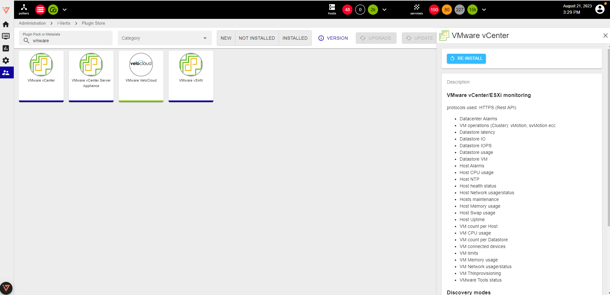

To monitor a VMware infrastructure, install the required plug-ins from the Plugin Store.

Create the connector to access vCenter, configure the job and perform discovery.

See the complete procedure for [VMware monitoring](../../monitoring-resources/discovery/vmware-discovery.md)

