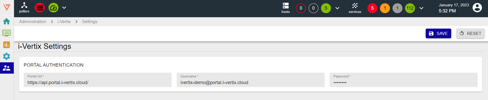

Some connections parameters have to be configured in order to access the monitoring profiles included in the Plugin Store.

Such parameters can be configured via the web GUI, by selecting **Administration -> i-Vertix -> Settings**

Portal Authentication
Portal Url: https://api.portal.i-vertix.cloud/ 
Username & Password: ask them via mail to i-Vertix tech support <u>support@i-vertix.com</u>

Follow the [update/upgrade](plugin-update-installation.md) step, it is mandatory.

