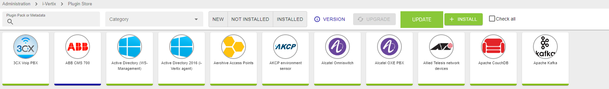

Access the Plugin Store from: **Administration -> i-Vertix -> Plugin Store**, then press the **Upgrade** button to install the latest plugins.

:::warning[Mandatory]
This task is mandatory to ensure a properly working monitoring experience
:::

