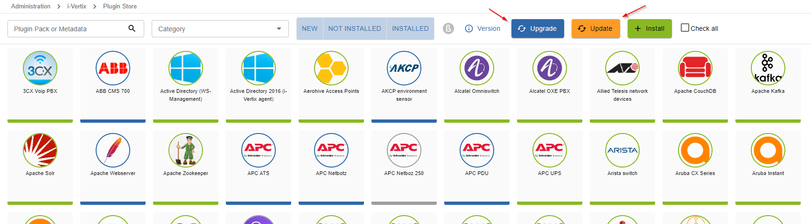

Access the Plugin Store from: **Administration -> i-Vertix -> Plugin Store**, then press the **Update** or **Upgrade** button to install all the available plugins updates.

:::caution Mandatory
This task is mandatory to ensure a properly working monitoring experience
:::

