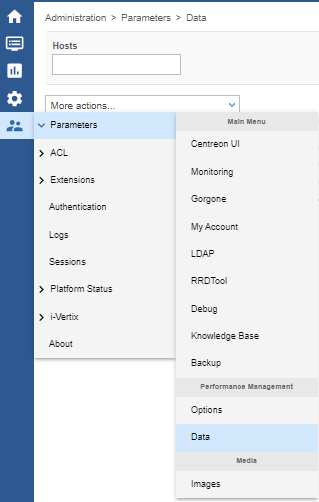
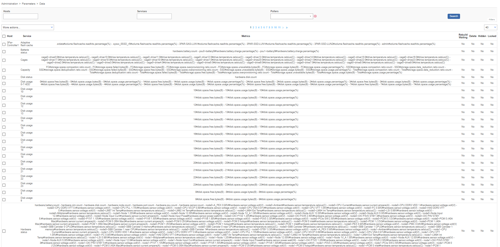
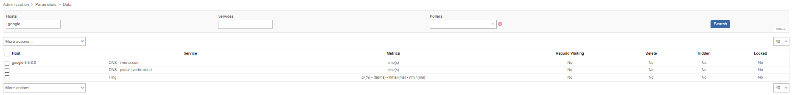
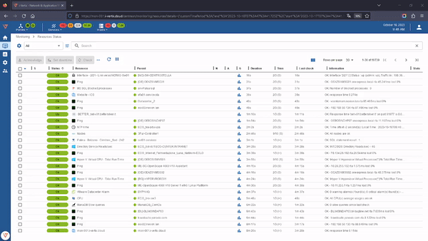

### Graphs rebuild

When you need to restore a RRD graphs because it's maybe corrupt or you have done a database restore go to
Administration -> Parameters -> Data

This page contains all the chart configurations that are collected by i-Vetix IT Monitoring.

You can search for the resource through filters (for example: Hosts).

## Procedure

:::caution

Once your monitoring platform is restored and all is doing well, you can **rebuild
RRD** files in order to restore all performance graphs.

:::

To proceed to reconstruct the graphs follow this procedure:

- filter by hosts and/or services
- select the services for which you want to restore the graph (for example: Ping)
- click the drop-down
menu **More actions...** and select the option **Rebuild RRD Database**

:::caution

The rebuild process takes time, it is a background process and depends on the amount of data.

We recommend you to do a test with 1-2 services, if it goes well you can also do it more massively

:::
