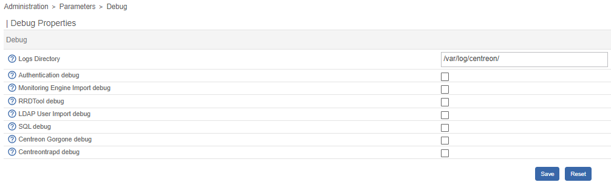

This part allows to enable debug level logging of i-Vertix processes.

Go to **Administration > Parameters > Debug**.

- **Logs Directory** field defines the path where event logs will be recorded
- **Authentication debug** box can be used to log authentications to the
i-Vertix interface
- **Monitoring Engine Import debug** box enables logging of the scheduler
debugging
- **RRDTool debug** box enables logging of the RRDTool graph engine debugging
- **LDAP User Import debug** box enables logging of debugging of the import of
LDAP users
- **SQL debug** box enables the logging of SQL requests executed by the
Centreon interface
- **Centreon Gorgone debug** box enables logging of Gorgone process debugging
- **Centreontrapd debug** box enables logging of the Centreontrapd process
debugging