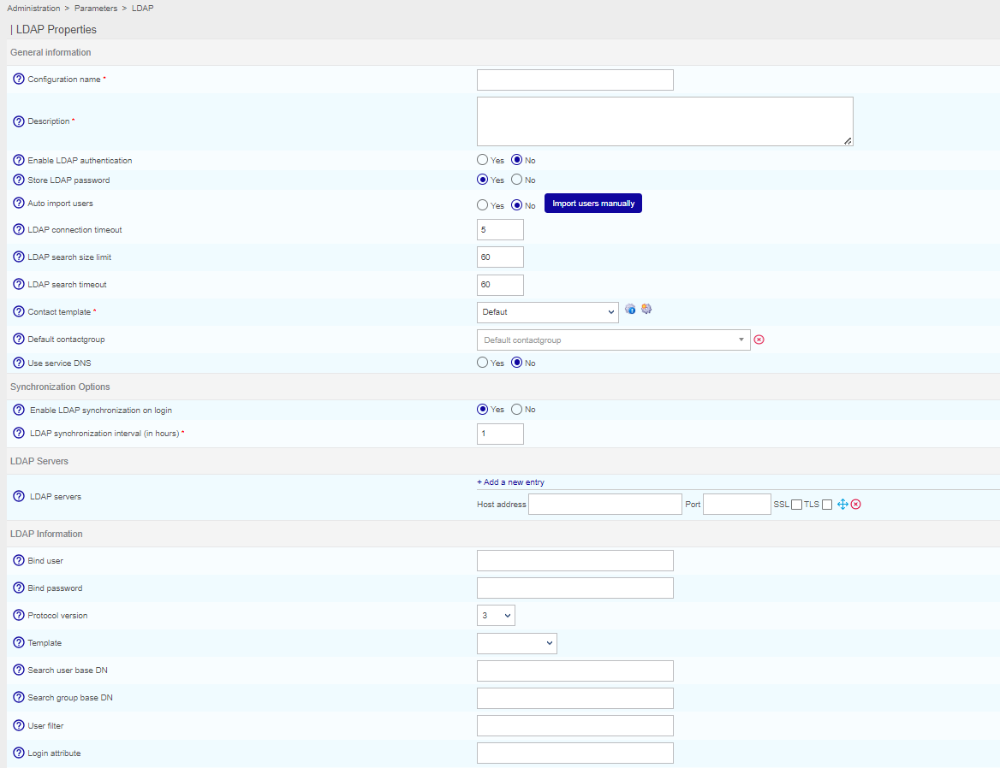

import Tabs from '@theme/Tabs';
import TabItem from '@theme/TabItem';


When you connect i-Vertix to an LDAP directory, users in this directory can log in to i-Vertix using their LDAP credentials.

Connecting i-Vertix to an LDAP directory does not create [users](../../managing-users-contacts/contacts-users.md) automatically in i-Vertix. According to your configuration, users from the LDAP directory can be created automatically when they log in to i-Vertix, or you can import them manually.

You can [grant rights to these users](../../managing-users-contacts/acl.md) indirectly by adding them to a contact group (which in turn can be included in an [access group](../../managing-users-contacts/acl.md#creating-an-access-group)).

> If you want to use SSO for authentication, please read
> [this procedure](../../administration/authentication/websso-WEBSSO.md).

## Configuration

Go to **Administration > Parameters > LDAP** and click on **Add**.



- **Configuration name** and **Description**: define the name and the
description of the LDAP server
- **Enable LDAP authentication**: enable authentication via the
LDAP server
- **Store LDAP password**: can be used to store user passwords in the
database, useful to authenticate users in the event of loss of connection
with the LDAP
- **Auto import users**:
    - **Yes** : All users in the directory will be able to log in to i-Vertix. The first time they log in, they will be created in i-Vertix, on page **Configuration > Contacts > Contacts/Users**, with their LDAP parameters (name, first name, email address...).
    - **No** : Users will only be able to log in to i-Vertix if their account has been imported manually into i-Vertix.
    - **Import users manually** : Whether auto import is enabled or not, you can use this button to import some users to the list of contacts.

- **LDAP search size limit**: can be used to limit the number of users to search for (1000 users maximum).
- **LDAP search timeout**: can be used define the maximum time for the
LDAP search.
- **Contact template**: defines the [contact template](../../managing-users-contacts/contact-templates.md) that will be linked
to all users imported from this LDAP directory.
- **Default contactgroup**: is used to add a new user to
a default contactgroup. This allows you to [grant rights](../../managing-users-contacts/acl.md) indirectly to the LDAP users.
- **Use service DNS**: indicates if it is necessary to use the DNS server
to solve the IP address of the LDAP directory.
- **Enable LDAP synchronization on login**: If enabled, a user LDAP
synchronization will be performed on login to update contact's data and
calculate new i-Vertix ACLs.
- **LDAP synchronization interval (in hours)**: Displayed only if the previous
option is enabled. This field is used to specify the time between two LDAP
synchronizations.

:::info

The contact's LDAP data won't be updated in i-Vertix until the next synchronization is expected.
If needed, "on-demand" synchronization are available from the **Administration > Session** page and from the **Configuration > Users > Contact/Users** list.
The interval is expressed in hours. By default, this field is set to the lower value : 1 hour.
We save a timestamp as reference date in the DB and use the CentAcl CRON to update it.
The reference date is used to calculate the next expected LDAP synchronization.
If you modify one of these two fields the reference timestamp will be reset to your current time.
The reference date won't be updated if you modify or not, only the other fields/options.

:::

- **LDAP servers**: can be used to add one or more LDAP directories to
which i-Vertix will connect.

The table below summarizes the settings to add an LDAP server:

| Column       | Description                                                            |
| ------------ | ---------------------------------------------------------------------- |
| Host address | Contains the IP address or DNS name of the LDAP server                 |
| Port         | Indicates the connection port to access the LDAP                       |
| SSL          | Indicates if the SSL protocol is used for the connection to the server |
| TLS          | Indicates if the TLS protocol is used for the connection to the server |

- **Bind user** and **Bind password**: define the user name and the
password for logging to the LDAP server
- **Protocol version**: indicates the version of the protocol using to
login
- **Template**: can be used to pre-configure the search filters for users
on the LDAP directory. These filters serve to propose, by default, a search
on the MS Active Directory, Okta or of Posix type directories.

:::caution

Before any import, check the default settings proposed. If you have not selected a Model, you will need to define the search filters manually by filling in the fields.

:::


With CentOS 7, it's possible to not check server certificate, follow procedure:

Add the following line in file "/etc/openldap/ldap.conf":

```shell
TLS_REQCERT never
```

Then restart Apache:

<Tabs groupId="sync">
<TabItem value="Alma/ RHEL / Oracle Linux 8" label="Alma/ RHEL / Oracle Linux 8">

```shell
systemctl restart httpd
```

</TabItem>
<TabItem value="CentOS 7" label="CentOS 7">

```shell
systemctl restart httpd24-httpd
```

</TabItem>
</Tabs>