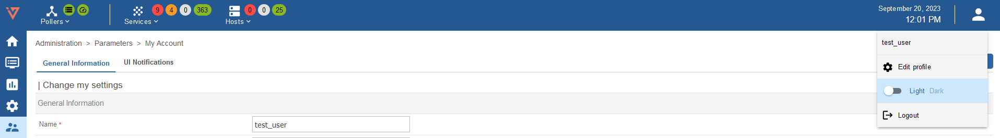
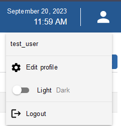
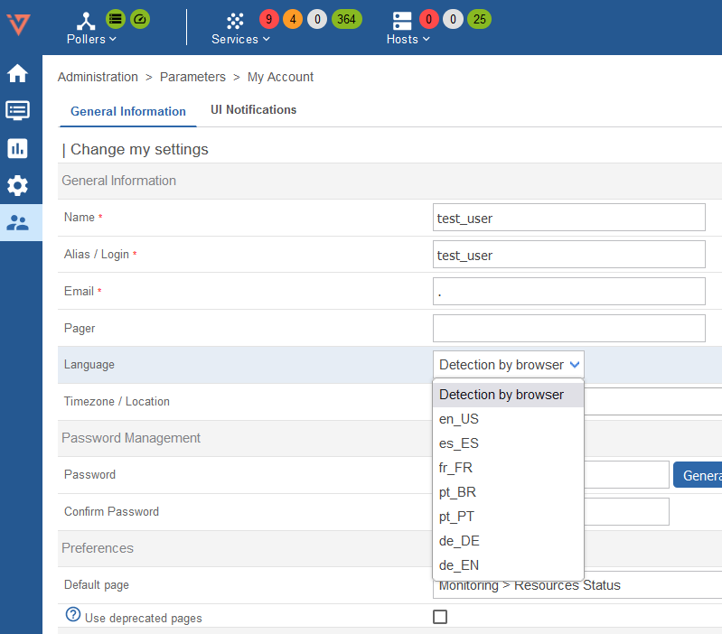

## My Account

To connect to your i-Vertix web interface, go to URL: `http://IP_ADDRESS/centreon`. (Replace **IP_ADDRESS** by the IP address or FQDN of your i-Vertix web server (Central Management).

Fill in your user name and associated password and click on the **Connect** button:

You are now connected to the i-Vertix web interface.

## Menus

### Switch to dark mode

When you first connect to the interface, i-Vertix is displayed in light mode by default.

On the banner, click on the profile icon and use the switch button to turn on the dark mode.
Next time you connect to the interface, the mode you previously selected remains on.

- Light mode:

- Dark mode:

You can also switch to dark mode by changing the theme in the account parameters.

Go to **Administration > Parameters > My Account** and select the **General Information** tab.
Select **Light** or **Dark** in the **Front-end Theme** field.

Then click on **Save**. The theme is now in the mode you have chosen.

### Change the user interface language

On the banner, click on the profile icon, then click on **Edit profile**:

In the language select box, choose your language:

Then click on **Save**. Your interface is now translated.

## Change default page

You can choose the dafault page (normally the default page is (**Monitoring > Reesource Status**).

In the Preferences > Default Page box choouse your page:

## Reset your password

### Reset your password before expiration

When your password is going to expire in the next 7 days, an orange dot appears in the banner on the right
next to the profile icon:

Click on **Edit profile**, then change your password:

### Reset your password when expired

If you have not changed your password before it expires, you will be redirected after login
to a dedicated page where you can update it:

Fill in your current password, define a new one and then click on **Reset Password**.