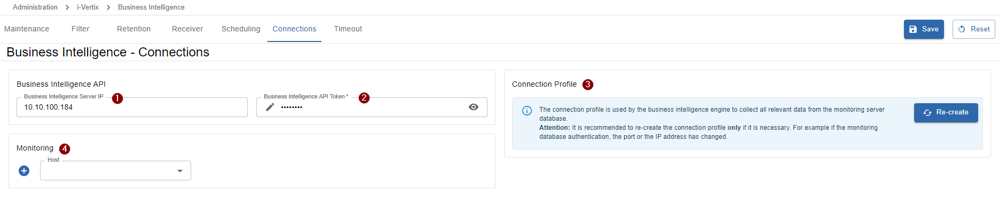

import ImageCounter from "../../../src/components/ImageCounter";
import PowerGreen from "../../../src/components/Icon/PowerGreen";
import PowerRed from "../../../src/components/Icon/PowerRed";

This page is divided by the single tabs present on the Settings page.

Here is a list of the most common settings:

- [Database update](./bi-settings#-versions)
- [Configure SMTP for i-Vertix BI](./bi-settings#smtp-configuration)
- [Add timeperiods to be used in BI](./bi-settings#-timeperiods)
- [Exclude pollers from BI](./bi-settings#-pollers)
- [Exclude hostgroups from BI](./bi-settings#-hostgroups)

## Maintenance

### <ImageCounter num={1} /> Maintenance status

- <PowerRed spaceRight /> the red button indicates that the maintenance mode is <strong>deactivated</strong>
- <PowerGreen spaceRight /> the green indicates that the maintenance mode is <strong>activated</strong>

:::caution

Please beware that **deactivating** the maintenance status during an actual system update or while reports are being built can lead to **inconsistent** or **suddendly aborted report job executions**
as well as a **severe data warehouse inconsistency**.

:::

:::tip

To switch the maintenance mode status, simply press the red/green power button.

:::

### <ImageCounter num={2} /> ETL Job Running

When a loading icon is present, it indicates that at the moment the ETL job is syncing data from the central monitoring server to the i-Vertix BI data warehouse.

:::note

While the ETL job is running, no reports can be generated.

:::

:::danger

Do **not perform any updates** on the i-Vertix BI server while the ETL job is running!

Also the **i-Vertix BI API must not be restarted** under any circumstances during this process, otherwise it will also kill the currently running ETL job.

Premature cancellation of the ETL job will result in data warehouse inconsistency and therefore incomplete and inconsistent reports.

:::

If you are worried that the ETL job is taking longer than expected,
please search the [Report generation failing troubleshooting section](./bi-troubleshooting#report-generation-is-failing) for *ETL job still running*`.

### <ImageCounter num={3} /> Reports Building

When a loading icons is present, it indicates that at the moment reports are being built.

This information is especially useful before activating the maintenance mode.

:::caution

**Activating** the maintenance mode or **performing updates** while reports are being built can **lead into errors** during the build-process!

:::

### <ImageCounter num={4} /> Versions

List of currently installed package versions on the i-Vertix BI server.

After performing an update on the i-Vertix BI server you will find an update button for the `API DB` or the `ETL DB`.
Both database versions should always be kept on the latest version to ensure that the data will be synced correctly during the ETL job execution.

:::note

When performing a database update, the maintenance mode will be activated automatically and needs to be turned off after the successful update.

:::

:::caution

Make sure the ETL job is currently suspended and no reports are being built before updating any database component!

:::

### <ImageCounter num={5} /> Incomplete Data

This list shows, which pollers are missing data in the data warehouse.
The calculation behind checks the synced data of the last 14 days and reports any missing data from pollers for the specific day.

If the missing data was recovered again in the meantime by the i-Vertix Smart Pollers, it is possible to **repair** the data in the data warehouse.
For doing so, select the days you want to recover from the list and click on the **Repair** button.
The ETL job will start and sync the recovered data to the data warehouse on the i-Vertix BI server.

:::caution

Make sure the ETL job is currently suspended and no reports are being built before repairing any data!

:::

### <ImageCounter num={6} /> ETL Job History

List of all recent ETL jobs performed in the last 14 days containing information about the date and time of execution,
the job duration and which days were synced.

---

## Filter

### <ImageCounter num={1} /> Timeperiods

`include filter` - which means, only selected items are **included** - everythign else is automatically **excluded**

Select all relevant timeperiods you want to use in your reports.
Non-selected timeperiods will not be considered in the data warehouse thus not taken into account for calculations.

### <ImageCounter num={2} /> Pollers

`exclude filter` - which means, only selected items are **excluded** - everything else is automatically **included**

Data from *excluded* pollers will not be synced to the data warehouse.
This includes all data from hosts and services which are monitored by the excluded poller.

:::tip

Excluding pollers may be useful to save hardware resources and computing power for non-relevant data.

:::

### <ImageCounter num={3} /> Hostgroups

`exclude filter, regex` - which means, only selected or matched items are **excluded** - everything else is automatically **included**

- It is possible to directly select hostgroups from the select which will be excluded (only the selected hostgroup).
- It is possible to write a custom regex which will exclude all hostgroups whose name match the provided pattern.
Hostgroups excluded by regular expressions are marked in select options as `Excluded by regex`.

---

## Retention

### <ImageCounter num={1} /> Performance Data

Performance data stored in the data warehouse represent the actual values of single monitoring checks.
The data will be calculated on hourly, daily and monthly basis to be used in reports, using
the `Raw performance data` (all monitoring values from one day).

:::note

The sliders indicate how long the associated data remains in the data warehouse.
If the data is older than the set duration, it is automatically deleted and can therefore no longer be used in reports. 

In practical terms, this means that if for example 3 months have been set for daily performance data,
no data older than 3 months is available for a report.

:::

#### Default values

- <ImageCounter num={2} /> Raw performance data: <code>1d</code> <i>(1 day)</i>
- <ImageCounter num={3} /> Hourly aggregated performance data: <code>3m</code> <i>(3 months)</i>
- <ImageCounter num={4} /> Daily aggregated performance data: <code>6m</code> <i>(6 months)</i>
- <ImageCounter num={5} /> Monthly aggregated performance data: <code>3y</code> <i>(3 years)</i>

### <ImageCounter num={6} /> State Event Data

State event data stored in the data warehouse represent the state changes and events of monitoring checks.
The data will be calculated on a daily and monthly basis to be used in reports, using
the `Raw state event data` (all events from one day).

:::note

The sliders indicate how long the associated data remains in the data warehouse.
If the data is older than the set duration, it is automatically deleted and can therefore no longer be used in reports. 

In practical terms, this means that if for example 3 months have been set for daily state event data,
no data older than 3 months is available for a report.

:::

#### Default values

- <ImageCounter num={7} /> Raw state event data: <code>1d</code> <i>(1 day)</i>
- <ImageCounter num={8} /> Daily aggregated state event data: <code>6m</code> <i>(6 months)</i>
- <ImageCounter num={9} /> Monthly aggregated state event data: <code>3y</code> <i>(3 years)</i>

### <ImageCounter num={10} /> Generated Reports

:::note

The sliders indicate how long generated reports remain saved on the i-Vertix Business Intelligence server.
If the report creation-date is older than the set duration,
it is automatically deleted on the i-Vertix BI server and can therefore no longer available for download.

:::

- <ImageCounter num={11} /> <strong>Daily generated reports</strong>: generated by the default schedule <code>daily</code>
- <ImageCounter num={12} /> <strong>Weekly generated reports</strong>: generated by the default schedule <code>weekly</code>
- <ImageCounter num={13} /> <strong>Monthly generated reports</strong>: generated by the default schedule <code>monthly</code>
- <ImageCounter num={14} /> <strong>Custom scheduled reports</strong>: generated by a <code>custom schedule</code> configured on the report job
- <ImageCounter num={15} /> <strong>Manually generated reports</strong>: generated by <code>manually executing</code> a report job

#### Default values

- <ImageCounter num={11} /> Daily generated reports: <code>3m</code> <i>(3 months)</i>
- <ImageCounter num={12} /> Weekly generated reports: <code>6m</code> <i>(6 months)</i>
- <ImageCounter num={13} /> Monthly generated reports: <code>18m</code> <i>(18 months)</i>
- <ImageCounter num={14} /> Custom scheduled reports: <code>1y</code> <i>(1 year)</i>
- <ImageCounter num={15} /> Manually generated reports: <code>1y</code> <i>(1 year)</i>

---

## Receiver

:::note

At the moment, reports can only be sent via email.
More different *Receiver* options will follow in the future (S/FTP, Cloud services, Slack, Teams)..

:::

### SMTP Configuration

Configure an SMTP Server to receive generated reports via email.

To create a new SMTP Server, open the credential manager by clicking on the select input and add a new SMTP Credential.

    
SMTP Credential

Fill in all the required SMTP information:

- **Name:** set a name for the new credential
- **Access Groups:** `keep empty`
- **Global:** `Enabled` (this is important, otherwise non-admin users won't be able to receive emails)
- **Server:** set the server address of your SMTP server
- **Port:** set the port of your SMTP server
- **Sender:** set the sender email address - emails will be sent using this mail address
- **Username:** set the SMTP server authentication username
- **Password:** set the SMTP server authentication password
- **SSL/TLS:** enable ssl/tls if needed by your SMTP server

`Save` and `Select` the newly added SMTP credential.

---

## Scheduling

### <ImageCounter num={1} /> Daily update ETL Data

This input defines the daily execution time of the ETL job.

The ETL job is a process running in the background which syncs all relevant data to the i-Vertix BI system.
The daily ETL job is a very resource intensive task and takes about 10-30 minutes depending on the monitoring system's size (amount of hosts and services) and the hardware of the i-Vertix BI server.

If for some reason the daily ETL job did not run (due to maintenance) or an unexpected error, the next successful ETL job will recover the missing daily data automatically.
In that case the execution takes longer, because more than 1 day of data has to be processed.

### <ImageCounter num={2} /> Default report execution time

This input defines the default execution time of scheduled report jobs, using default scheduling options.

When scheduling a report, multiple scheduling options are available (based on the type of report template used): daily, weekly, monthly or a custom schedling.
It is also possible to set a custom execution time for every job, but by default this default report execution time is selected.

### <ImageCounter num={3} /> Day of week for weekly reports

This input defines the first day of week and is used for the weekly scheduling of report jobs.

When selecting a report job to be scheduled weekly, the report job will execute every week on the weekday selected in this input at the default (or modified) execution time.

### <ImageCounter num={4} /> Day of month for monthly reports

This input defines the first day of the month and is used for the monthly scheduling of report jobs.

When selecting a report job to be scheduled monthly, the report job will execute every month on the day of month selected in this input at the default (or modified) execution time.

---

## Connections

### <ImageCounter num={1} /> Business Intelligence Server IP

The Business Intelligence Server IP represents the ip address of the i-Vertix BI server, reachable from the monitoring central server.

The ip address is used to access the i-Vertix BI API.
Please make sure the monitoring central server is able to reach the i-Vertix BI server regarding firewall policies or similar on port **3000** using **HTTPS**.

### <ImageCounter num={2} /> Business Intelligence API Token

The Business Intelligence Server API token is used to authenticate with the i-Vertix Business Intelligence API.

The API token was generated and presented during the [setup process of the i-Vertix BI server](./bi-setup#api--reporting-engine).
If somehow the API token has changed (newly setup system for example) you should update the existing API token credential and insert the new token.

### <ImageCounter num={3} /> Re-Create Connection Profile

Re-creating the database connection profile is needed when the i-Vertix BI IP address has changed.

The connection profile holds the database connection information to the monitoring central server for the i-Vertix BI system.
A new special database user was created during the i-Vertix BI setup process which is restricted to only access from the defined i-Vertix Business Intelligence Server IP address.

:::danger

If the Business Intelligence Server IP has changed you must re-create the connection profile,
otherwise the daily ETL job will not be able to sync any new data.

:::

### <ImageCounter num={4} /> Monitoring

The select holds the reference to the monitored Business Intelligence host created during the
[4th step of the module setup process](./bi-setup#4th-step-monitor-the-i-vertix-business-intelligence-server).

If you did not create the host during the setup process you have here the possibility to create a new host with
all interesting checks assigned for the i-Vertix Business Intelligence Server bny clicking on the `+` button next to the select input.

If you already have a host to monitor the i-Vertix Business Intelligence server but the reference is missing in the settings you should select the host from the list.

:::info

Before creating a new host, make sure you have installed the `i-Vertix Business Intelligence` plugin pack from the Plugin Store.

:::

---

## Timeout

### <ImageCounter num={1} /> Single Report Execution Timeout

The single report execution timeout limits the duration of a single report-creation (1 output file).
Normally generating a report takes between 5-90 seconds depending on the amount of data used and
the complexity of visuals that have to be rendered.

If the report engine is taking longer than expected or is somehow having difficulties rendering a report,
the timeout ensures that the system and resources won't be blocked too long for one report.

The recommended **default value is 120 seconds**.

If you encounter a problem where a report was not generated due to timeout, you can increase the single report execution timeout.
Before doing so, review the report parameters defined in the report job to make sure that everything is correct.

### <ImageCounter num={2} /> Total execution timeout

The total execution timeout limits the duration of all reports that are being built at the same time.

The recommended **default value is 3600 seconds** (1 hour).

It is only recommended to increase this value if you schedule a lot of reports on a daily basis (and by a lot, I mean 250+).

:::note

If you encounter problems that daily scheduled reports continuously fail due to a timeout exception, the total execution timeout could have been exceeded.

:::
