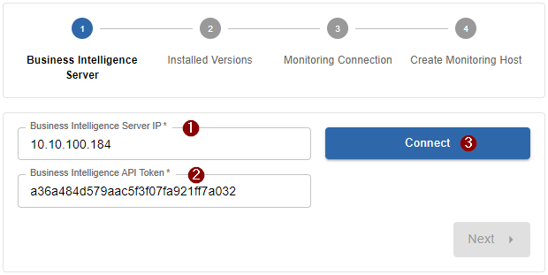
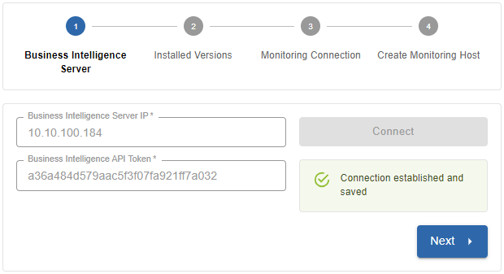
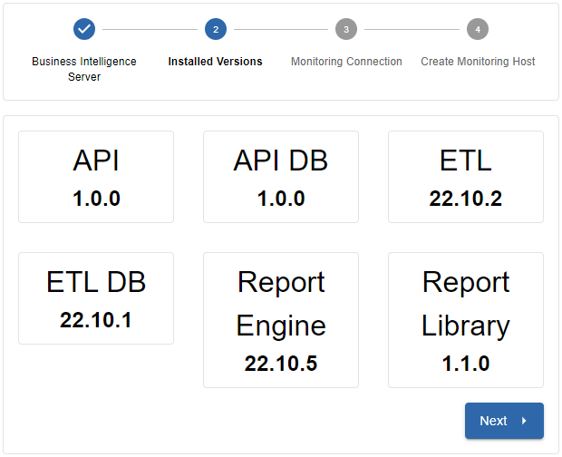
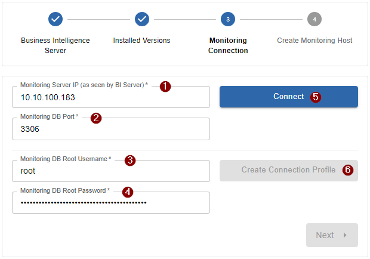
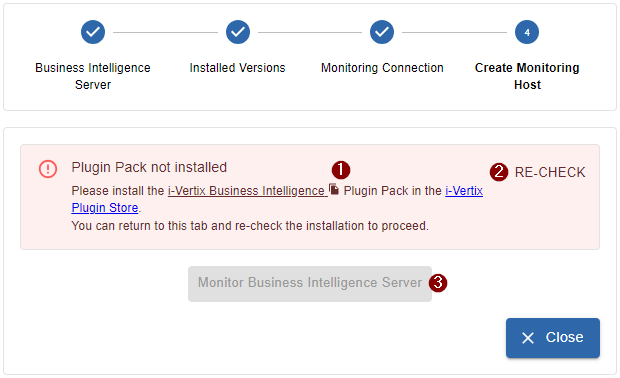

import ImageCounter from "../../../src/components/ImageCounter";

## Installation

The pre-configured i-Vertix Business Intelligence instance is available in OVA format for virtualization environments. Please contact our support ([support@i-vertix.com](mailto:support@i-vertix.com)) if you need other virtualization formats for your environment.

Please have a look at the [system requirements](./bi-requirements) when creating the new virtual machine.

:::info

If you need help on how to import the OVA into your VMware environment, please have a look at our [How to import a Virtual appliance](../installation/setup-central-poller/import-virtual-appliance#downloading-the-virtual-machine) documentation

:::

---

## Configure your system

After completing the virtual machine import and configuration, start the newly created virtual machine.

After the startup-process is completed, log into the command line of the i-Vertix BI system with the credentials provided by the i-Vertix team.

Following menu should appear:

[bi menu](../assets/bi/menu.png)

:::note

If the menu does not appear or if you are in the normal command line interface, you can always re-open the menu with the command `menu` (which is a system alias)

:::

### Change password

The first real step after the initial system-startup should be changing the password.

To change the password, select option `4) System settings` from the menu.

Now select option `5) Change password`.

You can now enter your new password.

>It is strongly recommended to choose a strong password, as there is no further SSH restriction (such as ssh-keys) implemented.

### Network configuration

Next you need to configure the network settings for your newkly imported i-Vertix business intelligence system.

:::info

Keep in mind that the i-Vertix BI system requires a connection to the **Monitoring Central Server**!

:::

To change the network settings, select option `4) System settings` from the menu.

Now select option `1) Change network settings`. The *Network Manager* should open.

1. Choose `Edit a Connection`
2. Select the Ethernet connection to edit (should be `ens192` or similar) - navigate with keyboard arrows
3. Configure following fields:
   
   **IPv4 CONFIGURATION**: Manual
   
   - **Adresses**: *set the ip address*
   - **Gateway**: *set the gateway address*
   - **DNS server**: *set the DNS server*
   - **Search domains**: *set the domain (if necessary)*
   - *keep the rest unchecked*
   
   **IPv6 CONFIGURATION**: Ignore (*or configure if necessary*)
   
   [x] Automatically connect
   [x] Available to all users

4. Confirm by selecting `<OK>`
5. Return to the Network Manager main screen by selecting `<Back>`
6. `Quit` the Network Manager
7. Confirm restarting the *NetworkManager* service to make your changes effective

:::info

From now on you should be able to connect via SSH (port 22) to the i-Vertix BI server

:::

### Timezone settings

By default, the timezone is set to Europe/Rome.

If you need to change the timezone, select option `4) System settings` from the menu.

Now select option `2) Change timezone`.

You will be asked to enter the new timezone. Here is a list of valid *TZ identifiers* to insert: [tz database on Wikipedia](https://en.wikipedia.org/wiki/List_of_tz_database_time_zones)

### Proxy settings

If you need to set a proxy server for your system, select option `4) System settings` from the menu.

Now select option `3) Proxy settings`.

You will be guided through the further process by the program itself.

---

## Configure the i-Vertix BI services and the monitoring module

### API & Reporting Engine

To simplify the setup process of our i-Vertix services, we have created a setup script that does most of the work for you.

:::note

To complete this step the *i-Vertix Business Intelligence* module needs to be fully installed and licensed on the Monitoring system. If it isn't already you should take care of it now.

:::

To launch the setup script, which configures the API and the reporting engine, select option `9) Setup i-Vertix services` from the menu.

You will be asked for the corret path to the .env file, which is located by default in `/usr/share/ivertix-bi/backend/.env`. If no custom modifications were made, you can simply accept the provided path.

After accepting, the database will be initialized and configured.

If any problems happen during the database setup, please contact us at [support@i-vertix.com](mailto:support@i-vertix.com) with the corresponding error messages.

After the database was initialized, the **API token** will be **generated and printed on the screen**.

:::warning

It is very important to **copy and store** the API token for a moment because it is needed in the further setup process (monitoring module setup).

The API token will only be exposed once during the setup. Afterwards it is not possible to retrieve it again. If the token gets lost, a new API token must be generated.

:::

After the token was created, the SSL encryption certificate will be created.

You will be questioned some general information for the certificate. Please insert at least following information:

- Country Name (2 letter code, you can find all valid codes on [iso.org](https://www.iso.org/obp/ui/))
- State or Province Name
- Locality Name
- Organization Name (company name)
- Common Name (server hostname)
- Email Address

All other fields can be left blank (enter `.` or just skip the question by pressing Enter).

Next you will be asked for the host address, which interacts with the BI server. The ip address is used to create a new readonly database user for monitoring purposes. The requested ip address should be the ip address of the **Central Monitoring Server**, as seen by this server.

After this step is complete, the setup is finished and the API service is started automatically.

There is no need to copy and store the generated readonly database password.

---

## Monitoring module setup

After finishing the above setup steps on the i-Vertix BI system you can now move on to the module setup part.

For that, log in to your i-Vertix monitoring platform using an account with admin privileges.

Head over to `Administration -> i-Vertix -> Business Intelligence`.

The setup wizard should now appear.

### 1st Step: Business Intelligence Server Connection

- <ImageCounter>1</ImageCounter> Insert the previous set-up ip address of the i-Vertix Business Intelligence Server
- <ImageCounter>2</ImageCounter> Insert the previously generated API token which was exposed during the setup program
- <ImageCounter>3</ImageCounter> Click `Connect` to test the connection

After a successful connection you can proceed with the next step by clicking `Next`.

:::note

If the connection cannot be established, head over to the [Troubleshooting](./bi-troubleshooting) section which may help you finding the cause

:::

### 2nd Step: Verify installed versions

Quick overview of the installed versions on your fresh i-Vertix BI server. Click `Next` to proceed with the next step.

### 3rd Step: Monitoring database connection

- <ImageCounter>1</ImageCounter> Insert the central monitoring server ip address as seen by the i-Vertix BI server (same ip address which was requested during the BI server setup process). By default the current Browser address is used, this address is not always the right one
- <ImageCounter>2</ImageCounter> Insert the monitoring database port (default `3306`)
- <ImageCounter>3</ImageCounter> Insert the monitoring database superadmin/root username (default `root`)
- <ImageCounter>4</ImageCounter> Insert the monitoring database superadmin/root password (consult the i-Vertix team)
- <ImageCounter>5</ImageCounter> Click `Connect` to test the database connection from the i-Vertix BI server to the central monitoring server

:::note

If the connection cannot be established, head over to the [Troubleshooting](./bi-troubleshooting) section which may help you finding the cause

:::

- <ImageCounter>6</ImageCounter> After the connection is established, click `Create Connection Profile`. In the background, a new dedicated user is created on the central monitoring database for the i-Vertix BI system.

After successfully creating the connection profile, click `Next` to proceed with the next step. Eventual errors during the creation process will be displayed on the wizard itself.

### 4th Step: Monitor the i-Vertix Business Intelligence Server

Almost done! The 4h and last step of the monitoring module setup is optional but highly recommended!

By monitoring the Business Intelligence Server you always have the most important components of the i-Vertix BI server in view.

If you don't already have the dedicated Plugin Pack installed, head over to the i-Vertix Plugin Store (preferably in a new tab) and search for the `i-Vertix Business Intelligence` plugin pack (you can copy the plugin pack name by clicking on the file icon inside the alert <ImageCounter>1</ImageCounter>). After installing, return to the setup page, click on <ImageCounter>2</ImageCounter> `Re-Check`. After the system has recognized, that the plugin pack was installed, click on <ImageCounter>3</ImageCounter> `Monitor Business Intelligence Server` to automatically create the monitoring host with all relevant checks assigned.

---

The setup is now complete and almost everything is ready now for your first report job.

To create your first report job, Report Templates are required. You can get them from the integrated [i-Vertix Report Store](./bi-report-store).

