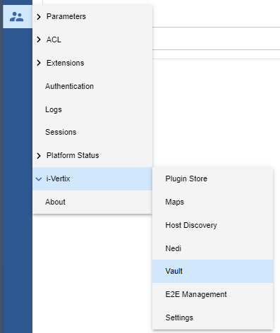
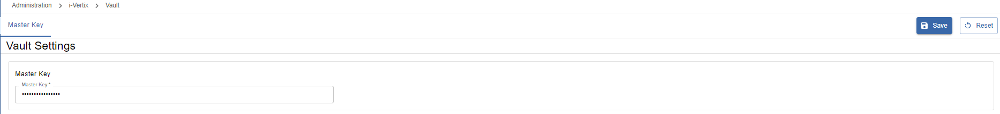

## Overview

IT Monitoring Vault simplifies access credentials management, making it easier for customers and MSPs to work with different IT environments without compromising security.

Credentials are stored centrally, can be accessed by discovery functions and sensitive data such as the password field is protected by a master key.

Users can configure and manage multiple credentials and easily switch between them.

i-Vertix Vault, is a complete internal credential manager (not just passwords), with functionality to be extended in the future.

The i-Vertix Vault supports four types of access:

- **SNMP**
- **SSH**
- **I-VERTIX AGENT** (VMware O.S. discovery)
- **WSMAN** (VMware O.S. discovery)

The stored credentials are used for these discoveries such as:

- **NEDI Discovery**
- **Network Discovery**
- **VMware OS Discovery**
- **Meraki**

## How to use

To access the i-Vertix Vault, you must edit, or create, a discovery job. The i-Vertix Vault is not actually accessible from a dedicated menu item.

In the example configuration below (NEDI Discovery) we have created a new entry (under **Configuration > Hosts > NEDI Configuration**):

or we can use an entry already present on i-Vertix Vault:

When credentials are changed, these changes will affect ***all*** hosts/configurations where these credentials are used.

To see if credentials have been used check **u** (usage):

to check where they are used click on Edit

this menu will open:

In the above example, the credentials selected, are also in use in the NEDI Discovery Job 

:::info

Currently, it is not currently possible to use (make link) of the users/passwords created on the i-Vertix Vault to add them to the host configuration.

:::

An important functionality of the i-Vertix Vault is the ability to retrieve credentials without relying on a personal credential store (e.g., Keepass). It is crucial to note that this functionality is subject to Access Control Lists (ACLs).

:::info

There is a **Master Key** which encrypts all credentials (for Admin users only), it will be randomly generated the first time and can then be changed as required.

You can find the **Master Key** in **Administration > i-Vertix > Vault**:

**Master Key is used by the system to decrypt the credentials stored in the db.**

:::
