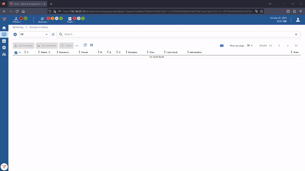
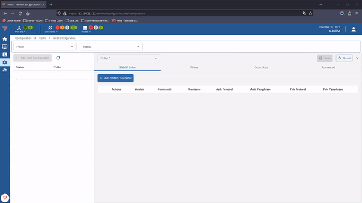
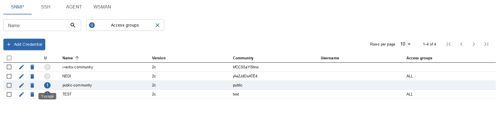
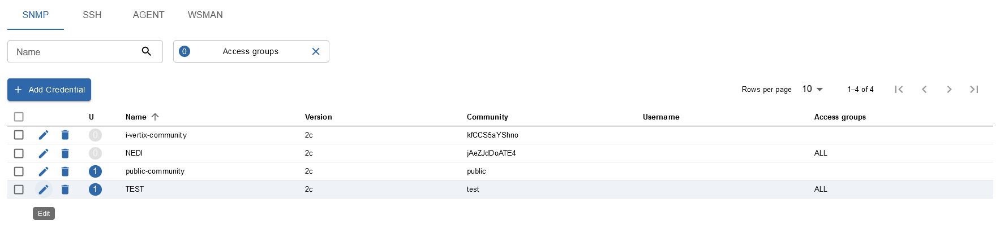
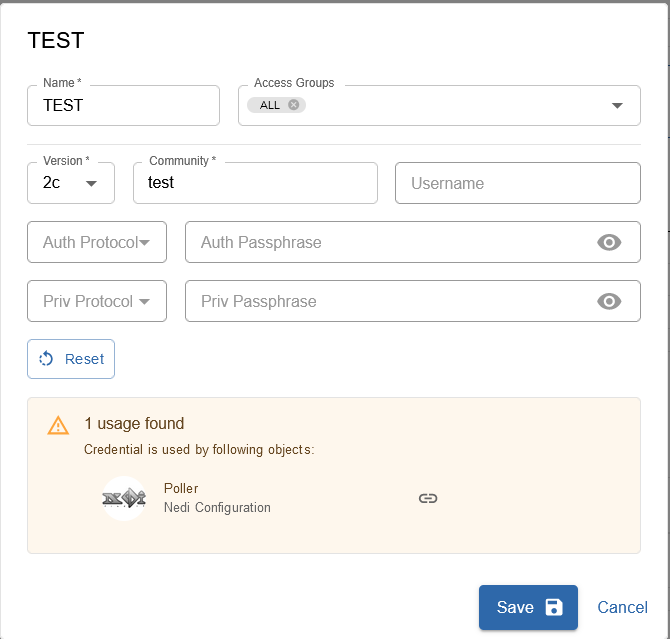

## VAULT

Vault, in i-Vertix IT Monitoring, is a complete internal credential manager (not just passwords), with functionality to be extended in the future.
For now, the i-Vetix IT Monitoring Vault can be used for the following 4 types of access:

- **SNMP**
- **SSH**
- **I-VERTIX AGENT** (vmware o.s. discovery only)
- **WSMAN** (vmware o.s. discovery only)

The stored credentials can be used for various utilities such as:

- **NEDI Discovery**
- **Network Discovery**
- **VMware OS Discovery**
- **Meraki**

At the moment the i-Vetix IT Monitoring Vault is only available in certain pages of the webgui (VMWARE, NEDI & MERAKI), but in the future there will be a menu item to retrieve all configured credentials.

In the example configuration below (NEDI Discovery) we have created a new entry (under **Configuration > Hosts > NEDI Configuration**):

or we can use an entry already present on i-Vetix IT Monitoring Vault:

When credentials are changed, these changes will affect ***all*** hosts/configurations where these credentials are used.

To see if credentials have been used check Usage:

to check where they are used click on Edit

this menu will open:

In the above example, the credentials selected, are also in use in the NEDI Discovery Job 

:::info

Currently, it is not currently possible to use (make link) of the users/passwords created on the i-Vetix IT Monitoring Vault to add them to the host configuration.

:::

One important use of the i-Vetix IT Monitoring Vault is to use it to retrieve credentials without using a personal credential store (e.g. keepass); remember that this functionality is subject to ACLs.

:::warning

IMPORTANT

There is a **Master Key** which encrypts all credentials (for Admin users only)

THE MASTER KEY IS USED BY THE SYSTEM TO DECRYPT THE CREDENTIALS STORED IN THE DB.

THE FIRST TIME IT IS GENERATED RANDOMLY, THEN IT CAN BE CHANGED.

:::
