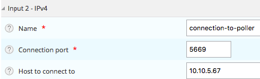

## Broker and the firewall

In certain cases you may not be able to initialize the Broker data flow
from the poller (or the Remote Server) to the Central Server or the Remote
Server.

Go to the **Configuration > Pollers > Broker configuration** menu and click on
**Broker SQL** configuration on the Central Server or Remote Server.

Go to the **Input** tab panel and add a new **TCP - IPv4** entry.

Enter the **Name** of the configuration, the TCP **Connection port** for
connecting to the poller, and the **Host to connect to**. Then **Save** your
configuration.

