import Tabs from '@theme/Tabs';
import TabItem from '@theme/TabItem';

# Smart Poller Configuration

## Poller configuration

<Tabs>
<TabItem value="i-Vertix3 Poller" label="i-Vertix3 Poller" default>

To attach a Smart Poller **i-Vertix3** to a Central Management, please follow these instructions:

1. go to Configuration -> Pollers -> Pollers

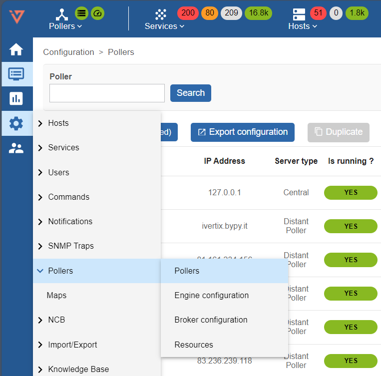

2. Click on Poller1 **Poller1**
3. Rename **Poller1** with a new name, according to your internal naming convention
4. Enter the IP address of the Smart Poller

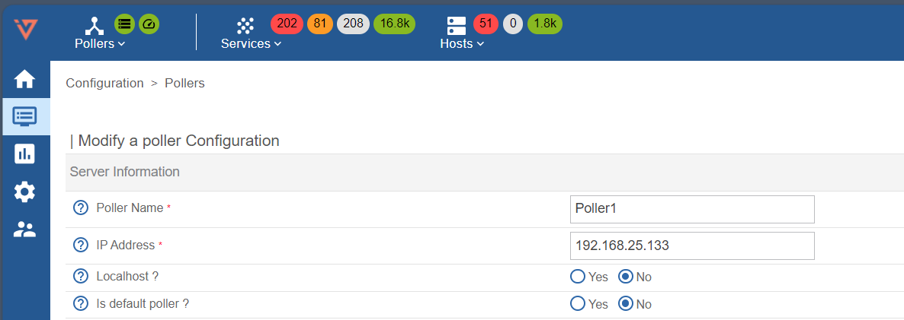

5. Save this configuration by clicking **Save** at the top right corner

---

## Broker configuration

1. go to Configuration -> Pollers -> Broker configuration

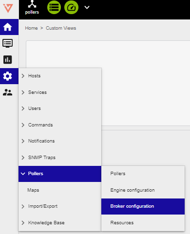

2. Click on Poller1 **Poller1**
3. In the **General** tab rename **Poller1** with a new name, according to your internal naming convention
4. Set the field **"Event queue max size"** to **250000**

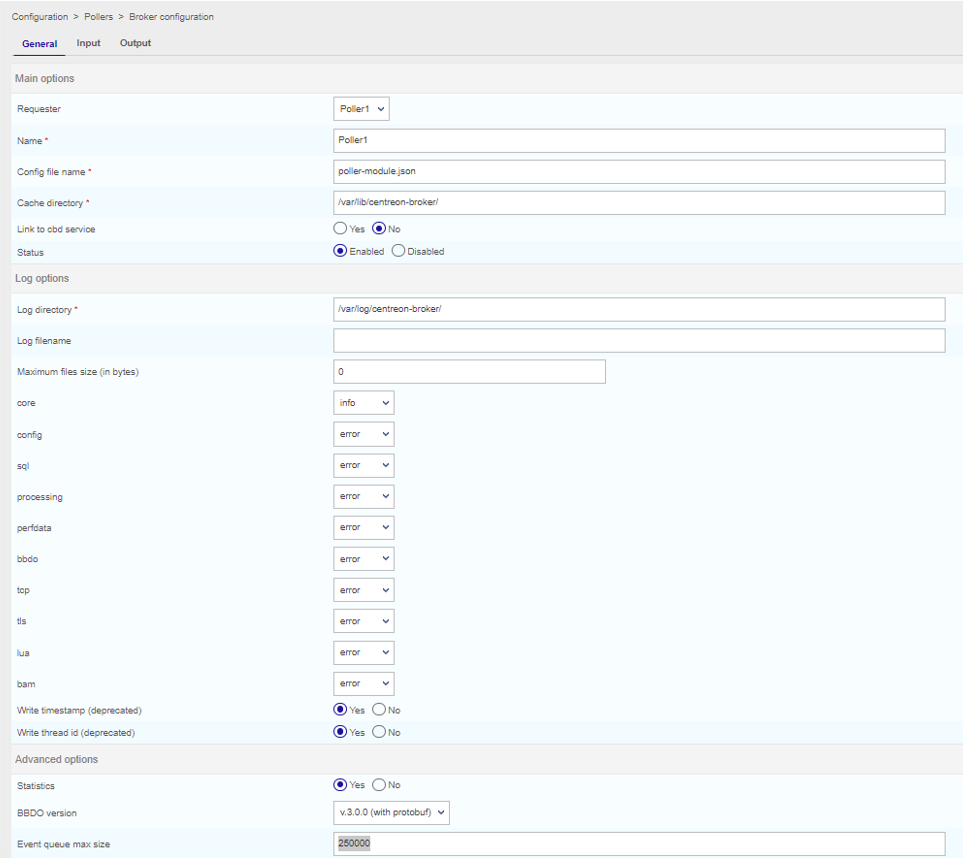

5. Select **Output** tab and enter the Central Manager IP **"Host to connect to"** filed

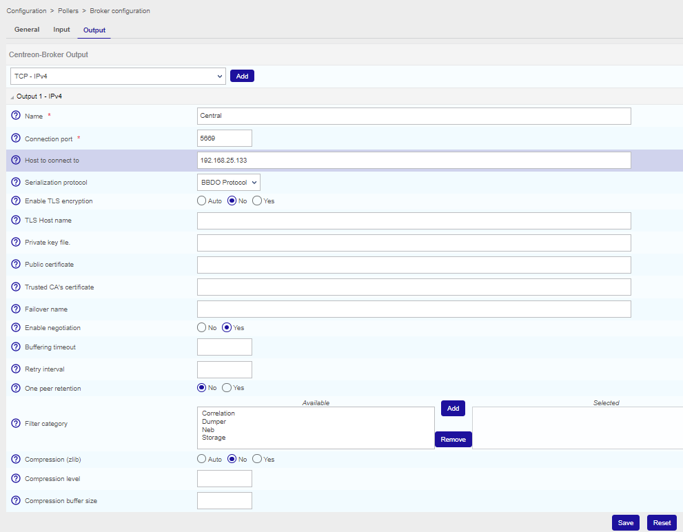

6. Save this configuration by clicking **Save** at the top right corner

---

## Engine configuration

1. go to Configuration -> Pollers -> Engine configuration

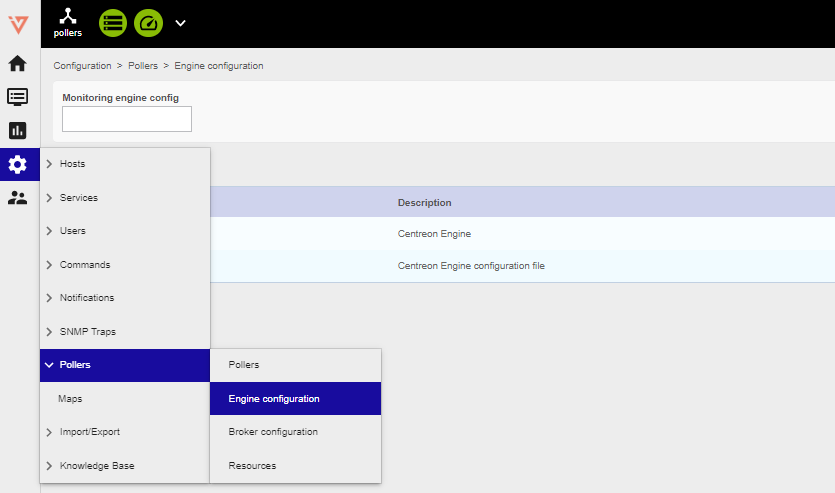

2. Click on Poller1 **Poller1**

3. In **Files** tab configuration Name: replace "Poller1" with a new poller name, as
per your naming convention

4. Go to **Data** tab

5. Enter two **empty** brocker directive like the image below (clik **+ Add a new entry** twice):

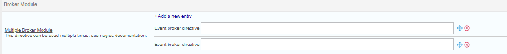

And write the first path on the first directive and the second on the following one

    1 - /usr/lib64/centreon-engine/externalcmd.so

    2 - /usr/lib64/nagios/cbmod.so /etc/centreon-broker/poller-module.json

The result should be like the image below

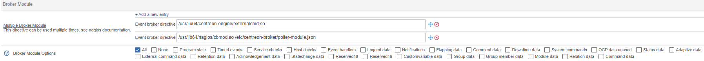

---

## Pollers restart

1. Go to Configuration -> Pollers -> Pollers

2. Select the Smart Poller that is being configured

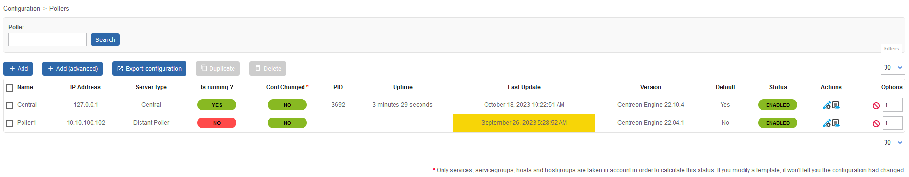

3. Click on **Export configuration**

4. Select the first 4 options (at left) , then select **Method -> Restart** in the drop down menu

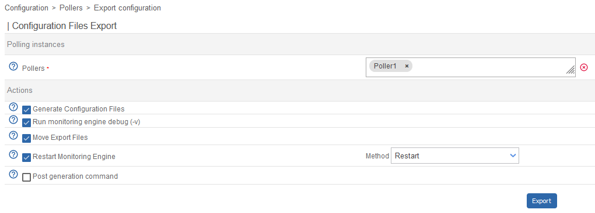

5. Log on to the Central Management (SSH) do a sudo bash and enter the password

:::caution Mandatory

The following steps are mandatory in any case Central Manager performs such a synchronization every 4 hours

:::

6. Launch the following commands:

    1 - *scripts*

    2 - *cd i-vertix/*

    3 - *./sync_poller.sh*

7. In case the system asks for a **yes/no** confirmation answer yes, the CLI will show as many "ok" as the number of Pollers that are being synchronized

8. Final check, select: Configuration -> Pollers -> Pollers

Check the configuration is like the one shown
in the picture.

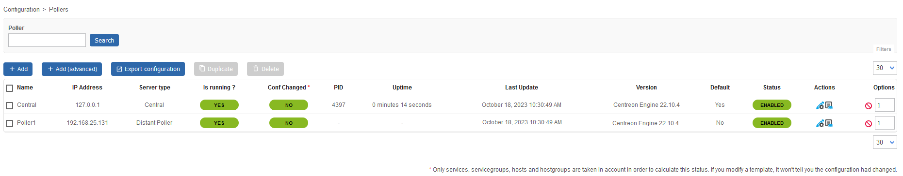

</TabItem>
<TabItem value="i-Vertix4 Poller" label="i-Vertix4 Poller">

To attach a Smart Poller **i-Vertix4** to a Central Management, please follow these instructions:

1. go to Configuration -> Pollers -> Pollers

2. Click on Poller1 **Poller1**
3. Rename **Poller1** with a new name, according to your internal naming convention
4. Enter the IP address of the Smart Poller

5. Save this configuration by clicking **Save** at the top right corner

---

## Broker configuration

1. go to Configuration -> Pollers -> Broker configuration

2. Click on Poller1 **Poller1**
3. In the **General** tab rename **Poller1** with a new name, according to your internal naming convention
4. Set the field **"Event queue max size"** to **250000**

5. Select **Output** tab and enter the Central Manager IP **"Host to connect to"** filed

6. Save this configuration by clicking **Save** at the top right corner

---

## Engine configuration

1. go to Configuration -> Pollers -> Engine configuration

2. Click on Poller1 **Poller1**

3. In **Files** tab configuration Name: replace "Poller1" with a new poller name, as
per your naming convention

4. Go to **Data** tab

5. Enter two **empty** brocker directive like the image below (clik **+ Add a new entry** twice):

And write the first path on the first directive and the second on the following one

    1 - /usr/lib64/centreon-engine/externalcmd.so

    2 - /usr/lib64/nagios/cbmod.so /etc/centreon-broker/poller-module.json

The result should be like the image below

---
## Gorgone configuration export

- Synchronize the Plugins from Central to the Poller
	- Login through SSH on Central and became root user **(sudo bash)**
	- start the script **/opt/pgum/scripts/i-vertix/sync_poller.sh**

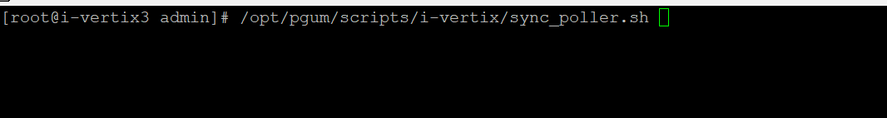

Now you have all plugins on your Poller

- Create the Gorgone configuration for the new Poller
	- logon on your i-Vertix Central GUI and go to **Configuration -> Pollers**
	- click on the ICON **“Gorgone configuration”** under **Actions**

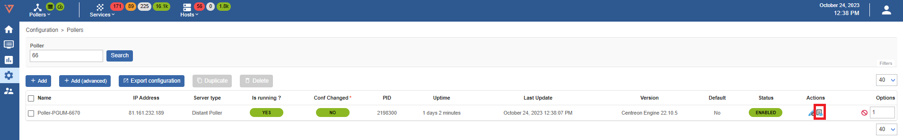

	- this screen will appear

Press “Copy to clipboard"

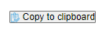

- Now login to the i-Vertix4 Poller through SSH and became **root**
	- paste the copied information and press enter

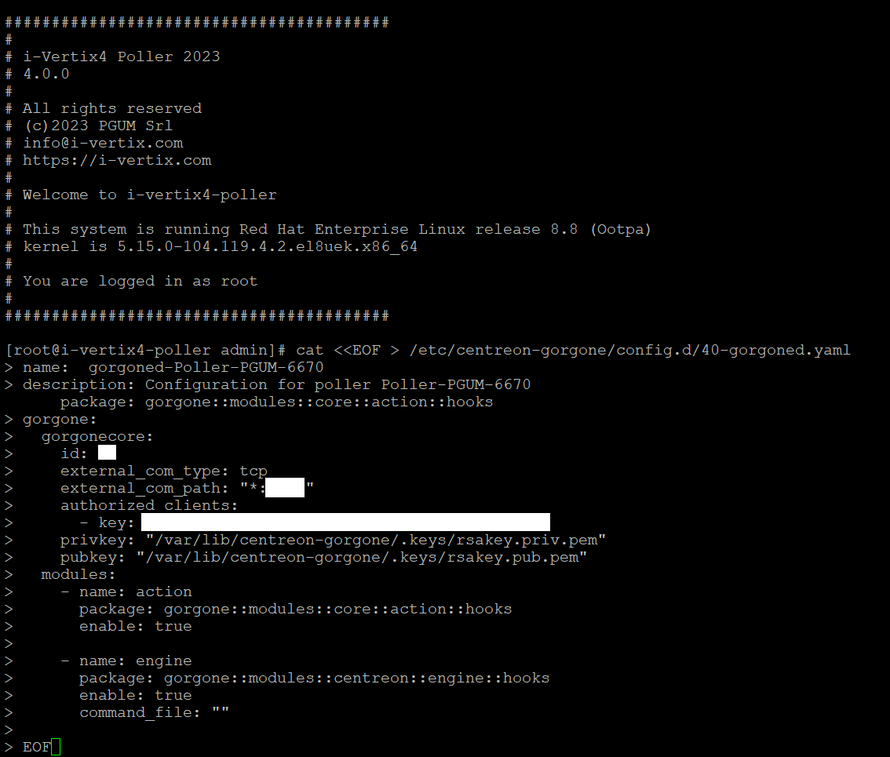

	- restart the gorgone service on your Poller
	    - systemctl restart gorgone.service

---

## Pollers restart

1. Go to Configuration -> Pollers -> Pollers

2. Select the Smart Poller that is being configured

3. Click on **Export configuration**

4. Select the first 4 options (at left) , then select **Method -> Restart** in the drop down menu

5. Log on to the Central Management (SSH) do a sudo bash and enter the password

:::caution Mandatory

The following steps are mandatory in any case Central Manager performs such a synchronization every 4 hours

:::

6. Launch the following commands:

    1 - *scripts*

    2 - *cd i-vertix/*

    3 - *./sync_poller.sh*

7. In case the system asks for a **yes/no** confirmation answer yes, the CLI will show as many "ok" as the number of Pollers that are being synchronized

8. Final check, select: Configuration -> Pollers -> Pollers

Check the configuration is like the one shown
in the picture.

</TabItem>
</Tabs>