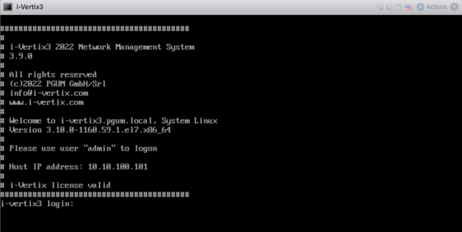

import Tabs from '@theme/Tabs';
import TabItem from '@theme/TabItem';

## First Login

After completing the VM configuration procedure in the chosen hypervisor, **start** the Central Manager and Smart Poller VMs.

The following configuration steps must be performed on both the Central Manager and the Smart Poller.
Startup can take from a few seconds to some minutes.

It is recommended that the startup process is checked through the **hypervisor console**.

Once the VM is started, the following screen with a login prompt will be displayed:

<Tabs>
<TabItem value="i-Vertix3" label="i-Vertix3 (Central & Poller)" default>



On **i-Vertix3** system you will need to log into i-Vertix Monitoring console to configure the network settings, using the following credentials:

1. User: '**admin**'

2. Password: '**password**' (to be changed as soon as possible)

:::caution

If you fail the login process three times, the IP Address will be blocked for 30 minutes (see [fail2ban](../../installation/security-aspects/fail2ban.md)).

:::

After the authentication, a menu that allows you to configure the next steps is displayed


> Note:
    > If the menu doesn’t appear automatically at startup, simply type on the console the command ```menu```.

The first task to be completed must be the [network configuration](network-configuration.md)

**NOTE:**
> Please be sure the [technical information](../before-you-start/technical-information.md) are done

---

:::note

Check that **DNS** is working

Type **ping www.google.com** and verify that the output returns Google IP Address, for example:

```
ping www.google.com
PING www.google.com (142.250.180.164) 56(84) bytes of data.
64 bytes from mil04s44-in-f4.1e100.net (142.250.180.164): icmp_seq=1 ttl=117 time=5.76 ms
64 bytes from mil04s44-in-f4.1e100.net (142.250.180.164): icmp_seq=2 ttl=117 time=6.11 ms
64 bytes from mil04s44-in-f4.1e100.net (142.250.180.164): icmp_seq=3 ttl=117 time=5.99 ms
64 bytes from mil04s44-in-f4.1e100.net (142.250.180.164): icmp_seq=4 ttl=117 time=5.87
```


Check that Internet access is available (http and https).

Type **cd /tmp** then **wget www.google.it**, type **ll** to make sure that the file **index.html** was created.

:::

---

:::info

Internet connection should always be available, to perform (among other things):
1. [License installation](license.md) (performed by i-Vertix personnel)

2. [Plugin Packs installation](../../monitoring-resources/monitoring-basics/plugin-packs.md) (performed by i-Vertix personnel)

3. [NTP configuration](ntp-configuration.md)

:::

</TabItem>
<TabItem value="i-Vertix4" label="i-Vertix4 (Poller)">


On **i-Vertix4** system you will need to log into i-Vertix Monitoring console to configure the network settings, using the following credentials:

1. User: '**admin**'

2. Password: '**changeme**' (to be changed as soon as possible)


:::caution

If you fail the login process three times, the IP Address will be blocked for 30 minutes (see [fail2ban](../../installation/security-aspects/fail2ban.md)).

:::

After the authentication, a menu that allows you to configure the next steps is displayed


> Note:
    > If the menu doesn’t appear automatically at startup, simply type on the console the command ```menu```.

The first task to be completed must be the [network configuration](network-configuration.md)

**NOTE:**
> Please be sure the [technical information](../before-you-start/technical-information.md) are done

---

:::note

Check that **DNS** is working

Type **nslookup www.google.com** and verify that the output returns Google IP Address, for example:

```
nslookup www.google.com
Server:         192.168.25.2
Address:        192.168.25.2#53

Non-authoritative answer:
Name:   www.google.com
Address: 142.251.209.4
Name:   www.google.com
Address: 2a00:1450:4002:402::2004
```

:::

---

:::info

Internet connection should always be available, to perform (among other things):
1. [License installation](license.md) (performed by i-Vertix personnel)

2. [Plugin Packs installation](../../monitoring-resources/monitoring-basics/plugin-packs.md) (performed by i-Vertix personnel)

3. [NTP configuration](ntp-configuration.md)

:::

</TabItem>
</Tabs>