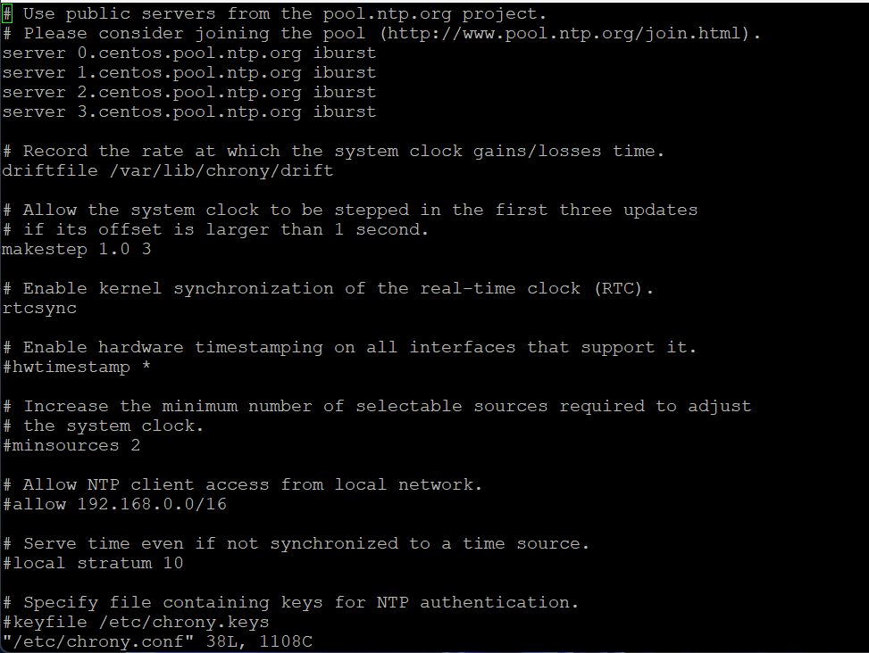

import Tabs from '@theme/Tabs';
import TabItem from '@theme/TabItem';

:::info

Here you can find a list of all usable timezones:

https://en.wikipedia.org/wiki/List_of_tz_database_time_zones


:::

<Tabs>
<TabItem value="i-Vertix3" label="i-Vertix3 (Central & Poller)" default>

## Modifying NTP settings on i-Vertix3 Poller

In the system shell follow this procedure:

1. Run the command *sudo bash* (root password is required)
2. Launch the command *chronyc tracking* (to check synchronization, see ex. 1)
3. Run the command *chronyc sources* (to che NTP source, see ex. 2)

---
## Modifying NTP settings

1. Run the command *sudo bash* (root password is required)
2. Run the command *vi /etc/chrony.conf* (see ex. 3)
3. Comment (using the *#*) servers 0, 1, 2, 3 and insert the NTP Server address that fit your necessities (if
requested)
4. Save the file
5. Run the command:
```bash
systemctl restart chronyd.service
```

### Examples i-Vertix3

Below are some examples of commands to run to diagnose any problems

#### Example 1 *chronyc tracking*


#### Example 2 *chronyc sources*


#### Example 3 *vi /etc/chrony.conf*



</TabItem>
<TabItem value="i-Vertix4" label="i-Vertix4 (Poller)">

## Modifying NTP settings on i-Vertix4 Poller

After logging in run the **menu** command


and choose option **5** (i-Vertix Poller Settings)


The options will be displayed:
1. NTP time settigs
2. change timezone

By choosing option **2**, you will be able to change the default timezone (Europe/Rome)


to the one you want (e.g. Europe/London) you will be prompted to answer yes if you want to change the timezone.


The system will confirm this choice.


And finally


It is preferable, then, to return to the previous menu and choose 1 to set the system time according to the new timezone.


:::note

View the commands below (example 1, 2, and 3) for diagnosing any problems

:::

### Examples i-Vertix4

Below are some examples of commands to run to diagnose any problems

#### Example 1 *chronyc tracking*


#### Example 2 *chronyc sources*


#### Example 3 *vi /etc/chrony.conf*


</TabItem>
</Tabs>