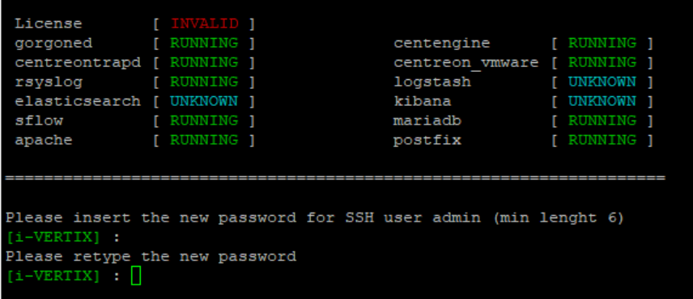

## Configuration of system password (CLI)

In order to **modify the password**:

1) Log into the system

2) Enter **menu** command

3) Select option **10) i-Vertix poller passwords** _(in case of Smart Poller)_

4) Select option **11) Set i-Vertix poller passwords** _(in case of Central Manager)_

5) Type the new password **_(min. 6 characters)_** for **SSH user admin**, twice _(for Central Manager & Smart Poller)_

6) Type the new password **_(min. 6 characters)_** for **SMB user i-vertix**, twice _(for Central Manager only)_

