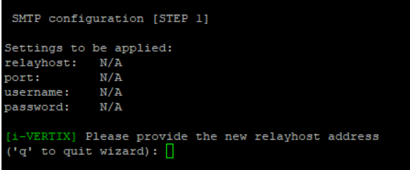

import Tabs from '@theme/Tabs';
import TabItem from '@theme/TabItem';

Email notifications settings can be configured on both Central Manager and Smart Poller.

:::info

By default notifications about to monitored devices/services are sent by the Smart Pollers.

:::

Since the Central Manager can perform self-diagnostics procedures, in case it detects any issues, it can generate alarm notifications as well.
Therefore SMTP should be configured also on the Central Manager itself.

<Tabs>
<TabItem value="i-Vertix3" label="i-Vertix3 (Central & Poller)" default>

## SMTP Configuration

* Select option **`7`** - SMTP settings (e-mail)

* a new menu shows up

* Select **Y** and a new menu shows up

* Select the proper SMTP option among the proposed ones

### Available options

1. **Normal SMTP**: please follow each step carefully

    

2. **SMTP with authentication**

    

3. **SMTP for Office365 or Amazon AWS SES**

    

---

### Configuration steps for SMTP

Compile every voice the menu steps indicate for each SMTP option you choose.

Once the proper option has been selected and configured, quit by typing **`q`**

If you want to test the configuration you've just made, simply type **`T`** in the menu.

:::caution

Provide a real e-mail sender and receiver for the test

:::

</TabItem>
<TabItem value="i-Vertix4" label="i-Vertix4 (Poller)">

## SMTP Configuration

* Select option **`7`** - SMTP settings (e-mail)

* a new menu shows up which displays what the current relayhost configurations are

* Select the proper SMTP option among the proposed ones

### Available options

1. **Normal SMTP**: please follow each step carefully

    

2. **SMTP with authentication**

    

3. **SMTP for Office365 or Amazon AWS SES**

    

### Configuration steps for SMTP

Compile every voice the menu steps indicate for each SMTP option you choose.

Once the proper option has been selected and configured, quit by typing **`q`**

If you want to test the configuration you've just made, simply type **`T`** in the menu.

:::caution

Provide a real e-mail sender and receiver for the test

:::

---

</TabItem>
</Tabs>
