## Job settings

Install the Cisco Meraki Cloud Controller plugin from the Plugin Store : **Administration -> i-Vertix -> Plugin Store**

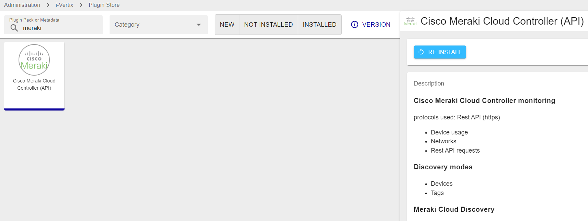

### Main settings
Add new job and select Cisco Meraki from this path: **Configuration -> Hosts -> Discovery Jobs**

* **Job Name**: use a meaningful name 
*  **Poller**: select the Smart Poller that will run the scan
* **Meraki API Token**: add Meraki Token API
    * Several tokens can be stored
    * The authentication token is provided directly by the Meraki console

    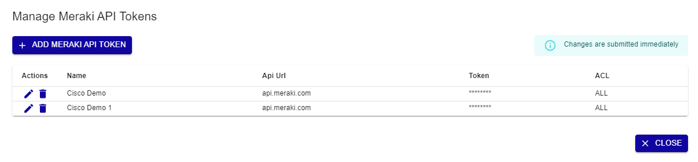

* **Organization**: Select the Organization
* **Networks**: Select the Network (optional)
* **Hostname Prefix**: string of characters that provides information about the device (optional)
* Select **Use cache** if you have a large number of devices and API requests are high (optional)

### Access
**Access Groups**: user group that can view and modify this job and all the hosts it will discover

### Excluded Object
List of hosts excluded from the discovery  

Click on **Next** to move to the next configuration settings page

### Template Rules

Mapping rules are preconfigured by i-Vertix

:::note

It can happen that some **Template Rules** are missing. In such a case:
* **Download the relevant plugin** from the Plugin Store and install it
* Click on **RESET** to add Template Rules included in the plugin you have just installed to the Template Rules list
* Contact support@i-vertix.com if the template rule is still not available

:::

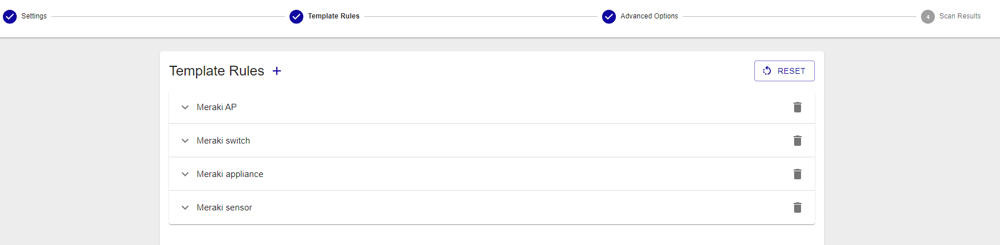

### Advanced Options
* Devices with coordinates can be placed on i-Vertix Maps, create a [geo map](../../i-vertix-maps/map-types.md) before running the discovery 
* Devices can be assigned to custom hostgroups, Network or Organization hostgroups

### Scan Results

Once the scan completes, its **results are displayed**.

They depend on hosts reachability, template rules mapping, API reachability and status filters that have been applied (Note: “new” and “existing (ip)” are applied by default).

Different filters are available: **Device, Type, Networks, Device Status, Status, Model, Serial, Tags**.

**Device status** filters are:
* Online
* Offline
* Alerting
* Dormant

**Status** filters are:

* **new**: hosts are highlighted in green. Connection was established and the proper templates were assigned to the hosts. To start monitoring new hosts, select them and click on **ADD TO MONITORING**.
* **existing (ip)**: an host with the **same IP address** had already been detected. The host is likely already being monitored.
* **existing**: an host with the **same IP address and hostname** had already been detected. The host is likely already being monitored.
* **conflict**: an host with the **same hostname** had already been detected, or **the host doesn’t have any hostname**. To resolve the conflict, hostname has to be entered or modified.
* **excluded**: the host was excluded from the discovery (**EXCLUDED HOST**).
* **no template assigned**: the host didn’t match any templates. Amend the discovery job and assign a new template rule, or add the host manually.

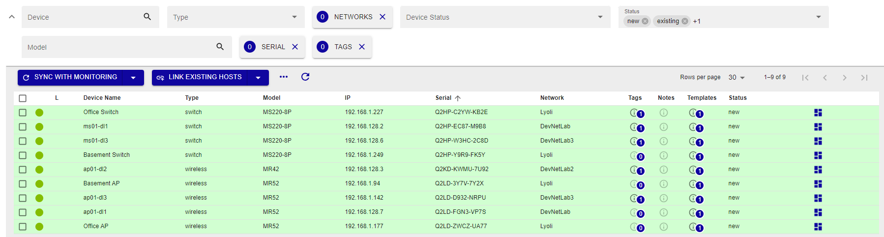

The result tab displays the hosts that were detected by the discovery, along with the following information:

* **Device name**
* **Type**: Host/device type
* **Model**: Host/device model 
* **IP**: Host IP Address
* **Serial**: serial number
* **Network**: the network on which the host is located
* **Templates**: Template(s) assigned to the Host  
* **Status**: Host status

To see Host details, click on it

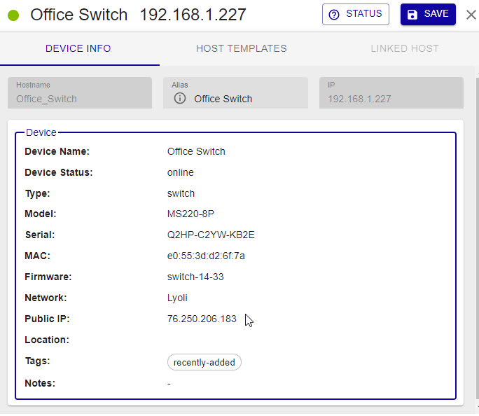

### Device info

* Hostname: it can be changed if the host is not yet being  monitored
* Alias: optional description, it can always be changed 
* IP: Host IP Address

### Device

* Device Name
* Device Status: status can be online, offline, alerting, dormant
* Type: Device type
* Model: Device model 
* Serial: Device serial number
* MAC: Host mac address
* Firmware: Firmware version
* Network: the network on which the host is located
* Public IP
* Location: device location
* Tags
* Notes: description field

### host templates

* **Templates from rules** 

Host template associated with the host as per Template Rules match. To replace it or add another/others, click on **+ HOST TEMPLATE**

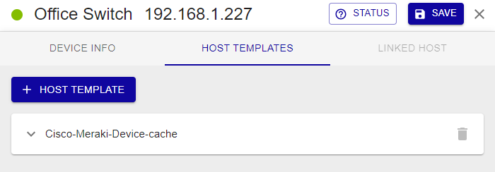

### Linked host

Link to Host is only available for device in state existing or existing ip.

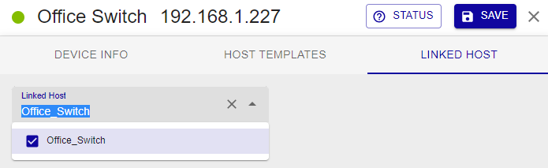

## How to monitor Hosts

Select the hosts you want to monitor and click on **SYNC WITH MONITORING**.

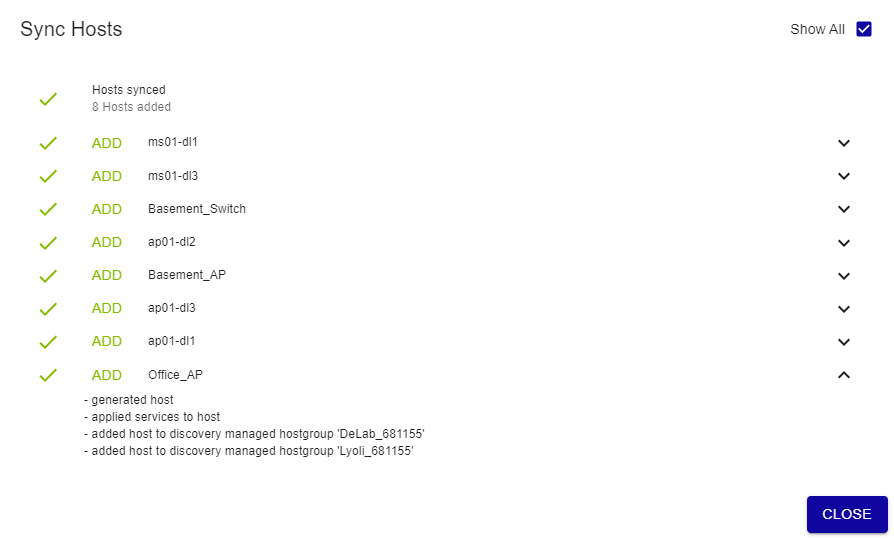

:::note

As previously stated, any changes will take effect only once they are exported to the **Smart Poller(s)**. 

:::

## Meraki Dashboards

For wireless devices, different information is collected and displayed in dashboards. For access, follow this path:

**Reporting -> Meraki Dashboard -> Wireless**

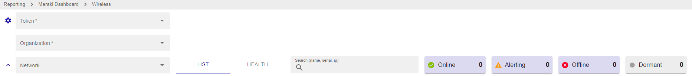

### List tab

To view the list of devices, select the mandatory **Token** and **Organisation** fields in the filters. Other filters are available, including Networks, Search by Name, IP or Serial, Device Status.

The list tab displays the hosts that were detected by the discovery, along with the following information:

* **Device status**: status can be online, offline, alerting, dormant
* **Name**: Device name
* **Serial**: serial number
* **Model**: Host/device model 
* **Public ip**: Host IP Address
* **Local ip**: Host IP Address
* **Ethernet**: 
* **Monitored**: 
* **Status**: Host status

To see Host details, click on it:

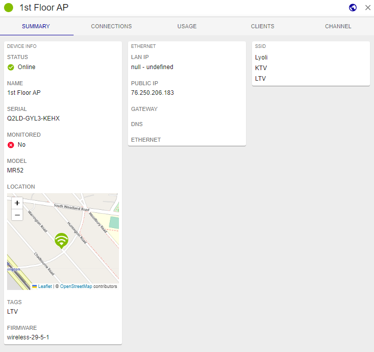

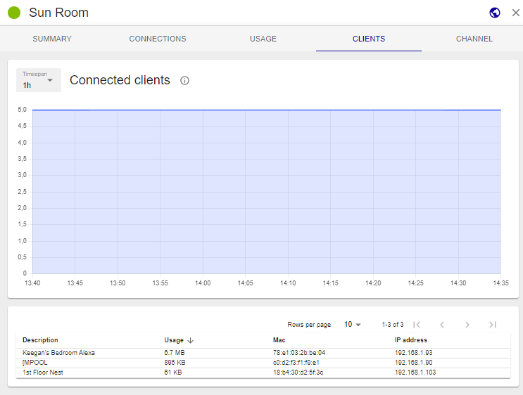

### health tab
Before selecting the tab, the function must select at least one available network.

New search filters based on SSID and Timespan are available.

i-Vertix IT Monitoring offers various dashboard:

**Problematic connection step**

A problematic connection step with the Cisco Meraki Dashboard refers to a specific stage or action in the process of connecting to and accessing the Dashboard that is encountering difficulties or issues. It indicates that there is a specific point in the connection flow where problems are arising, resulting in an inability to establish a successful connection or access the Dashboard's features and functionality.

When facing a problematic connection step with the Cisco Meraki Dashboard, it's important to identify the specific stage or action causing the issue in order to troubleshoot effectively. 

**Connection issues by SSID**

Connection issues by SSID in the Cisco Meraki Dashboard refer to problems encountered when attempting to establish a wireless network connection using a specific Service Set Identifier (SSID). An SSID is a unique identifier assigned to a wireless network to distinguish it from other nearby networks.

**Connection issues by client or device type**

Connection issues by client in the Cisco Meraki Dashboard refer to problems encountered by specific devices or clients when attempting to establish a connection to the network. It means that certain devices or users are experiencing difficulties connecting to the network, while other devices may connect without any issues.

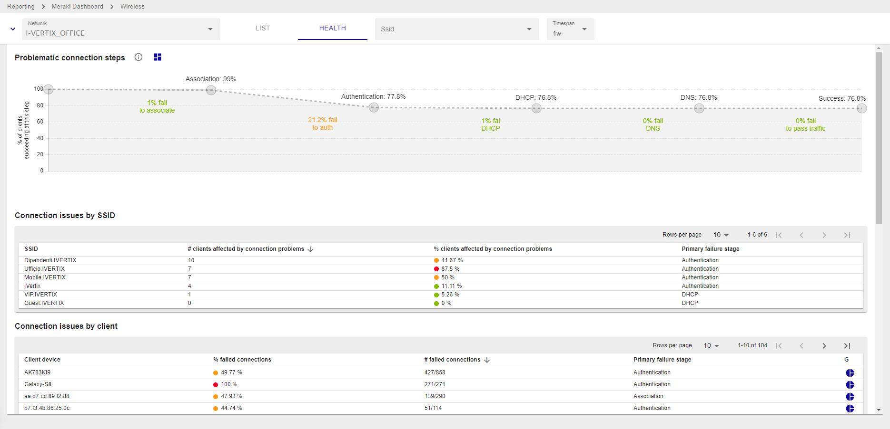

**Connection issues by AP**

Connection issues by Access Point (AP) in the Cisco Meraki Dashboard refer to problems encountered with a specific AP or group of APs in the network. It means that certain APs are experiencing difficulties in establishing and maintaining connections with client devices, resulting in poor or inconsistent network connectivity.

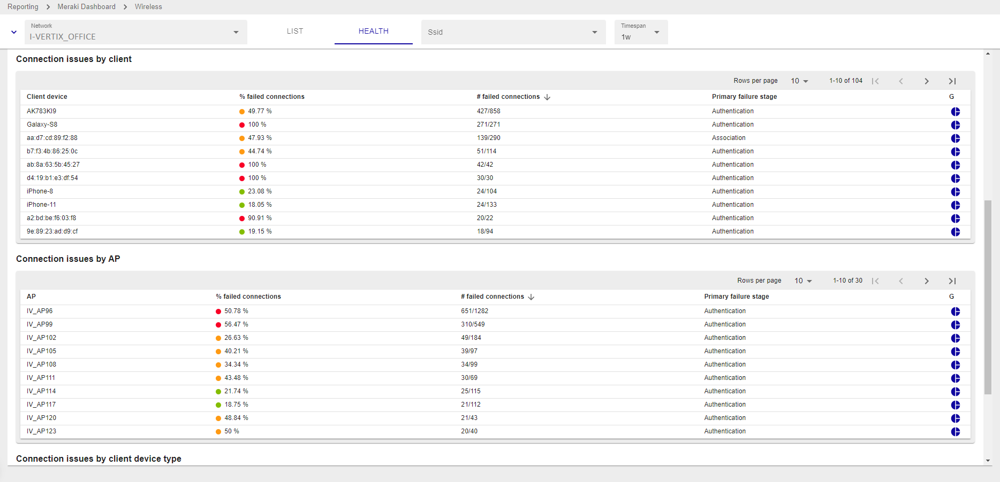

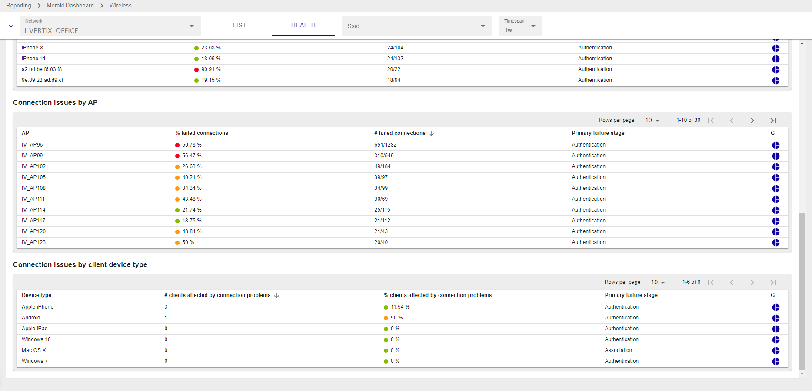

### How to add the Problematic connection step widget to your dashboards

1. Press on the button **Create widget on custom view**

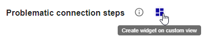

2. Select a **Custom view** or click on **Create new custom view**

If you choose to create a new custom view select the number of column

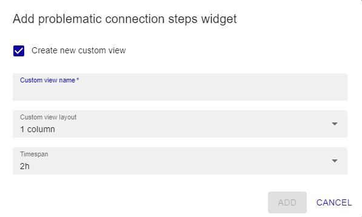

3. Select the Timespan

4. Press ADD

The custom view now is ready, follow this path: **Home -> Custom Views**