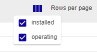
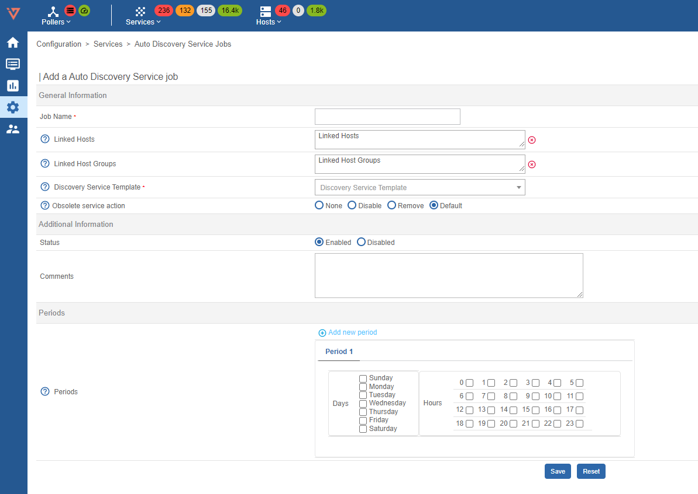

## Manual Discovery

Go to the **Configuration > Services > Manual Discovery**.

Select a Host and a Discovery Template, then press scan to start the Service Discovery. It is also possible to filter by Poller, Hostgroup. 

### Debug

Scanning with the Debug flag set will display a window with the command executed during the scan. The command can be copied and used to further analyse the result.

### Filtered

Only after scanning can the Filtered flag be unchecked, this option allows the selection of discovery templates that are not directly related to the host. 

## Discovery result

Once the scan completes, the results are shown. Available filters are: **Search** and **Status**. Status filter "new" is applied by default.

**Status** filters are:

* **new**: services that have not yet been monitored. To start monitoring new services, select them and click on **SYNC TO MONITORING**.
* **excluded**: a service that has already been identified and will not have to be monitored.
* **existing**: the service is likely already being monitored.

The Toggle columns button allow to allow to hide and apply filters to columns

During scanning, the SCAN button is replaced by the ABORT button, which can be pressed to cancel the scan.

### Services by host

The services were added and can be displayed in the menu **Configuration -> Services -> Services** by host:

## Auto Discovery Service Job

### Overview

An Auto discovery Service Job allows to dynamically create services and to link them to a
host, based on the elements discovered.

To create a rule, go to **Configuration > Services > Auto Discovery Service Jobs** and click on the **Add** button:

**General information**

* Job name: descriptive name
* Linked Hosts: the hosts on which the discovery command should be run
* Linked Host Groups: the host groups on which the discovery command should run
* Discovery Service Template: the Discovery service template used for the discovery on host
* Obsolete service action: defines the action to be carried out when a configured service is no longer available in the scan result. Default uses the global discovery settings.

**Additional information**
* Status: Enabled or Disabled
* Comments: text field for notes

**Periods**
* Periods: set days and hours for the Auto Discovery. Leave days and hour empty to use Auto Discovery Defaults. Press Add new period to schedule the execution of jobs over several time periods.

Press **save** to add the auto discovery job

### Job Execution

The job will run according to the previously configured schedule, or select the job(s) and click **Schedule immediate discovery (Forced)** from the More Actions drop down menu to start the discovery immediately.

