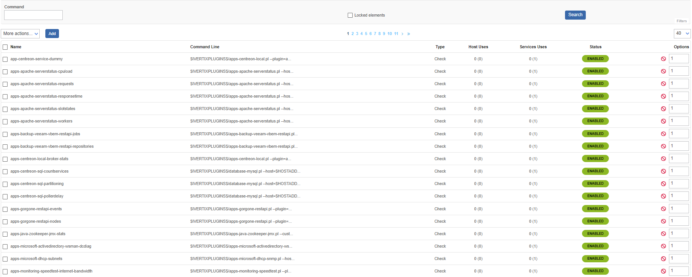
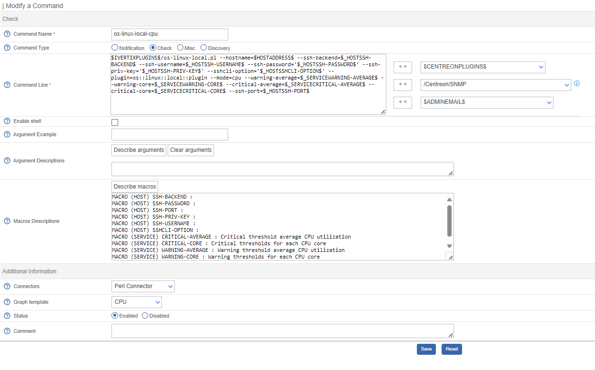

import Tabs from '@theme/Tabs';
import TabItem from '@theme/TabItem';


## Definition

A **command** is the definition of a line of code that uses a script or application to perform an action. It is
possible to execute this command by specifying arguments.

There are four types of command:

* **Verification** checks commands are used by the schedulers to verify the status of a host or of a service.
* **Notification** commands are used by the schedulers to notify contacts (by email, SMS, etc).
* **Discovery** commands are used by the schedulers to perform discovery.
* **Miscellaneous** commands are used by the additional modules (to perform certain actions), by the scheduler for data processing, etc.
  data processing, etc.

All the commands can be configured in the menu: **Configuration > Commands > Checks**.


:::info

By default, locked commands are hidden. 

Check the "Locked elements" box to list all commands.

:::

## Adding a command

1. Go to the **Configuration > Commands** menu
2. Click on **Add**



:::note

The configuration fields of a command are the same regardless of the type of command chosen.

:::

## Configuration fields

* The **Command Name** field defines the name of the command.
* The **Command Type** field allows us to select the type of command.
* The **Command Line** field indicates the application or script to use with the command.
* The **Enable Shell** field allows us to enable functions specific to a shell, such as the pipe, etc.
* The **Argument Example** field defines examples of arguments (each argument starts with a ```"!"```).
* The **Describe arguments** button is used to add a description to arguments of the ```"$ARGn$"``` type. This description will be visible when the command is used in a host or service form.
* The **Clear arguments** button clears the description of defined arguments.
* The **Describe macros** button is used to add a description to all macros. This description will be visible when the command is used in a host or service form.
* The **Connectors** selection list is used to associate a connector with the command. For more information on connectors, see the *[Perl Connector](#perl-connector)* and *[SSH Connector](#ssh-connector)* chapters.
* The **Graph Template** field is used to associate the command with a graphical model.
* The **Comment** field can be used to add a comment to the command.

## Arguments and macros

In the **Command Line** field it is possible to use *[macros](macros.md)**and arguments.

The macros are used to pass various settings to the scripts called by the commands.
When the Scheduler executes the command, each of the arguments and macros are replaced with their respective values.

Each macro appears in the form ```$value$```:

```shell
$IVERTIXPLUGINS$/os-linux-local.pl --plugin=os::linux::local::plugin --mode=cpu \
--hostname=$HOSTADDRESS$ --ssh-backend=$_HOSTSSH-BACKEND$ --ssh-username=$_HOSTSSH-USERNAME$ \
--ssh-password='$_HOSTSSH-PASSWORD$' --ssh-priv-key='$_HOSTSSH-PRIV-KEY$' --sshcli-option='$_HOSTSSHCLI-OPTION$' \
--warning-average=$_SERVICEWARNING-AVERAGE$ --warning-core=$_SERVICEWARNING-CORE$ \
--critical-average=$_SERVICECRITICAL-AVERAGE$ --critical-core=$_SERVICECRITICAL-CORE$ \
--ssh-port=$_HOSTSSH-PORT$
```

:::tip

Good practice requires replacing the arguments by *[custom macros](macros.md#custom-macros)*.

:::

## Connectors

### SSH connector

SSH Connector is a free software under the Apache Software License version 2 (ASL 2.0).

It speeds up execution checks over SSH when used together with the monitoring engine.

### Perl connector

Perl Connector is a free software under the Apache Software License version 2 (ASL 2.0).

It speeds up the execution of Perl scripts when used together with the monitoring Engine.