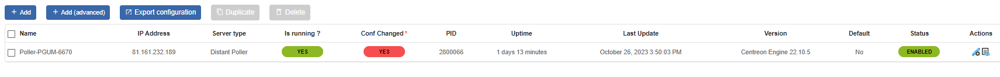
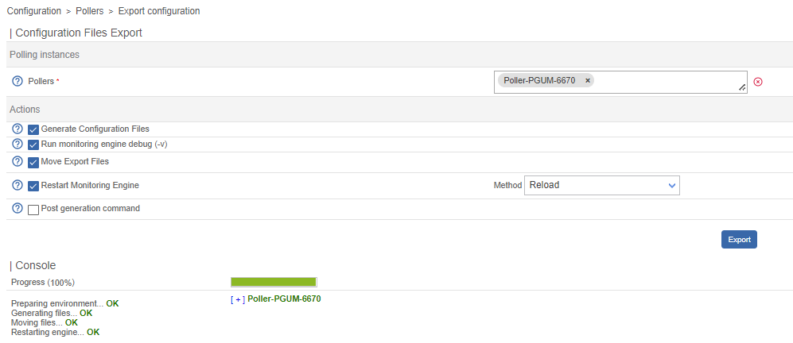
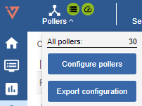

When you create, delete or edit objects (hosts, services, thresholds, etc.) in the **Configuration** menu, the changes are not automatically applied (neither to the central server on which you have made the change or poller connected to it).

In order for the changes to be taken into account, you must export the configuration.

Any change to the configuration must be made and exported from the Central Server interface or API, regardless of which poller is affected by the change (Central Server or Poller).

## Exporting the configuration

1. Go to the **Configuration > Pollers > Pollers** page. The page shows the status of your Central Server and any
Server and all the Pollers linked to it: changes are shown in the **Conf changed** column.

2. Select the Central Server or Poller whose configuration has changed.  

   

3. Click on **Export configuration**.

4. Check the following boxes (see section [**Export options**](#export-options)) :

   - **Generate Configuration Files**
   - **Run monitoring engine debug (-v)**
   - **Move Export Files**
   - **Restart Monitoring Engine**. Use the most appropriate method:
     - **Reload** : if you have created, deleted or edited monitored objects
     - **Restart** : if you have made changes to the way a poller communicates with the central server, or
     to the configuration of the engine. Restarting takes more time than reloading.

5. Click on **Export**. A log of the export will be displayed.

    

6. Read the log to check that the export worked normally and that no errors were returned.

## Export options

The options work as follows:

- **Generate Configuration Files**: Generates the monitoring engine configuration
  files in a temporary directory. This configuration is generated from objects that have been configured via the web interface
- **Run monitoring engine debug (-v)**: Performs a sanity check on the monitoring engine configuration files
- **Move Export Files**: Moves the configuration files from the temporary
  directory to the monitoring engine configuration directory
- **Restart Monitoring Engine**: Restarts the monitoring engine to apply the new
  new configuration
- **Post generation command**: Executes the post-generation command specified in the configuration.

## Quick export

Administrators and users with the [appropriate rights](#activating-the-feature) can activate a quick export button that allows them to export the configurations of ALL pollers at once (i.e. the configuration of the Central Server and Pollers).

### When to use this feature

> Do NOT use this feature if you have a large number of Pollers. This feature is also not suitable if you are an MSP and each poller belongs to a different customer.

### Activating the feature

* The feature is automatically enabled for **admin** users.
* To make this feature available to a **non-administrator** user, make sure they have the [**Deploy Configuration**](../../managing-users-contacts/acl.md#poller-configuration-actions--poller-management) permission and the [**Display Top Counter Pollers Statistics**](../../managing-users-contacts/acl.md#global-functionalities-access) permission.

### Exporting all configurations

To quickly export the configuration for all pollers:

1. Click the **Pollers** menu at the top left of the screen, then click **Export configuration**.

   

2. Confirm the export in the pop-up that appears.