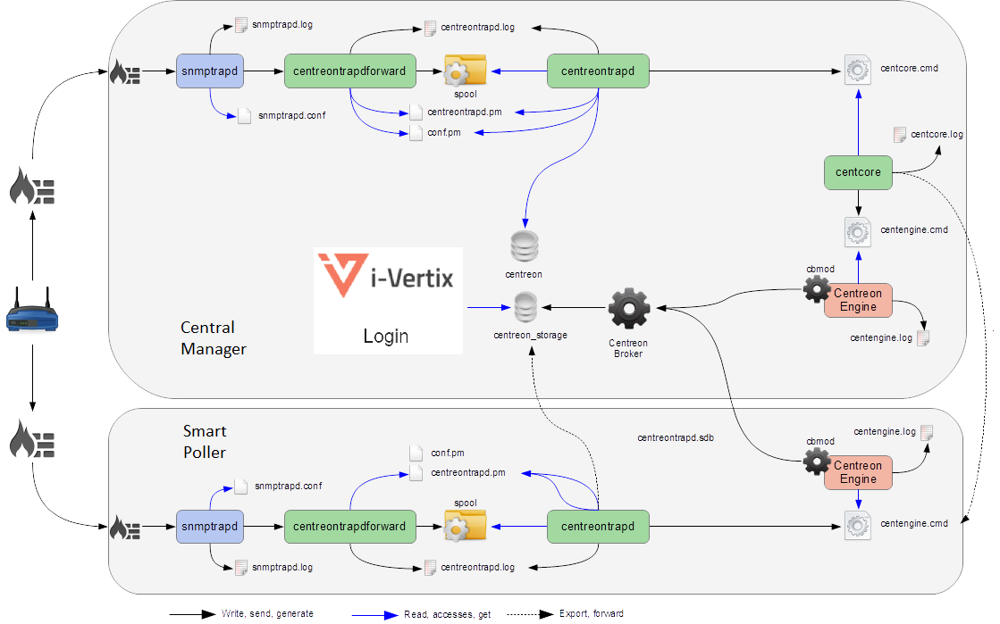

## Debug SNMP Traps

Several elements are involved in SNMP traps management.
In case of a problem, it is necessary to check the proper functioning of its architecture, there are several things to check.

### Sender settings

The first thing to do is to check the configuration of the device or application that issued the trap you should have received.
Check the IP address or DNS name, SNMP community, and version.

### Firewall, routing

The second point is to control network firewalls and software permissions, and to implement a specific routing.
If one or more network firewalls are present, or if port translation and/or IP addressing is in place, make sure that the connection between the sender and the poller is possible.
Using network probes, debugging network devices (firewalls and routers), or software tcpdump/wireshark on the poller can help you confirm receipt of data on UDP port 162.

### Snmptrapd

After validating the connection, check the operational status of the snmptrapd process (which must be running) and its configuration options. It is possible to enable logging of the process.
To do this, edit the **/etc/sysconfig/snmptrapd** file and replace the "OPTIONS" line with the following:

``` shell
# snmptrapd command line options
# OPTIONS="-On -d -t -n -p /var/run/snmptrapd.pid"
OPTIONS="-On -Lf /var/log/snmptrapd.log -p /var/run/snmptrapd.pid"
```

Restart the process to take the changes into account.
Thus, any SNMP traps received will be listed in **/var/log/snmptrapd.log**.

If you are filtering by SNMP community, check the allowed communities in the **/etc/snmp/snmptrapd.conf** configuration file.
If, after all these checks, SNMP traps are not included in the log, verify that the process is listening on UDP port 162 for remote devices by using the command:

``` shell
netstat -ano | grep 162
```

You must have a result like:

``` shell
udp        0      0 0.0.0.0:162             0.0.0.0:*                           off (0.00/0/0)
```

If not, change the listening port of the process.

:::warning

Don't forget to disable the logs after you've finished. Otherwise, the size of the logs can be very important.

:::

### Centreontrapdforward

Once the snmptrapd process is validated, check the centreontrapdforward process.
The first step is to check the access parameters of this process snmptrapd in the file **/etc/snmp/snmptrapd.conf**

* Check that snmptrapd service executes centreontrapdforward. To do this, edit the file **/etc/snmp/snmptrapd.conf** and verify that its contains:

``` shell
traphandle default su -l centreon -c "/usr/share/centreon/bin/centreontrapdforward"
```

If the path to the file is incorrect, change it and restart the snmptrapd process.
You can check that the centreontrapdforward binary is working properly by checking the configuration part of *[centreontrapdforward](enable-snmp-traps.md#centreontrapdforward)*.

### Centreontrapd

The next process to check is Centerontrapd. This daemon allows you to connect an SNMP trap to a passive service connected to a host in i-Vertix using an IP address or DNS from a remote device.
To verify its operation, you should check the centreontrapd configuration settings.

You can check the proper functioning of binary centreontrapd by checking the configuration part of *[centreontrapd](enable-snmp-traps.md#centreontrapd)*.

You can set up debug mode for the **centreontrapd** service. Edit the following file:

```shell
vi /etc/sysconfig/centreontrapd
```

Then modify option **severity** to **debug**:

```shell
OPTIONS="--logfile=/var/log/centreon/centreontrapd.log --severity=debug --config=/etc/centreon/conf.pm  --config-extra=/etc/centreon/centreontrapd.pm"
```

Then restart **centreontrapd**:

```shell
systemctl restart centreontrapd
```

### Gorgone

The Gorgoned daemon must be running to pass information from centerontrapd to the monitoring engine as an external command.
Enable the debug mode via the **Administration > Parameters > Debug** menu and restart the process.

If any external commands are sent to the monitoring engine, please check the path to "$cmdFile" in the **/etc/centreon/conf.pm** configuration file.
The path should be **/var/lib/centreon/centcore.cmd** in a Central i-Vertix IT Monitoring server.

### IT Monitoring Engine

The monitoring engine must receive external commands from i-Vertix Gorgone process in order to change status and output of the passive service.

:::info

Please check the event log.
For IT Monitoring Engine, the path is **/var/log/centreon-engine/centengine.log**.

:::

You should find lines as:

``` shell
[1352838428] EXTERNAL COMMAND: PROCESS_SERVICE_CHECK_RESULT;i-vertx-Server;Traps-SNMP;2;Critical problem
[1352838433] PASSIVE SERVICE CHECK: i-vertix-Server;Traps-SNMP;2;Critical problem
```

If only the external command appears but not the consideration thereof by the scheduler ("PASSIVE SERVICE CHECK"), there may be a system clock problem synchronizing issue.
The server is late and the order will be processed later, either in advance and the order will not be taken into account.


### Detailed diagram

You will find below a detailed diagram of all the processes used and/or present at the reception of an SNMP trap:
