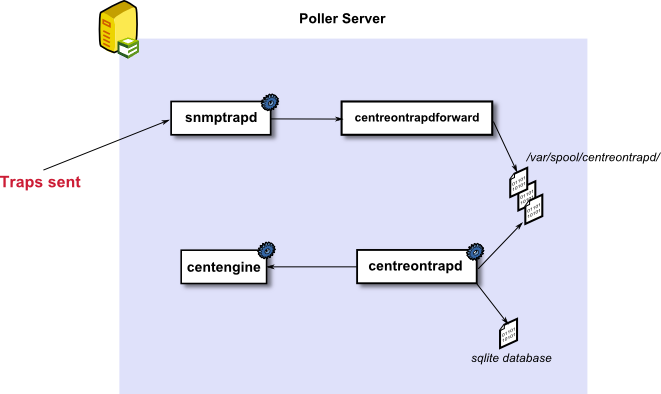
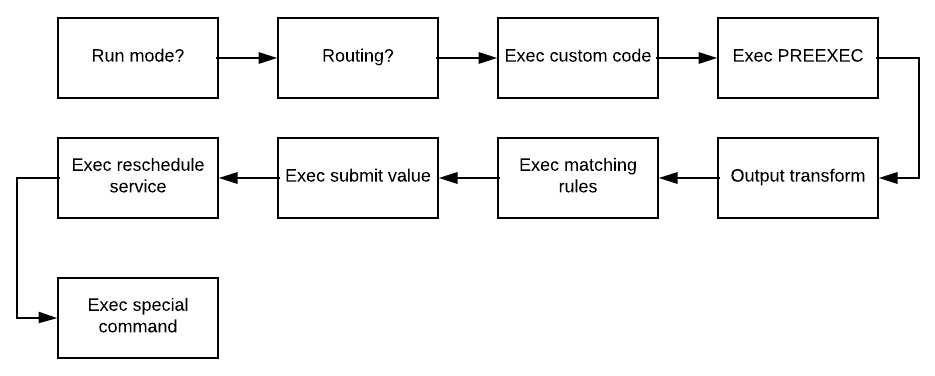

## Description

SNMP traps are information sent from monitored devices to a polling server using the SNMP protocol.
This information contains several attributes, including

* The address of the device sending the information
* The root OID (Object Identifier) corresponding to the identifier of the received message
* The message sent by the SNMP trap, which corresponds to a set of settings (1 through N).

To be able to interpret the received event, the management server must have in its configuration the necessary elements to translate the event.
To do this, it must have a database containing the OID and the descriptions, which are called MIB files. There are two types of MIBs:

* Standard MIBs, which use standardized OIDs and are implemented by many vendors on their devices
* MIB vendors, which are specific to each vendor and often to each device model.

MIB vendors can be retrieved from the device.
I-Vertix allows us to store the definition of SNMP traps in its MariaDB database.
The traps can then be associated with passive services via the **Relationships** tab of a service's definition.

## Architecture

### SNMP trap processing by the central server

SNMP trap processing is as follows:

1. **snmptrapd** is the service that allows the retrieval of SNMP traps sent by the device (by default, it listens on port **UDP 162**).
2. Once the SNMP trap is received, it is sent to the 'centreontrapdforward' script, which writes the received information to a buffer folder (by default **/var/spool/centreontrapd/**)
3. The **centreontrapd** service reads the information received in the buffer folder and interprets the traps received, checking the i-Vertix database for the actions required to handle these events
4. **centreontrapd** transmits the information to the scheduler or the **gorgoned** service (to send the information to a remote scheduler), which changes the status and information associated with the service to which the SNMP trap is linked.


### SNMP trap processing by a poller server

To keep a copy of the SNMP trap configuration on each satellite server, a SQLite database is used to cache the trap information contained in the MariaDB database. This SQLite database is automatically created by the central server.

The processing of an SNMP trap is as follows:

1. **snmptrapd** is the service used to retrieve SNMP traps sent by the device (by default it listens on port **UDP 162**)
2. Once the SNMP trap is received, it is sent to the 'centreontrapdforward' script, which writes the received information to a buffer folder (by default **/var/spool/centreontrapd/**)
3. The **centreontrapd** service reads the information received in the buffer folder and interprets the various traps received, checking in the SQLite database the actions to be taken to process the traps received
4. The **centreontrapd** service transmits the information to the scheduler, which changes the status and information associated with the service to which the SNMP trap is linked.




:::note

The i-Vertix Gorgone process is responsible to copy the SQLite base on the remote poller.

:::

### Successive actions by the centreontrapd process

Successive actions by the centreontrapd process are:



## Configuring services

### Snmptrapd

To call the ‘centreontrapdfoward’ script, the file **/etc/snmp/snmptrapd.conf** must contain the following lines:

``` shell
disableAuthorization yes
traphandle default su -l centreon -c "/usr/share/centreon/bin/centreontrapdforward"
```

You can optimize the performances of snmptrapd by using the following options:

* **-On** don’t try to convert the OIDs
* **-t** don’t log the traps to the syslog server
* **-n** don’t try to convert the IP addresses into host names

These options can be changed in the file **/etc/sysconfig/snmptrapd**:

``` shell
OPTIONS="-On -d -t -n -p /var/run/snmptrapd.pid"
```

### centreontrapdforward

To change the buffer folder towards which the information will be written, change the configuration file
**/etc/centreon/centreontrapd.pm**:

```perl
our %centreontrapd_config = (
    spool_directory => '/var/spool/centreontrapd/',
);

1;
```

You can also map the folder in the RAM, by adding the following line in the file **/etc/fstab**:

``` shell
tmpfs /var/spool/centreontrapd      tmpfs defaults,size=512m 0 0
```

### centreontrapd

Two configuration files existent in centreontrapd:

* **/etc/centreon/conf.pm** contains the connection information to the MariaDB database
* **/etc/centreon/centreontrapd.pm** contains the configuration of the centreontrapd service

#### Configuration of the service

In the file **/etc/centreon/centreontrapd.pm** we advise changing three settings only (if necessary):

* If the **mode** option is defined in 1 centreontrapd functions on a satellite server, otherwise it functions on a
  central server.
* The **centreon_user** option can be used to change the user executing the actions.
* The **spool_directory** option can be used to change the buffer folder to be read (if you have changed it in the
  ‘centreontrapdforward’ configuration file).

Here is an example of possible configuration of the file **/etc/centreon/centreontrapd.pm** (the configuration file can
be changed with ```‘-config-extra = xxx’```):

```perl
our %centreontrapd_config = (
    # Time in seconds before killing not gently sub process
    timeout_end => 30,
    spool_directory => "/var/spool/centreontrapd/",
    # Delay between spool directory check new files
    sleep => 2,
    # 1 = use the time that the trap was processed by centreontrapdforward
    use_trap_time => 1,
    net_snmp_perl_enable => 1,
    mibs_environment => '',
    remove_backslash_from_quotes => 1,
    dns_enable => 0,
    # Separator for arguments substitution
    separator => ' ',
    strip_domain => 0,
    strip_domain_list => [],
    duplicate_trap_window => 1,
    date_format => "",
    time_format => "",
    date_time_format => "",
    # Time in seconds before cache reload
    cache_unknown_traps_retention => 600,
    # 0 = central, 1 = poller
    mode => 0,
    cmd_timeout => 10,
    centreon_user => "centreon",
    # 0 => skip if MariaDB error | 1 => don't skip (block) if MariaDB error (and keep order)
    policy_trap => 1,
    # Log DB
    log_trap_db => 0,
    log_transaction_request_max => 500,
    log_transaction_timeout => 10,
    log_purge_time => 600
);

1;
```

#### Configuring the database connection

On i-Vertix Central server, edit the **/etc/centreon/conf.pm** file:

```perl
$centreon_config = {
    VarLib => "/var/lib/centreon",
    CentreonDir => "/usr/share/centreon/",
    "centreon_db" => "centreon",
    "centstorage_db" => "centreon_storage",
    "db_host" => "localhost:3306",
    "db_user" => "centreon",
    "db_passwd" => "centreon"
};

1;
```

On a poller, edit the **/etc/centreon/centreontrapd.pm** file:

```perl
our %centreontrapd_config = (
    ...
    "centreon_db" => "dbname=/etc/snmp/centreon_traps/centreontrapd.sdb",
    "centstorage_db" => "dbname=/etc/snmp/centreon_traps/centreontrapd.sdb",
    "db_host" => "",
    "db_user" => "",
    "db_passwd" => "",
    "db_type" => 'SQLite',
    ...
);

1;
```