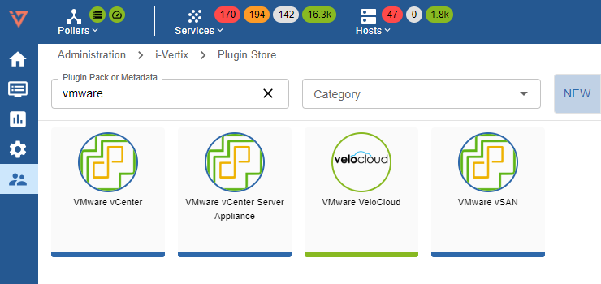
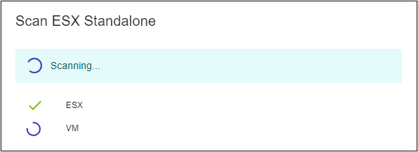

Go to **Administration -> i-Vertix -> Plugin Store** and install the required VMware plugins

### Create the VMware connector

Go to **Configuration -> Hosts -> VMware Connector** and press on button **Add Container**

Insert the following information:
* **Container Name**: use a meaningful name
* **Poller**: select the Poller that will issue the connection request
* **Protocol**: http or https
* **IP / FQDN**: enter the vCenter IP Address

Press **“SAVE & DEPLOY”**

### Configure a new job
To add a new Discovery Job:

Go to **Configuration -> Hosts -> Discovery Jobs** 
* click on **+ADD JOB**
* select **VMware Discovery**

### Job settings

* **Job Name**: use a meaningful name
* **Poller**: select the Smart Poller that will perform the scan
* **Container**: select a Container or click on **+ ADD CONTAINER** to create a new one
* **ESX, Datastores, Virtual Machines, NICs**: select the ones you want to scan

Press **Next**

### Template Rules
Mapping rules are preconfigured by i-Vertix

Click on **NEXT** to run the scan. The user interface shows all the discovery steps, while they happen.

### Results
Once the scan finishes, the virtual environment topology/tree is displayed. 

To start monitoring any discovered items, select them and click on **ADD/UPDATE MONITORING**. 

Remember to **export the configuration to the Smart Pollers**.

See the complete procedure for [VMware monitoring](../../monitoring-resources/discovery/vmware-discovery.md)

