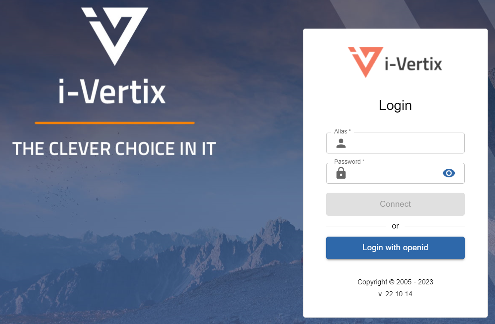

In this chapter, you will find information on how to quickly configuring Central Manager and Smart Poller.

## Import virtual machine

Once the ova has been downloaded, import the Central Manager and Smart Poller image into VMware or your hypervisor.

Start the vm and wait for the login screen.

:::note

See the complete procedure for [importing the virtual machine](../../installation/setup-central-poller/import-virtual-appliance.md)

:::

## First Login to VMs

You will need to log into i-Vertix Monitoring console to configure the network settings, using the following credentials:

* **User: 'admin'**

* **Password: 'password'** (to be changed as soon as possible)

See the complete procedure for [first Login to VMs](../../installation/setup-central-poller/first-login.md)

## Network configuration

Network configuration is a key step in using the monitoring service correctly, so assign a correct IP address to the Central Manager and Smart Poller.

See the comple procedure for [network configuration](../../installation/setup-central-poller/network-configuration.md)

## Activate the license

To activate your licence, provide i-Vertix with the necessary information as described in the procedure [Activate the license](../../installation/setup-central-poller/license.md) and download when ready.

## Access to Web console

Once the license is activated, you can access the Central Manager web console.

You can log in using the default credentials:

* Username: **admin**

* Password: **password**

How to [access to Web console](../../installation/configuring-smart-poller/first-web-access.md)

