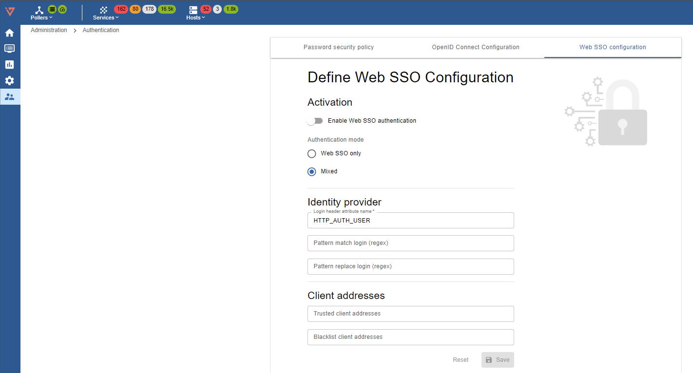

Web SSO authentication relies on the Apache web server. It is Apache which, depending on its configuration, is
responsible for authenticating the user before allowing access to the i-Vertix IT Monitoring web interface.
Many Apache modules allow authentication via OIDC, SAMLv2, TLS, Kerberos, etc. protocols.

> Users must be present in the i-Vertix IT Monitoring configuration to access the interface.

## Configure Web SSO authentication

Go to **Administration > Authentication > Web SSO Configuration**:



### Step 1: Enable authentication

Enable authentication:

- **Enable Web SSO authentication**: enables/disables Web SSO authentication.
- **Authentication mode**: indicates if the authentication should be done using only Web SSO or using local
  authentication as well (**Mixed**).

> When setting the parameters, it is recommended to activate the "mixed" mode. This will allow you to retain access to
> the local `admin` account in the event of a misconfiguration.

### Step 2: Configure your identity provider's access credentials

Configure Identity Provider information:

- **Login header attribute name**: which variable from the headers should be used to retrieve the user's login.
  For example `REMOTE_USER`.
- **Pattern match login (regex)**: a pattern to search for in the login header attribute name.
  For instance, type `/@.*/` to find the end of the email address in your login.
- **Pattern replace login (regex)**: the string that will replace the string defined in the **Pattern match login (regex)** field.
  Leave **Pattern replace login (regex)** blank to delete the string found by **Pattern match login (regex)**.

### Step 3: Configure client addresses

If you leave both fields blank, all IP adresses will be allowed to access the i-Vertix IT Monitoring interface.

- **Trusted client addresses**: If you enter IP addresses in this field, only these IP addresses will be allowed to access the i-Vertix IT Monitoring interface. All other IP addresses will be blocked. IP addresses must be separated by commas.
- **Blacklist client addresses**: These IP adresses will be blocked. All other IP addresses will be allowed to access the i-Vertix IT Monitoring interface.

### Step 4: Configure the Apache web server

You must configure the Apache module allowing authentication with the identity provider.
Once this configuration is done, you must modify the i-Vertix IT Monitoring configuration for Apache in order to allow access only
to authenticated users.

1. Edit **/etc/httpd/conf.d/10-centreon.conf** and search for the following block:

  ```apache
      Header set X-Frame-Options: "sameorigin"
      Header always edit Set-Cookie ^(.*)$ $1;HttpOnly;SameSite=Strict
      ServerSignature Off
      TraceEnable Off

      Alias ${base_uri}/api ${install_dir}
      Alias ${base_uri} ${install_dir}/www/
  ```

2. Replace it by:

  ```apache
      Header set X-Frame-Options: "sameorigin"
      Header always edit Set-Cookie ^(.*)$ $1;HttpOnly;SameSite=Strict
      ServerSignature Off
      TraceEnable Off

      RequestHeader set X-Forwarded-Proto "http" early

      Alias ${base_uri}/api ${install_dir}
      Alias ${base_uri} ${install_dir}/www/

      <Location ${base_uri}>
          AuthType openid-connect
          Require valid-user
      </Location>
  ```

  > In this example, the Apache module used was **mod_auth_openidc**. This is why authentication is **openid-connect**.

3. Validate the Apache configuration using:

  ```shell
  /opt/rh/httpd24/root/usr/sbin/httpd -t
  ```

4. Then restart Apache web server:

  ```shell
  systemctl restart httpd24-httpd
  ```

5. To conclude, rebuild the cache:

  ```shell
  sudo -u apache /usr/share/centreon/bin/console cache:clear
  ```

### Step 5: Configure your Identity Provider (IdP)

Configure your IdP to add the i-Vertix IT Monitoring application to use your protocol to authenticate your users,
And to authorize the following `redirect URI` to forward your connecter users to i-Vertix IT Monitoring:

```shell
{protocol}://{server}:{port}/centreon/websso
```

> Replace `{protocol}`, `{server}` and `{port}` by the URI to access to your i-Vertix IT Monitoring server.
> For example: `https://centreon.domain.net/centreon/centreon/websso`