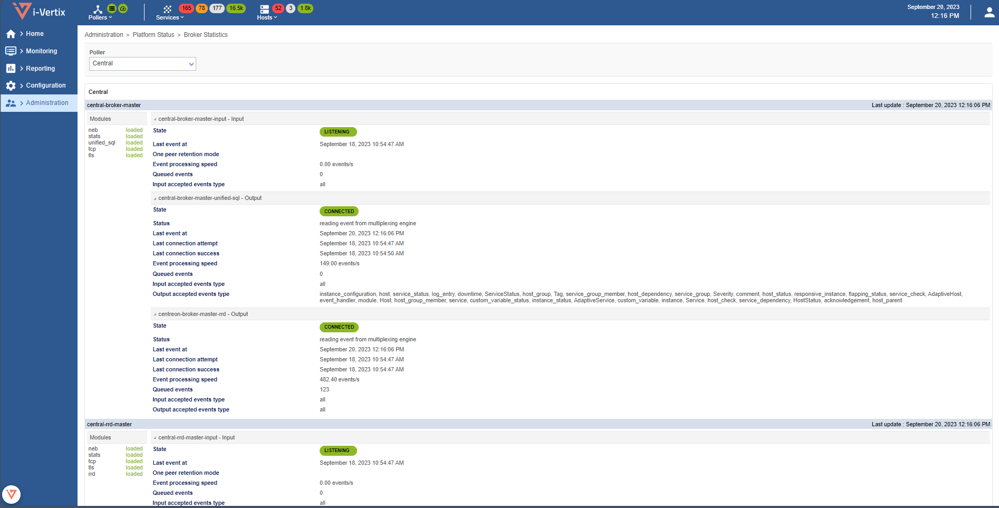
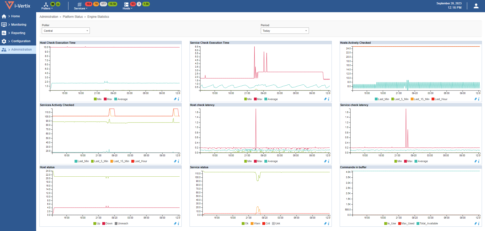

The status of the i-Vertix platform is available through the `Administration >
Platform Status` menu.

## Broker Statistics

To visualize the statistics of the Centreon Broker components, go to the
`Administration > Platform Status > Broker Statistics` menu and select the
poller:

## Engine Statistics

It is also possible to visualize the performance of the Engines through
performance graphs. Go to the `Administration > Platform Status > Engine
Statistics` menu and select the poller:

