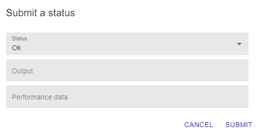

import Tabs from '@theme/Tabs';
import TabItem from '@theme/TabItem';

### Principle

For passively checked services, it is possible send a result manually to the
scheduler so that it is taken into account.

### Practice

<Tabs groupId="sync">
<TabItem value="From the Resources status page" label="From the Resources status page">

1. Go to **Monitoring > Resources Status**.

2. Select the service you want.

3. On the **More actions** menu, click **Submit a status**.

    The following window appears:
    
    

    - The **Status** field defines the status the service will have once the result is submitted
    - The **Output** field defines the message to be displayed for the service in the **Information** column
    - The **Performance data** field can be used to define performance data for the generation of graphs.

</TabItem>
<TabItem value="From real-time monitoring" label="From real-time monitoring">

To submit a result, access the details page of the object. In the category
**Service Commands** click on **Submit result for this service**

The following window appears:

-   The **Host Name** and **Service** fields define the host and the
    service the result will be submitted
-   The **Check result** field defines the status of the service
-   The **Check output** field defines the message to be displayed for
    the service
-   The **Performance data** field can be used to define performance
    data for the generation of graphs

</TabItem>
</Tabs>