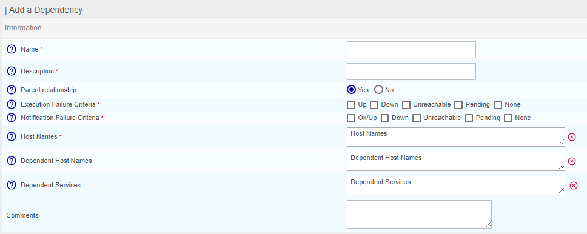
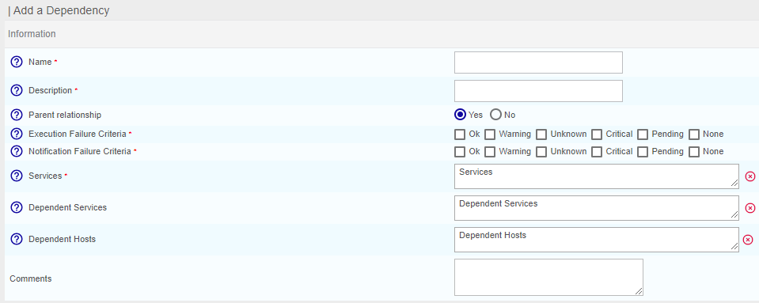
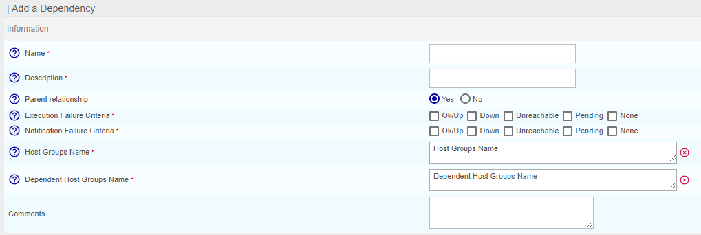
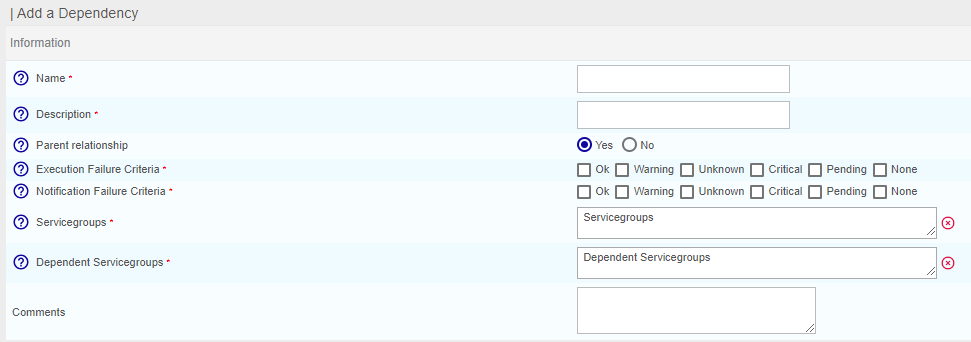

## Concept

Dependencies serve two primary purposes:

-   Reduce the burden of excessive alerts
-   Direct alerts towards specific targets

The dependencies of objects are of two types:

-   **Physical** dependencies between objects: a load balancing switch is situated upstream of a set of servers and downstream of a router
-   **Logical** dependencies between objects: the access to a website with authentication LDAP depends on the status of the LDAP directory itself

## Physical dependencies

Physical dependencies consist of taking into account physical links between equipment. This link can only be defined for **Host**.

The configuration of a physical dependencies takes place in the **Relations** tab of a configuration sheet of a host through **Configuration > Hosts > Hosts** menu.

It is possible of define two settings:

-   **Parent Hosts**: signifies that the hosts selected are parents of this host (situated upstream). If all the parent hosts selected become unavailable or impossible to reach the host itself will be considered by the scheduler as impossible to reach.
-   **Child Hosts**: signifies that the host becomes the parent of all the child hosts selected.

:::note

It is not possible to have dependencies between hosts from different pollers.

All the parents of a host must be in a Not-OK status for the host itself to be considered impossible to reach. If only one access path is down (physical dependencies link), the scheduler will continue to monitor this host.

:::

## Logical dependencies

Logical dependencies consist of installing logical links between multiple objects that may or not be of different types. E.g.: a service is in charge of supervising the access to a web page requiring an authentication based on a LDAP. It is logical that if the LDAP server is down, the access to the web page will be difficult or even impossible. In this situation, the notification issued should only be communicated to the LDAP directory and not to the website.

### Hosts

To configure a logical dependency, go into the **Configuration > Notifications > Dependencies > Hosts** menu and click **Add**.

In this case, we have two types of host that come into play: one or more hosts (called master hosts) of which the status controls the execution and notification of other hosts (called dependent hosts). If you use the Broker, it is also possible to control the execution and notification of services (called dependent services) from master hosts.

-   The **Name** and **Description** fields indicate the name and the description of the dependencies
-   The **Parent relationship** field should be ignored if you use the Engine. If it is enabled, and if the dependencies links of the master host become unavailable, the dependencies in the process of creation is not taken into account.
-   The **Execution Failure Criteria** field indicates the statuses of the master host(s) preventing the check of the hosts or the dependent services
-   The **Notification Failure Criteria** field indicates the statuses of the master host(s) preventing the sending of notifications to the hosts or the dependent services
-   The **Hostnames** list defines the master host(s)
-   The **Dependent Host Names** list defines the dependent hosts
-   The **Dependent Services** list defines the dependent services
-   The **Comments** field can be used to comment on the dependencies

### Services

To configure a logical dependency, go into the **Configuration> Notifications > Dependencies > Services** menu and click **Add**.

In this case, we have two entities that come into play: the (“master”) services which control the execution and the notification of other (“dependent”) services. If you use Broker, it is also possible of control the execution and the notification of other hosts.

-   The **Name** and **Description** fields indicate the name and description of the dependencies
-   The **Parent relationship** field should be ignored if you use the Engine. If it is enabled, and if the links of dependencies of the master service become unavailable the dependencies in the process of creation is no longer taken into account.
-   The **Execution Failure Criteria** field indicates the statuses of the master service(s) preventing the check of the hosts or the dependent services
-   The **Notification Failure Criteria** field indicates the statuses of the master service(s) preventing the sending of notifications to the hosts or the dependent services
-   The **Services** list defines the master service(s)
-   The **Dependent services** list defines the dependent services
-   The **Dependent hosts** list defines the dependent hosts
-   The **Comments** field can be used to comment on the dependencies

### Host groups

To configure a logical dependency, go into the **Configuration> Notifications > Dependencies > Host Groups** menu and click **Add**.

Two types of host groups: a host group is called a master if it controls the execution and the notification of other (“dependent”) host groups.

-   The **Name** and **Description** fields indicate the name and the description of the dependencies
-   The **Parent relationship** field should be ignored if you use the Engine. If it is enabled, and if the links of dependencies of the master host group become unavailable the dependencies in the process of creation is no longer taken into account.
-   The **Execution Failure Criteria** field indicates the statuses of the master host group(s) preventing the check of the dependent host groups
-   The **Notification Failure Criteria** field indicates the statuses of the master host(s) preventing the sending of notifications to the dependent host groups
-   The **Host groups name** list defines the master host group(s)
-   The **Dependent host group name** list defines the dependent host group(s)
-   The **Comments** field can be used to comment on the dependencies

### Service groups

To configure a logical dependency, go into the **Configuration> Notifications > Dependencies > Service Groups** menu and click **Add**.

Two types of service group: a service group is called a “master” if it controls the execution and the notification of other (“dependent”) service groups.

-   The **Name** and **Description** fields indicate the name and the description of the dependencies
-   The **Parent relationship** field should be ignored if you use the Engine. If it is enabled, and if the links of dependencies of the master service group become unavailable the dependencies in the process of creation is no longer taken into account.
-   The **Execution Failure Criteria** field indicates the statuses of the master service group(s) preventing the check of the dependent service groups
-   The **Notification Failure Criteria** field indicates the statuses of the master host(s) preventing the sending of notifications to the dependent service groups
-   The **Service group names** list defines the group(s) of master services
-   The **Dependent service group names** list defines the group(s) of dependent services
-   The **Comments** field can be used to comment on the dependencies

### Meta-services

To configure a logical dependency, go into the **Configuration> Notifications > Dependencies > Meta Services** menu and click **Add**.

Two types of meta-services: a meta-service is called a “master” if it controls the execution and the notification of other (“dependent”) meta-services.

-   The **Name** and **Description** fields indicate the name and description of the dependencies
-   The **Parent relationship** field should be ignored if you use the Engine. If it is enabled, and if the links of dependencies of the master meta-service become unavailable the dependencies in the process of creation is no longer taken into account.
-   The **Execution Failure Criteria** field Indicates which are the statuses of the meta-master service(s) that will prevent the check of the meta-dependent services
-   The **Notification Failure Criteria** field indicates the statuses of the meta-service(s) preventing the sending of notifications to meta-dependent services
-   The **Meta-service name** list defines the master meta-service(s)
-   The **Dependent meta-service** names list defines the dependent meta-service(s)
-   The **Comments** field can be used to comment on the dependencies

## Examples

This sub-chapter illustrates the use of these dependencies via a few actual cases.

:::note

The dependencies are based on failure criteria that is “do not do if”. Do not notify if the service is in a Critical state. Do not perform the check if the service is in a Critical, Alert, Unknown, … state.

:::

### Services dependencies

A service is checked using a Selenium scenario. This scenario connects to a web interface with an identifier and a password. This connection information is stored in a MariaDB database.

Consequently, if the database server does not reply, the Selenium scenario cannot complete. It seems obvious that it is necessary to create a logical dependency link between the service which uses the Selenium scenario and the service that is responsible for checking the status of the MariaDB server.

Moreover, considering that the Selenium scenario cannot perform properly, no performance data can be stored in the database. So, it is necessary not only to stop the notification for the service using the Selenium scenario but also the check.

To create this dependency, go into the **Configuration> Notifications > Dependencies > Services** menu and click **Add**.

1.  Enter the name and the description of the dependency
2.  For the **Execution Failure Criteria** and **Notification Failure Criteria** fields, check Warning, Critical, Unknown and Pending
3.  In the **Services** list select the service that is responsible for checking the status of the MariaDB server
4.  In the **Dependent Services** list, select the service that uses the Selenium scenario
5.  Save

From now on, if the service responsible for checking the status of the MariaDB server has “Warning”, “Critical”, “Unknown” or “Pending” status, the service responsible for executing the Selenium scenario will not be executed until the master recovers its OK status.

### Hosts dependencies

Let us take the case of two hosts which operate as a cluster. Three hosts are created to be able to monitor this cluster: a host A, a host B (both members of the cluster) and a host C (which centralizes the information from the cluster).

If host A or host B has a Not-OK status the services of host C will automatically be considered to be Not-OK. So, it is necessary to add a dependency which prevents the sending of notifications if host A or host B become faulty. However, performance data feed-back must always be operational; this is why it is necessary to continue the monitoring of host C.

To create this dependency, go into the **Configuration> Notifications > Dependencies > Hosts** menu and click **Add**.

1.  Enter the name and the description of the dependency
2.  For the **Notification Failure Criteria** field, check Warning, Critical, Unknown and Pending
3.  In the **Host Names** list, select host A
4.  In the **Dependent Host Names** list select host C
5.  Save

Repeat this operation for host B.

### Service Groups dependencies

Let us take the example of a set of Oracle services on which the ERP application bases itself. Two service groups are needed:

-   The Oracle Application group
-   The ERP Application group

If the Oracle services become critical, the services of the ERP application are automatically critical. It is necessary to create a dependency link to prevent the check and notification of the services of the application ERP if the Oracle application is Not-OK.

To create this dependency, go into the **Configuration> Notifications > Dependencies > Service Groups** menu and click **Add**.

1.  Enter the name and the description of the dependency
2.  For the **Execution Failure Criteria** and **Notification Failure Criteria** fields, check Critical and Pending
3.  In the **Service Group Names** list select the service group Oracle Application
4.  In the **Dependent Service Group Names** list, select the service group ERP Application
5.  Save