import ImageCounter from "../../../src/components/ImageCounter";

## Report Job List

To access the report job list, head over to `Reporting -> Business Intelligence -> Jobs`.

After a fresh installation of the i-Vertix BI module you will find an empty job list.

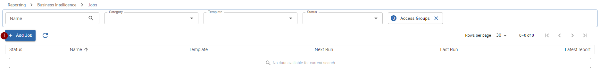

To create your first job, press the <ImageCounter num={1} /> <code>+ Add Job</code> button located on top of the list.
The detail panel will open and you will be able to enter all relevant information to create the job.

## Create your first Job

Let's create your first report job.
The below chapters will guide you step-by-step to create a complete scheduled report job using the `Hostgroup Availability` report template.

### General

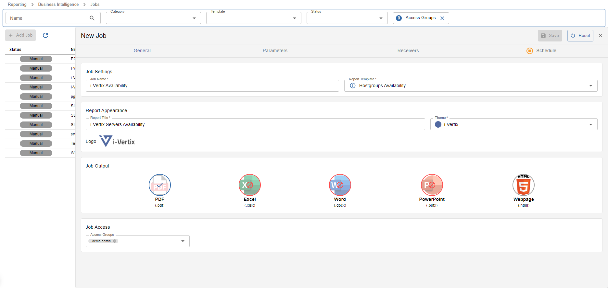

*As always, please insert all required fields marked by a `*` beneath the input label, otherwise saving the job is not available*

:::note

Insert the required information step-by-step - some fields are only available if previous inputs are filled in

:::

---

#### Job Information

This section covers the main report job information.

- **Job Name**: choose a name for your report job - what will it cover, what will it output, what is it for
- **Report Template**: choose the report template you want to use for your report job - the report template info is available by clicking the `i` button after selecting a report template

---

#### Report Appearance

This section covers the styling and personalization of generated reports using this job.

- **Report Title:** give your generated reports a custom title to better describe what the report is all about
- **Theme:** *(only available after selecting the report template)* choose a theme for your report - colors used in the report will change based on the selected theme
- **Logo:** the default logo is already pre-selected - to change or add a new logo simply click on the logo

Create a new Logo

1. Click on the current selected Logo to open the logo manager dialog

    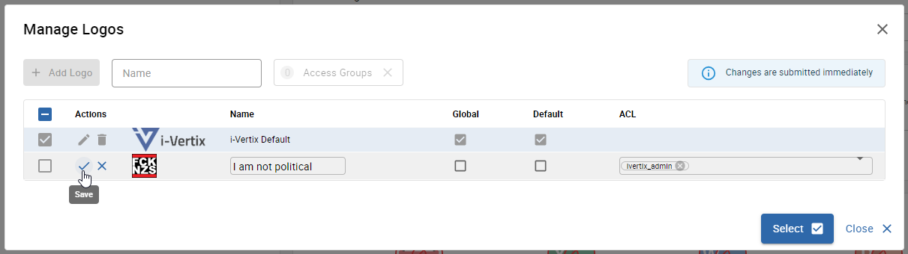

2. Upload the logo image
3. Choose a descriptive name for you uploaded logo
5. *(only for admins)* if you want to publish the new logo to anyone using the monitoring system, check the `Global` checkbox - once a logo is global it can not be modified to private anymore
4. *(only for admins)* if you want to replace the current default logo, check the `Default` checkbox - by saving the new logo the current default logo will be replaced with the new logo
5. add acl groups to restrict the access to the logo - only selected acl groups will have access to use and modify the logo

---

#### Job Output

This section defines, which report file types will be generated when a report job is executed.

Available types:

- PDF
- Microsoft Excel
- Microsoft Word
- Microsoft PowerPoint
- Webpage (HTML)

Some types may be unavailable due to the report template type incompatibility.

The report templates optimized types are selected by default.
To change the desired output types, simply click on the icons (min. 1 is required).

A report file will be generated on the report execution for each selected output type - for exmaple if
PDF and Word is selected, a report in PDF and Word format will be avaialble for download.

---

#### Job Access

This section covers the report job access management.

- **Access Groups:** choose all access groups you want to give access to your report job - any user with matching access groups will be able to modify and execute the job as well as download any reports generated by the report job

### Parameters

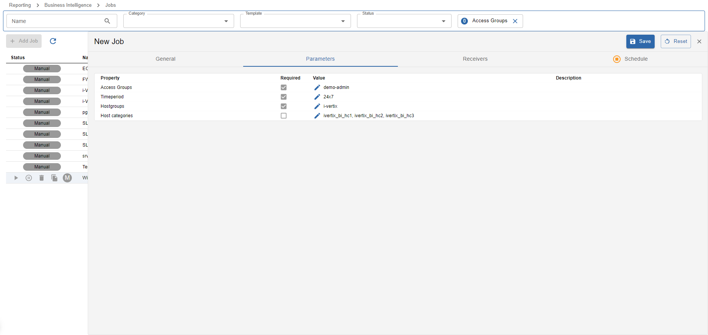

*As always, please insert all required fields marked by a checked required checkbox, otherwise saving the job is not available*

:::note

Settings parameters is only available after the Report Template was selected in the [Job Information](./bi-job#job-information)

:::

You will find a list of report parameters that can/need to be set for your report job.
Setting parameters influence what will later be present on the generated report itself.
Some parameters may filter data by f.e. hostgroups/host categories/service groups/service categories or similar.
Other parameters may hide or show additional content on the report.

:::info

Some parameters depend on other parameter values that act like a pre-filter.
You will be notified if other parameters need to be set first when editing parameter values.

:::

To set parameter values, click into the `Value` column of the desired parameter you want to set.

:::tip

Always read the parameter description to find out what the parameter will be used for!

:::

Types of parameter inputs:

- **Text input:** free text input
- **Number input:** special input that only allows numbers
- **Checkbox**: used for true/falsy values
- **Select box**: choose one or more values from the provided options - can be reliant on dependencies
- **Special metric input**: special input to select metrics, acts like a select box but can be tranformed to a regex input along with a regex-matching tool

### Receivers

*configuring receivers is optional*

By setting Receivers you can configure who will receive the generated reports by this report job.
At the moment, only `Email Receivers` are available, thus generated reports can only be sent to users via email.

You will find a list of all available already configured receivers which can be selected by clicking on the checkbox.

You also have the possibility to create a new receiver configuration by clicking the blue `+ Add New Email Receiver` button on top of the list.

Create a new email receiver

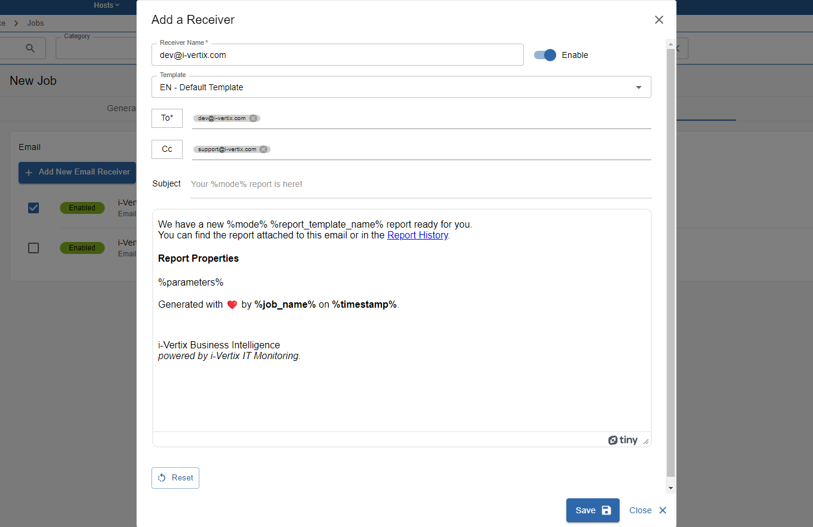

1. Set a descriptive reciever name - *who will receive the reports?*
2. Choose one of the pre-configured receiver templates (on the big textbox below you will se a preview of the text sent to the recipient)
3. Add email addresses who will receive the mail with the report files attached
4. *(optional)* Add email addresses who will receive a CC of the mail with the report files attached

After you have filled in all required information you can save the new receiver.

:::note

Don't forget to select your new receiver afterwards from the list to activate it for the report job!

:::

<i>(only for admins)</i> Create a new email receiver template

To create a new email receiver template, head over to `Administration -> i-Vertix -> BI Receivers`.

Click on `+ Add Template` and choose `Email Template`, afterwards the sidepanel should open.
Fill out the form and save your new receiver template by pressing the save button.
If you'd like to make your new template the default receiver template for future jobs, select `Default` before saving the template.

We also have some `Dynamic Fields` available that are replaced with dynamic content before the email is sent:

- **Report Template Name:** outputs the name of the used report template
- **Mode:** outputs the scheduling mode the report was created from: `manual` | `daily` | `weekly` | `monthly` | `custom`
- **Build time:** outputs the timestamp the report was created
- **Report parameters (table):** outputs a formatted list of used report parameters to build the report
- **Job Name:** outputs the current job name
- **Report History (link):** outputs a link that leads directly to the report history of the report job (monitoring authentication required)
- **Job ID:** outputs the job id (useful for debugging purposes)
- **Report ID:** outputs the report id (useful for debugging purposes)

:::caution

Don't forget to [configure the SMTP Server](./bi-settings#smtp-configuration) if you'd like to work with Email Receivers!

:::

### Schedule

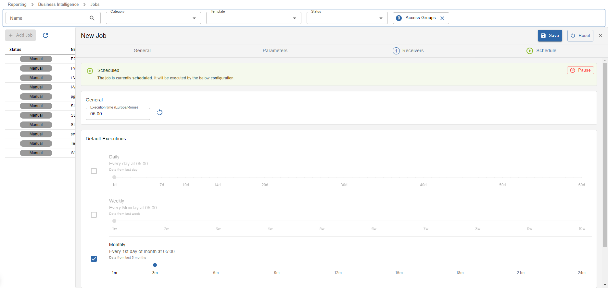

*scheduling a report job is optional*

On this last part of creating a new report job the scheduling can be configured.
Scheduling a job is optional - if a job is not scheduled executing is only available manually from the job list.

There are multiple ways to schedule a job:

- using the default daily execution
- using the default weekly execution
- using the default monthly execution
- adding custom execution configurations

---

#### Default Executions

Not all default execution types are always available because not every report template is designed to run on a daily/weekly/monthly basis.

This means, that if f.e. the daily scheduling is not available, the report job should also not be scheduled on a daily basis using custom executions.

**Example**:

In the above exmaple image the default monthly scheduling is selected and the slider is set to 3m (3 months) of data.
This means that the report will run on every 1st day of the month and includes the last 3 months of data.
Let's pretend it's the 1st of July: the generated report would contain data from the 1st of April **until** (exclusive)
the 1st of July - so practically all the data from April, May and June.

The same principle is also valid for the other default schedule types.

---

#### Custom Executions

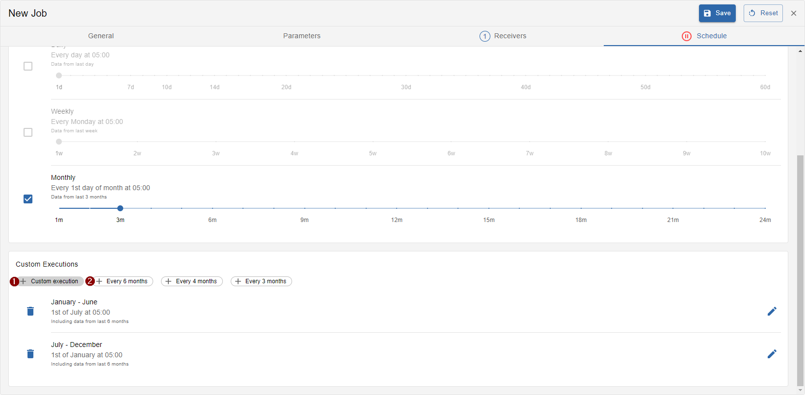

It is also possible to add custom execution configurations:

- <ImageCounter num={1} /> Create a new custom execution
- <ImageCounter num={2} /> Select already pre-defined custom executions

<ImageCounter num={1} /> Create a new custom execution using the wizard

1. Choose a schedule when the report job will be executed
    
    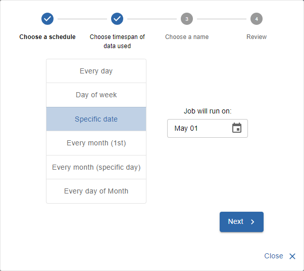

2. Choose the timestamp of data used in the report

    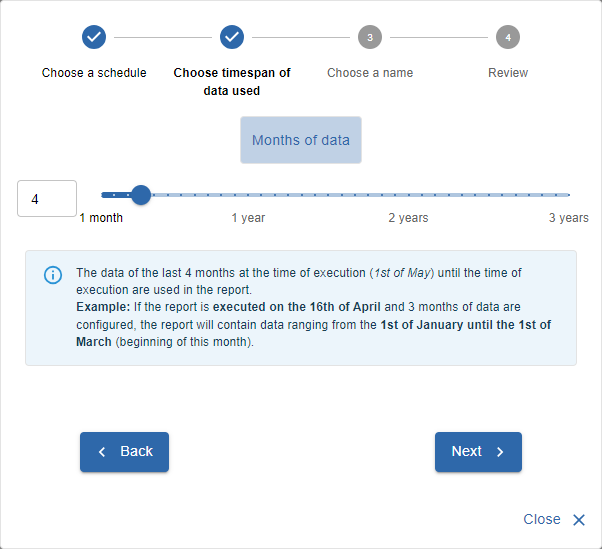

3. Choose a descriptive name to identify the custom execution

    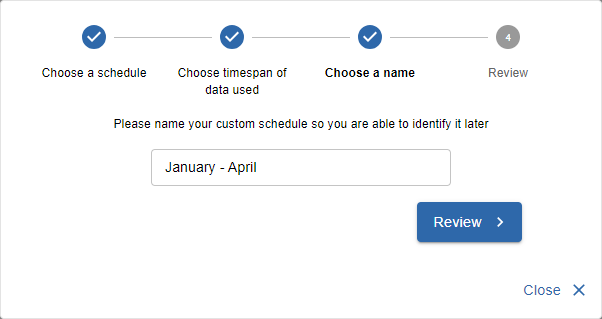

4. Review and save your custom execution

    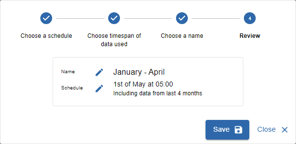

---

#### Change the execution time

It is possible to change the execution time of the report job by changing the value in the `Execution time (Timezone)` input.
Keep in mind that the configured time corresponds to the time of the display timezone in the input's label.

---

#### Pause/Resume scheduling

It is possible to pause and resume all configured job schedules without removing current schedule configurations.

Pause

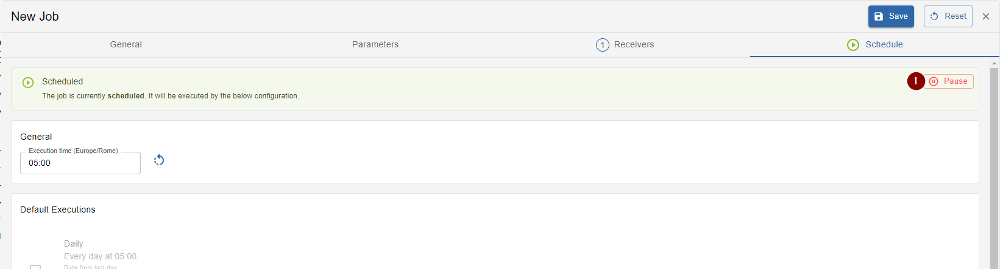

Press button <ImageCounter num={1} /> `Pause` to pause scheduling.

Resume

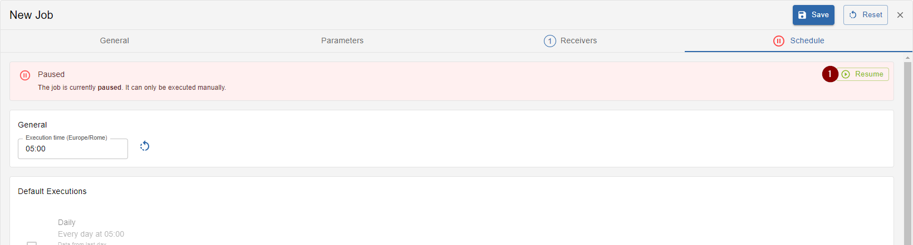

Press button <ImageCounter num={1} /> `Resume` to resume scheduling.

---

:::tip

You are now ready to save your first job. Press the `Save` button on the top right corner above the tabs to save the job.
If the save button is not available you might wanna check if something is still missing.

:::

## Manually execute Report Jobs

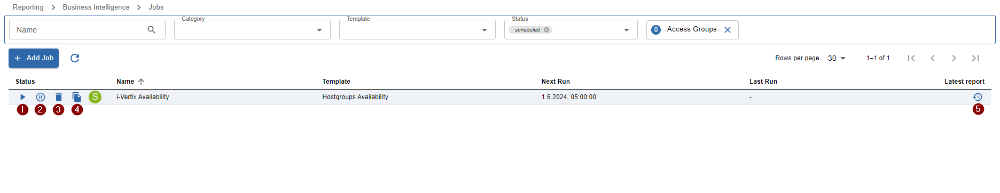

While hovering over report jobs in the job list, following actions will be available:

- <ImageCounter num={1} /> Execute the job
- <ImageCounter num={2} /> Pause/Resume the job's scheduling
- <ImageCounter num={3} /> Delete the job
- <ImageCounter num={4} /> Duplicate the job

We will now take a look at **executing the job**.

After clicking the execute icon

- the job is directly started
- the below popover appears

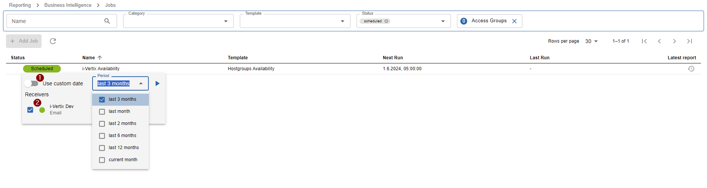

The betold popover is used to configure, who of your <ImageCounter num={2} /> **receivers** should
receive the generated reports and which <ImageCounter num={1} /> **period of data** should be used in the report.

To select the <ImageCounter num={1} /> period of data used in the report you have the possibility to choose between
defined periods or a custom date. You can enter a custom date by switching to `Use custom date`.

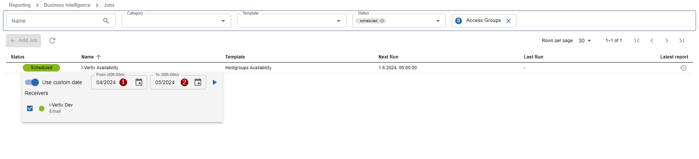

Here you will need to enter <ImageCounter num={1} disableMargin /> <strong>from</strong> which
date (time 00:00) <ImageCounter num={2} disableMargin /> <strong>to</strong> which date (time 00:00) the data will be utilized.

:::note

In the [next article](./bi-viewing-reports) you will learn about how to access generated reports from report jobs.

:::

