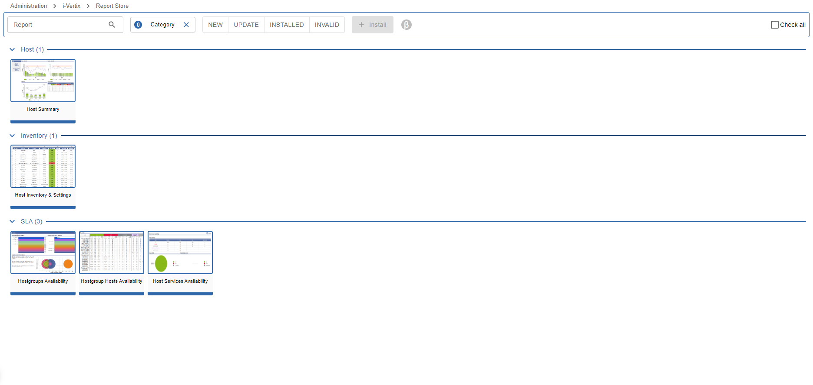
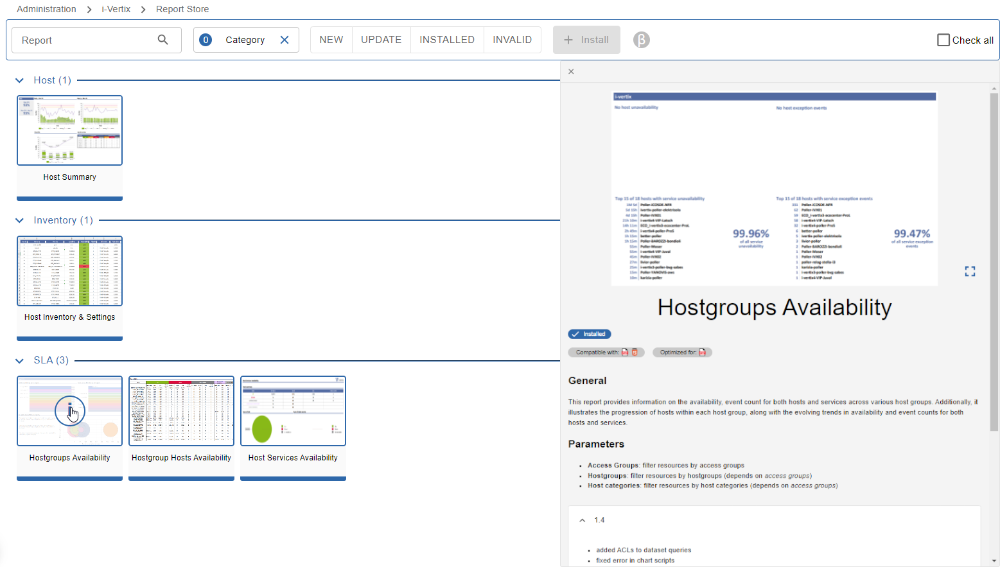
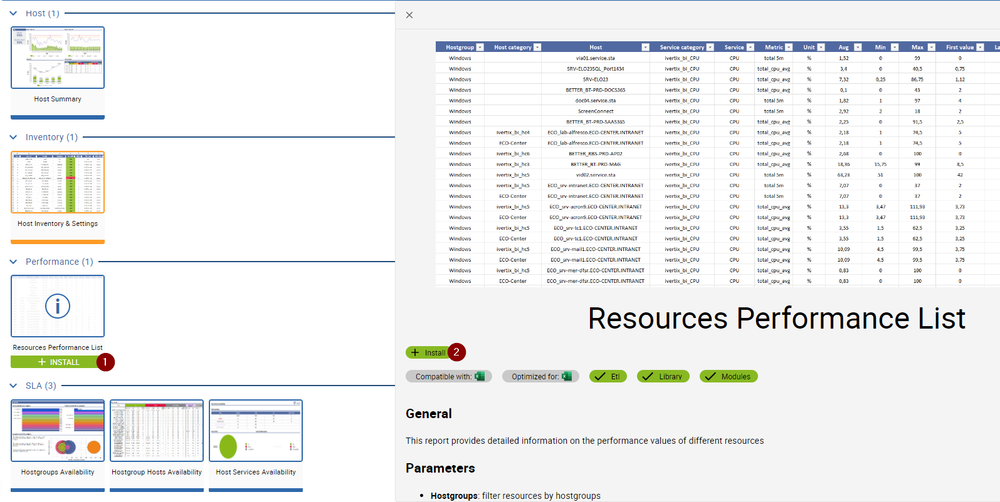
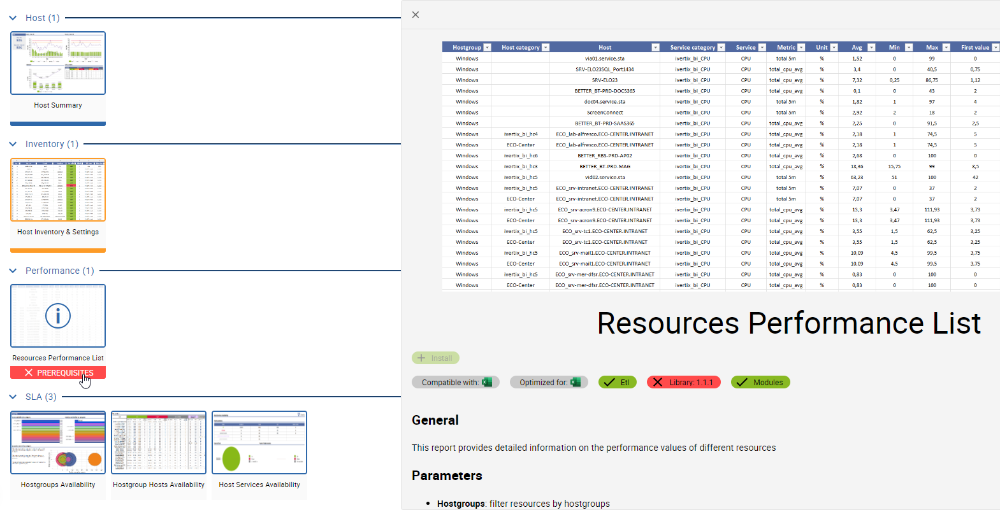

import ImageCounter from "../../../src/components/ImageCounter";

## About

The Report Store is similar to our [Plugin Store](../monitoring-resources/monitoring-basics/plugin-packs) which is used to install and update plugin packs.
Also the report store is connected to the i-Vertix Server to provide the latest available packages and updates for your monitoring system.

Although the Report Store is delivering *Report Templates* instead of *Plugin Packs*, the main principle stays the same:
you can install and update new or already installed report templates with just one click.

This removes a lot of complexity for you when it comes down to install and update report templates to use them in report jobs.

To access the Report Store, make sure you already have [configured the i-Vertix Store credentials](../quick-start-guide/how-to-configure-central-and-poller/plugin-store-configuration).
The same credentials and connection parameters are also used for the Plugin Store.

:::note

If the Plugin Store is already set up and running, you don't have to redo this step.

:::

### Report Templates

Report Templates consist of:

- a design file, used by the report engine to build and render the report
- localization files
- themes, used to individually style the report
- report parameter configuration

The downloaded report templates are directly transferred to the i-Vertix BI server using the REST API.

## Using the Report Store

To access the Report Store, head over to `Administration -> i-Vertix -> Report Store`.

You will find several available Report Templates, categorized and with a small preview image.

At the top of the page, several filters are available to find report templates easily.

The status filters `NEW` | `UPDATE` | `INSTALLED` | `INVALID` are very helpful to understand,
which report templates are already installed on the system and are up-to-date or have an update available.

### Report Template Detail

When hovering over a report template card, you can click the info button to see more details about the report template.

On the detail panel you will find a screenshot-gallery of an example report using the selected report template.

Below the screenshot you find following information:

- **Status:** `Installed` | `Install` | `Update to version x avaialble`
- **Compatible with:** displays the available report output formats for the selected report template
- **Optimized for:** displays optimized report output formats for the selected report template -
using an optimized format may include better graphs and overall layout and styling
- **Etl:** displays the compatiblity with the currently installed version of the `ETL` package on the i-Vertix BI Server
- **Library:** displays the compatiblity with the currently installed version of the `Report Library` package on the i-Vertix BI Server
- **Modules:** displays the compatiblity with the currently installed monitoring modules installed on the monitoring server

Below the above information you find a short description what this report template does and what it's used for.
This information is useful to understand if the selected report template fits your needs.

You will also find a list of available report parameters, which can be used to filter or configure data displayed
in your generated reports using this report template.

At the bottom you will find the changelog of the selected report template to understand if anything interesting was added or changed.

### Install Report Templates

You have 3 possibilites to install report templates:

1. <ImageCounter num={1} /> Install from the report template grid view by hovering the desired report template and click <code>+ INSTALL</code>
2. <ImageCounter num={2} /> Install from the report template detail by clicking the <code>+ Install</code> button below the report template name
3. **Massive Install:** to install more than one template at the same time select all templates you want to install by clicking anywhere on
the template card except the `+ INSTALL` and the `i`nfo button, then click the `+ Install` button located on the page header

:::note

If problems happen during the report template installation, please reach out to our [Support team](mailto:support@i-vertix.com)
with all relevant information and error messages.

:::

### Invalid/Unavailable report templates

Report templates that are not available for install are also listed in the report store and are marked with red color and status `x PREREQUISITES`.

This means, that some of the report template prerequisites are missing and therefore the report template would fail when used in report jobs.

You can find the list of missing prerequisites in the [Report Template Detail](./bi-report-store#report-template-detail).

In the above example, the required library version is not installed on the i-Vertix BI server.

Possible missing prerequisites:

| Prerequisite | Description                                                                                                                                                             | Steps to resolve                                             |
| ------------ | ----------------------------------------------------------------------------------------------------------------------------------------------------------------------- | ------------------------------------------------------------ |
| Etl          | The `ETL` package version installed on the i-Vertix BI server does not satisfy the required `ETL` package version required by the report template                       | Update the `ETL` package on the i-Vertix BI server           |
| Library      | The `Report Library` package version installed on the i-Vertix BI server does not satisfy the required `Report Library` package version required by the report template | Update the `Report Library`package on the i-Vertix BI server |
| Module: x    | The `Monitoring module x` is missing on the monitoring server and therefore does not satisfy the required module version by the report template                         | Install the required module on the monitoring server         |
