## Editing

### Adding objects

From **Monitoring -> Maps** page, click on the map you want to edit, then click on Edit at the top right corner to enter **Edit mode** 

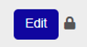

To save the changes applied to the map, click on **Save Map**.

To discard them click on **Reset**. 

To get back to map visualization, click on **Exit Edit Mode**.

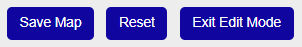

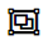 **Select objects** icon (available only for graphical maps): allows you to select one or more objects and reposition it/them on the map

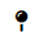 **Create a new marker** icon (available for both graphical and geographical maps): allows you  to **add a new object** on the map.

The **object** has the following **properties**:

* **Linked Object type**: Host, Service, Servicegroup, Hostgroup or Map
* **Icon Properties**: select **icon size** and the **icon pack** that is to be used
* **Service Status on Host Icon**: The host icon displays the most critical status of all services assigned to a host.

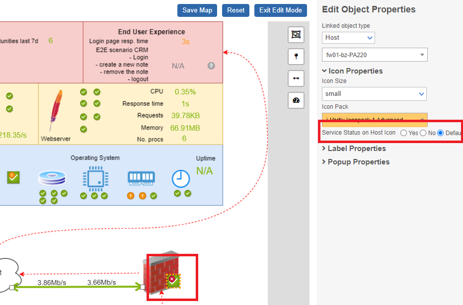

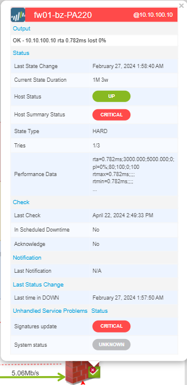

* **Label Properties**: if the label is enabled, it is possible to decide what information to display, its position relative to the object, size and color.
* **Popup Properties**: to select/change popup messages settings and configure which information they should include

### Adding Links

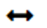 **Create a new line** icon: to add a new line/link between 2 objects

The object has the following properties:

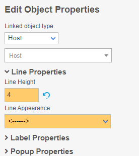

* **Linked Object type**: Host, Service, Servicegroup or Hostgroup.
* **Line Properties**: you can select the **thickness** of the line and the line **appearance** 

* **Performance Data Interpreter**: it can be used to select which performance metrics have to be displayed and the position of their values.

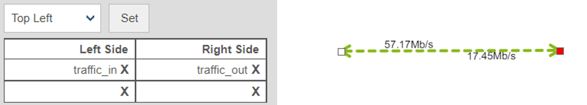

* **Label Properties**: if the label is enabled, it is possible to decide what information to display, its position relative to the object, size and color.
* Popup Properties: to select/change popup messages settings and configure which information they should include

### Adding Gadgets

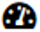 **Create a new gadget icon**.

Select the **service** that has to be represented by the new Gadget.

If in **Gadget Properties > Gadget** Type you select Map, instead of a service, you have to select the map that will be displayed within/inside the current one (i.e. the one you are editing). 

**Gadget Properties**: 
* **Gadget Type**: Gauge, Performance Graph, Big Text, Map
* **Gadget Size**
* **Gadget Opacity**

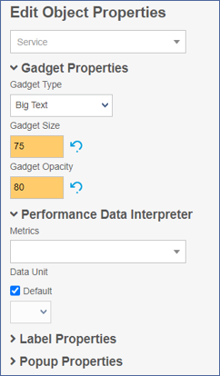

**Performance Data Interpreter**
* **Metrics** select the performance metric that has to be displayed
* **Data unit**

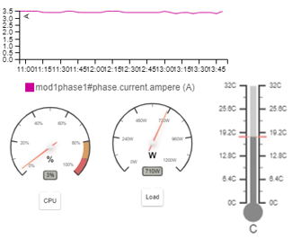

**Label Properties**: if the label is enabled, it is possible to decide what information to display, its position relative to the object, size and color.

**Popup Properties**: to select/change popup messages settings and configure which information they should include

## Map in Map feature
The "Map in Map" feature allows user to embed smaller maps within larger maps to provide a hierarchical view of infrastructure. Maps are created for each segment or location of the network to represent specific areas of the infrastructure, such as different floors of a building or separate departments within an organization.

:::note

This functionality can be used on the Graphic Map or the Geo Map

:::

### How to use Map in Map

Create the Graphical or Geo Map ([Maps configuration](managing-maps.md)).

There are available two options: **Create New Marker** or **Create a new Gadget**.

### Create New Marker

**Create New Marker**: select "Map" on **Linked Object Type** and the map you want to show. The icon placed on the map will be smaller and stylised. In the Geo Map it will only be visible by zooming into the position of the inserted object.

**Select the icon size**: tiny, small, middle, big

**Save** the Map

**Icon for Graphical Map** (ok, critical, warning, unknown, pending status):

    

**Icon for Geo Map** (ok, critical, warning, unknown, pending status):

     

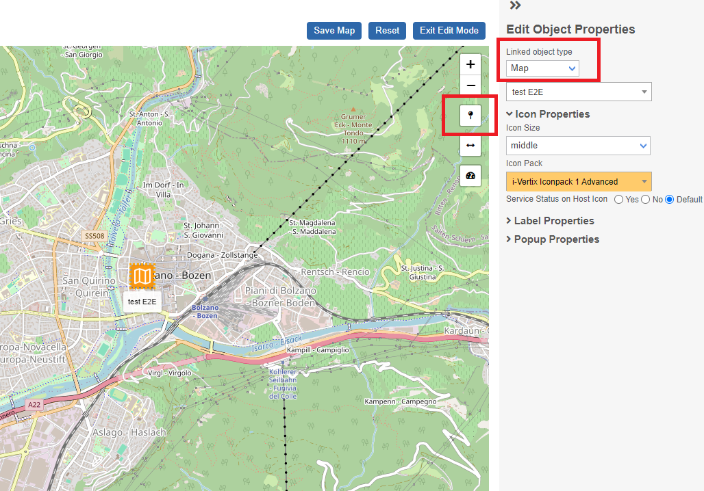

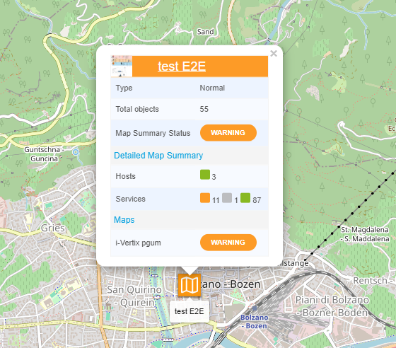

### Create a new Gadget

**Create a new Gadget**: select "Map" on **Gadget Type** and the map you want to show. The icon shown will be larger than the one created by marker. 

**Select the Gadget size**: small, medium, big

**Save** the Map

## Set acknowledgement
It is possible to acknowledge and stop the notification of hosts with problems directly from the map.

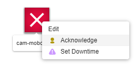

Right click and select acknowlegde.

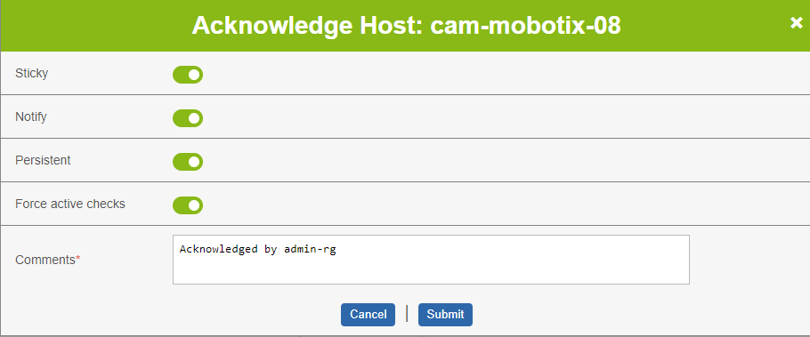

## Set the downtime
It is possible to set downtime of hosts and related services directly from the map.

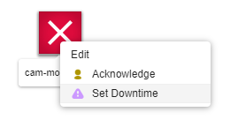

Press the right with button with the mouse and select downtime.

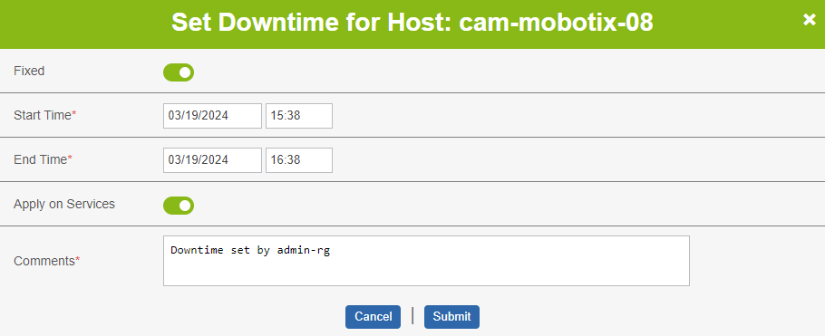

Enter the period during which the downtime will be active.

## Full list of map icon
Host displays **UP** status

 

Host displays **WARNING** status

Host displays **DOWN** status

Host displays **PENDING** status

Host displays **UNKNOWN** status

Service displays **OK** status

Host displays **WARNING** status

Service displays **CRITICAL** status

Service displays **PENDING** status

Service displays **UNKNOWN** status

All hosts in the hostgroup are in **UP** status

One or more hosts in the hostgroup are in **WARNING** status

One or more hosts in the hostgroup are in **DOWN** status

One or more hosts in the hostgroup are in **PENDING** status

One or more hosts in the hostgroup are in **UNKNOWN** status

All services in the servicegroup are in **UP** status

One or more services in the servicegroup are in **WARNING** status

One or more services in the servicegroup are in **CRITICAL** status

One or more services in the servicegroup are in **PENDING** status

One or more services in the servicegroup are in **UNKNOWN** status

The host is displaying **UP** status, but one or more services are displaying **WARNING** status.

The host is displaying **UP** status, but one or more services are displaying **CRITICAL** status.

The host is displaying **UP** status, but one or more services are displaying **UNKNOWN** status.

One or more services are in  status **ACKNOWLEDGE**

One or more services are in  status **DOWNTIME**

The host is status **ACKNOWLEDGE**

The host is status **DOWNTIME**

All hosts are in **UP** status and services are in **OK** status

One or more hosts/services are in **WARNING** status

One or more hosts are in **DOWN** status and/or one or more service are in **CRITICAL** status

One or more hosts/services are in **PENDING** status

 

One or more hosts/services are in **UNKNOWN** status

All hosts are in **UP** status and services are in **OK** status

One or more hosts/services are in **WARNING** status

 

One or more hosts are in **DOWN** status and/or one or more service are in **CRITICAL** status

 

One or more hosts/services are in **PENDING** status

One or more hosts/services are in **UNKNOWN** status

 

