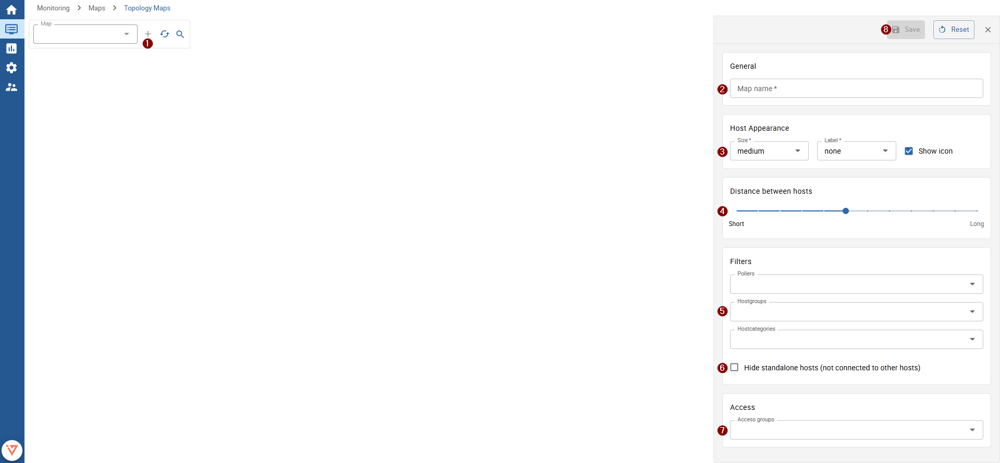
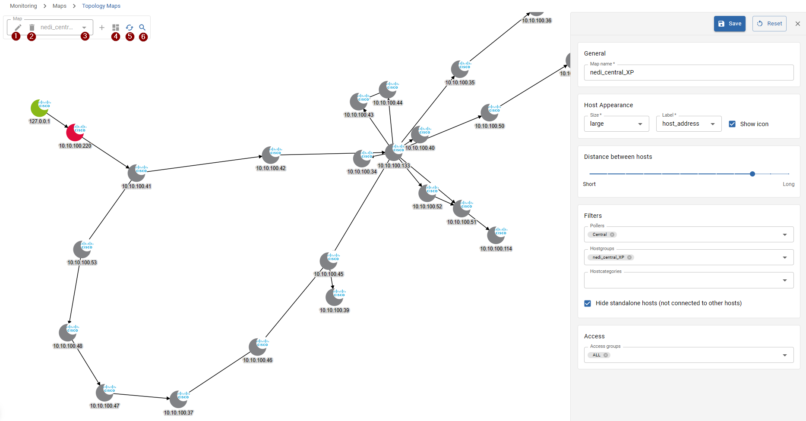
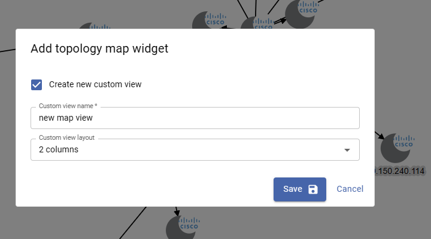

import Tabs from '@theme/Tabs';
import TabItem from '@theme/TabItem';
import ImageCounter from "../../../src/components/ImageCounter";

## Create a new graphical or geographical map

To create a new map, navigate to `Configuration -> Maps`.
The presented list shows all available maps. To add a new map, click the `Add` button above the list.

A new windows opens, where you need to define the map's name, type and access configuration.
You can also define the default configuration for your map objects, which all map objects will inherit.

:::note

You can always overwrite single settings for every map object (icon, line, gadget, nested map) manually.

:::

### General

* **Map Name**: enter a meaningful name
* **Type**

<Tabs groupId="type">
<TabItem value="normal" label="Graphical (normal)">

When selecting type *"Normal"*, the created map is like a static image where you can place hosts, services, groups, gadgets and nested maps.

* **Background**

By default, the background is an all-white `1920x1080px` image.
You can also upload a custom background image (`.png` or `.jpg`).

:::info

The map automatically zooms and scales the background to fit the display size, but high-resolution images are still recommended.

:::

* **Use background as Thumbnail**: automatically generates a thumbnail using your customized map background

</TabItem>
<TabItem value="geo" label="Geographical">

When selecting type *"Geographical"*, an interactive worldmap is created where you can place hosts, services, groups and nested maps.

</TabItem>
</Tabs>

* **Thumbnail**: upload a custom thumbnail to better distinguish the map in the map-overview
* **Enable object popups**: clicking on an object will bring up a popup that displays multiple details about the object. These details can be configured in "Popup Information" and can be changed later for each individual object.
* **Enable Labels**: display labels for placed objects
* **Always enable map adjustment**: upon closing popups, the map will automatically re-adjust.
    When this option is disabled by default, you can still re-align the map automatically when clicking the button on the top left corner of the map view
* **Show Alerts**: highlight objects, whose status changes to warning, critical, or unknown
* **Status**: enables or disables the map

### ACL

* **Access groups**: Define access groups which are granted access to the map - only users assigned to a selected access groups will be able to access the map

### Defaults

On this section you can define default settings for object labels and icon and line objects.

* Default Icons Options
* Default Line Options
* Default Label Options

:::note

Every default settings can be overwritten manually on single map objects.

:::

### Gadget Defaults

On this section you can define default settings for gauge, graph, text and map gadgets.

* Default Gauge-Gadget Options
* Default Graph-Gadget Options
* Default Text-Gadget Options
* Default i-Vertix Map-Gadget Options

:::note

Every default settings can be overwritten manually on single map objects.

:::

### Popup Information

On this section you can define which information is displayed by default on popups when clicking on objects (when not disabled).

* Only for Hosts and services
    > the provided information is only visible on host and service resources
* Only for Hosts
    > the provided information is only visible on host resources
* Only for Services
    > the provided information is only visible on service resources
* Only for Maps
    > the provided information is only visible on nested-map resources
* Only for Hosts, Service Groups, Host Groups and Maps
    > show a summary of contained/dependant resources - only for hosts, service groups, host groups and nested maps
* Only for Host Groups, Service Groups and Maps
    > show a detailed summary of contained/dependant resources - only for host groups, service groups and nested maps

---

To save your map, click the `Save` button on the top right.
To visualize and start placing objects on your map, navigate to `Monitoring -> Maps -> Maps`.
We also have a guidance, on how to place objects on your map: [Place and modify objects on a map](./edit-maps)

## Create a new topology map

To create a new topology map, navigate to `Monitoring -> Maps -> Topology Maps` and click the <ImageCounter num={1} /> `+` button next to the map-select.

### <ImageCounter num={2} disableMargin /> General

- **Map name**: enter a descriptive map name

### <ImageCounter num={3} disableMargin /> Host Appearance

- **Size**: define the size of displayed device nodes
- **Label**: choose the label for displayed device nodes (none, host name, alias, address)
- **Show Icon**: when enabled, the host icon is used to visualize the device on the map

### <ImageCounter num={4} disableMargin /> Distance between hosts

:::note

It is recommended to change this value after you have seen the map once.

Change this setting when some nodes are not clearly visible because they overlap (distance too near) or if you think the nodes are too far away (distance too long).

:::

Moving the slider to the left decreases the distance between different map nodes. Moving it to the right increases the distance.

### <ImageCounter num={5} disableMargin /> Filters

- **Pollers**: filter hosts by monitoring pollers - only hosts monitored by the selected pollers are shown on the map
- **Hostgroups**: filter hosts by hostgroups - only hosts assigned to selected hostgroups are shown on the map
- **Hostcategories**: filter hosts by host categories - only hosts assigned to selected host categories are shown on the map

- <ImageCounter num={6} /> **Hide standalone hosts**: hide hosts which are not related to any other host on the map (visible as single floating devices, often located on the outer edge of the map)

### <ImageCounter num={7} disableMargin /> Access

* **Access groups**: define who has access to the topology map - you need to specify at least one access group

---

Now you can save your new topology map by clicking the <ImageCounter num={8} /> `Save` button.

### Other actions

After the map is successfully saved, it is automatically displayed.

To edit the map again, click the <ImageCounter num={1} /> `Edit` button.
If you'd like to delete the currently opened map, click the <ImageCounter num={2} /> `Delete` button.

To view a different map, choose the map from the <ImageCounter num={3} /> select control.

It is also possible to:

- <ImageCounter num={4} /> Create a widget of the topology map

    

    Select an already existing custom view or create a new one by providing a view name and the layout.
    After clicking save, the widget is appended to the existing/new view.

- <ImageCounter num={5} /> Manually refresh the map
- <ImageCounter num={6} /> Search hosts on the map (the map automatically zooms on to the selected host)
