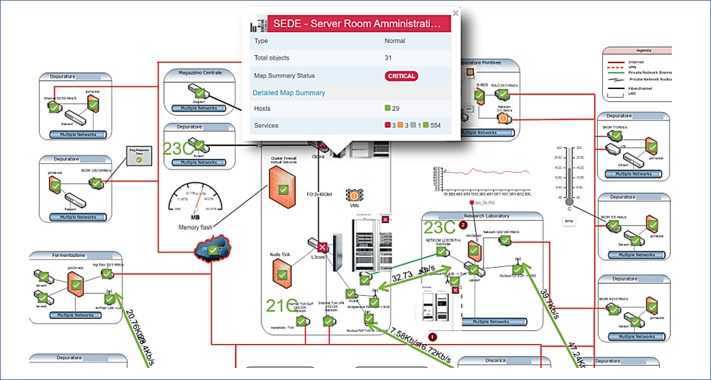
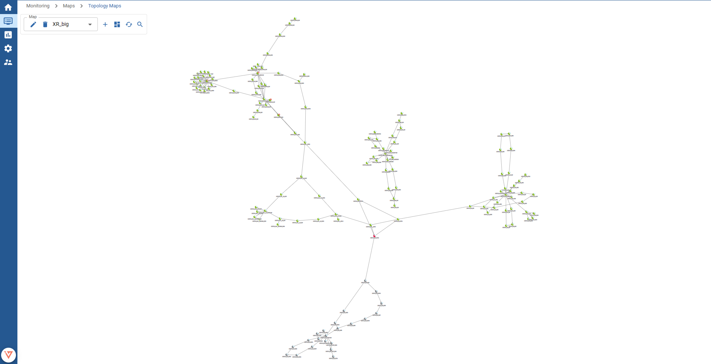

Maps display **Host and Services health status information**, but they can also display **performance indicators** in **near real time**.

Three types of maps are available:

### Graphical (normal) map

This type of map lets the user upload an image (such as a campus/building/floor map, a rack picture or a Visio network map screenshot) and use it as a static background, on which the user can place monitored Hosts and their Services.
Supported image formats are **.jpg .png .tiff** and **.bmp.**  
A shortcut/link to another map can also be placed in a map.

Graphical maps can be configured on page `Configuration -> Maps` and viewed on `Monitoring -> Maps -> Maps`.

### Geographical map

This type of map shows the position of monitored Hosts, on a **dynamic geographical** map.
It can be useful to display geographically distributed networks.
Geolocalization is performed through an integration with `openstreetmap.org` via its APIs.

Geographical maps can be configured on page `Configuration -> Maps` and viewed on `Monitoring -> Maps -> Maps`.

### Topology map

Such maps display the interconnectivity between monitored devices (hosts), along with the current device status.

This map type is useful to visualize network or reachability problems of monitored devices.

:::info

For this map to work properly, parent/child relations of hosts need to be configured.

Such relations are managed automatically when hosts are discovered from the network or the VMware discovery.
To configure relations manually, head over to `Configuration -> Hosts -> Hosts`, choose the host to configure, enter the `Relations` tab and choose the parent or dependant hosts.

:::

---

On the next section you find an explanation on how to add a new map.
