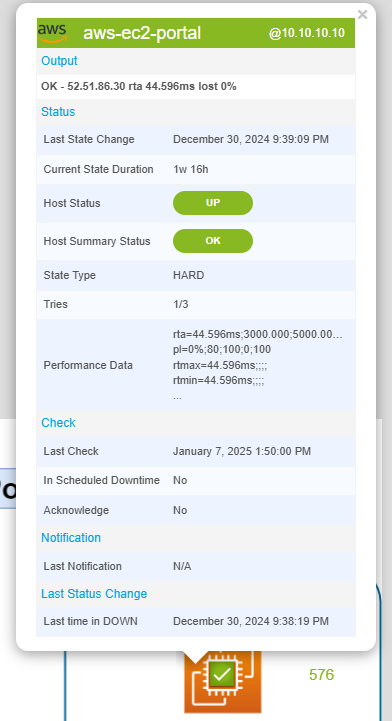
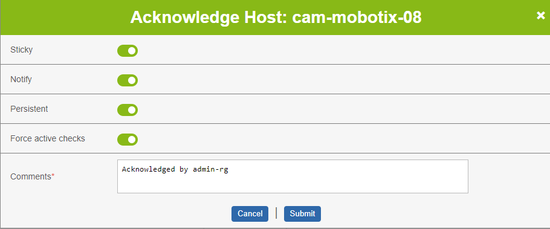
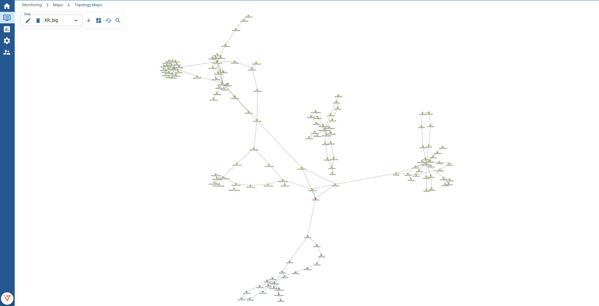

import Tabs from '@theme/Tabs';
import TabItem from '@theme/TabItem';

## Map Overview

To view all available maps of all types, navigate to `Monitoring -> Maps -> Maps`.

On this page you find all different kinds of maps available for visualization. All maps can be filtered by name and access groups.

Graphical (normal) and geographical maps can also be favorized for faster access. This can be done by clicking on the star icon on the top right corner of every list item.

On the top left corner of the map, a **color-coded square icon** represents the status of all resources placed on the map:

when there is at least one host or service in warning, critical or unknown status, the icon will take on the color of the one with the **highest severity**.
If no resource has any problems, the little square icon is green.

When hovering over a map, the owner of the map is displayed.

To visualize a map, simply click on it.

## Map Widgets

It is possible to display maps as *"widgets"* on the `Home -> Custom Views`.

:::tip

Topology Map widgets can be directly created from the [topology map view](./managing-maps#other-actions).

:::

To create new map widgets, see the documentation for [Creating a custom view](../events-alerts/viewing-events/create-custom-view.md#create-your-first-custom-view).

For graphical (normal) or geographical maps, make sure to select the Widget type **Map**.
For topology maps, make sure to select the Widget type **Topology Map**.

After you have saved the new widget, select the map in the widget preferences.

## View graphical and geographical maps

To view graphical or geographical maps, choose the map from the [Map overview](./visualize-maps#map-overview).

<Tabs groupId="type">
<TabItem value="normal" label="Graphical (normal)">

This is an example of a graphical (normal) map with custom background.

</TabItem>
<TabItem value="geo" label="Geographical">

When someone opens a geographic map, the previously saved viewpoint is restored.
You find more information about viewpoints in the [next chapter](./edit-maps#viewpoints) of our maps documentation.

---

This is an example of a geographical map with several services placed on it.
Some services are grouped together because of the zoom level.
When zooming in further, the services are ungrouped and become clearly visible.

### Grouped resources

On a geographical map, objects are grouped together when they share the exact same or a near position.
This behaviour is enabled by default and cannot be turned off.

Depending on the zoom level, the objects may ungroup automatically (when not sharing the exact same position).

When clicking on a group of resources, the zoom level of the map adjusts automatically to view all resources ungrouped.
In case of objects sharing the exact same position, the group is expanded and the grouped objects are visible.

</TabItem>
</Tabs>

### Map objects

Objects on graphical or geographical maps represent a **host**, **service**, **host group**, **service group**, **nested map** or a **single metric**.
They can be represented on the map by following types of objects:

- Icon
- Line
- Gadget

The status of a represented resource is shown by the color:

-  Up/Ok
-  Warning
-  Down/Critical
-  Unreachable/Unknown
-  Pending

When clicking on an object, a popup opens (when not disabled), displaying detailed information about the resource:

:::note

The above image is for illustrative purposes only.
The information displayed in the popup varies depending on the resource type.

:::

### Icon objects

An icon is the easiest and most common form to represent a resource on a map.

The icon itself and the icon's color indicate:

- which type of resource it represents
- which monitoring status the resource has at the moment

Following table can help you differentiate all types of icons and their respective resource types and statuses:

| Resource         | Up/Ok                                           | Warning                                                   | Down/Critical                                               | Unreachable/Unknown                                       | Pending                                                   |
| ---------------- | ----------------------------------------------- | --------------------------------------------------------- | ----------------------------------------------------------- | --------------------------------------------------------- | --------------------------------------------------------- |
| Host             |               | -                                                         |               |               |               |
| Service          |         |         |         |         |         |
| Host group       |     |     |     |     |     |
| Service group    |  |  |  |  |  |
| Geographical map |           |           |           |           |           |
| Graphical map    |           |           |           |           |           |

#### Highlighted state changes

When the status of a resource connected to an icon object changes, the object is highlighted and an animation is shown.

This behaviour helps you to detect critical state changes faster.

### Line objects

Using lines on a map can be especially useful when you want to represent flows between other resources.

Here is an example to visualize the interface traffic of a firewall:

In most cases the resource represented by a line is a service, but it is also possible to connect lines to a host, host group or service group.

As seen in the example (line representing a monitored interface), lines can not only display the status (by color), but also display additional metric values.
In this particular case the inbound and outbound traffic of the interface.

### Gadgets

Gadgets offer a different way of representing data.

Following types of gadgets are available:

Gauge

Using a gauge is useful when you want to understand how far a value has progressed towards its maximum.

In the above example the average CPU load (%) is displayed. A gauge fits here perfectly, due to a defined maximum value (100%).
The gauge not only shows the current value (55.5%), but also the thresholds for this CPU service (80-90% warning, 90-100% critical).

Other common examples for using gauges are storages/disks, temperature sensors or the memory usage.

:::note

Only services can be connected to gauges and only one service metric can be displayed.

In the above example the average CPU usage metric (metric *total_cpu_avg*) was used.

:::

Performance Graph

An interactive performance graph is displayed, showing performance values of a service over a configurable period of time.
It is possible to show all or also only one metric in the graph.

:::note

Only services can be connected to performance graphs and all *or* only one service metric can be displayed.

In the above example a log storage (all metrics) was used.

:::

Big Text

This type of gadget represents a single metric value as a large text.

The [text color](./visualize-maps#map-objects) indicates the status of the service.

:::note

Only services can be connected to performance graphs and only one service metric can be displayed.

In the above example a mysql storage (metric *used*) was used.

:::

Map

This type of gadget represents a nested map.

The [color](./visualize-maps#map-objects) of the square in the top right corner indicates the summarized status of all resources on the map.

:::note

Only maps can be connected to map gadgets.

It is also possible to visualize maps as an [icon object](./visualize-maps#icon-objects).

:::

---

Now you should know about the basics of viewing and understanding a map.
To understand now how to place objects on the map, check the [next Chapter of our i-Vertix Map Documentation](./edit-maps).

If you are already familiar with the principle of editing maps have a look at further actions which are possible on a map.

### Acknowledge problems and schedule downtimes

It is possible to acknowledge host or service problems as well as schedule downtimes directly from the map.

To acknowledge problems or schedule downtimes, right click a map object connected to a host or service and choose either *Acknowledge* or *Schedule Downtime*.

<Tabs groupId="context_menu">
<TabItem value="ack" label="Acknowledge">

When acknowledging a problem, you can define:

- the acknowledgement to be sticky
- to notify others about the acknowledgement
- the acknowledgement to be persistent
- to recheck the resource as soon as possible
- a comment describing the issue

You can learn more about acknowledging problems in our [Acknowledgement-Guide](../events-alerts/managing-alarms/acknowledge).

Click `Submit` to confirm and send the acknowledgement.

</TabItem>
<TabItem value="downtime" label="Schedule downtime">

When scheduling a downtime, you can define:

- the downtime to be fixed
- the duration or the exact start and end time
- if the downtime should also be applied on services (only available when the main resource is a host)
- a comment describing the issue

You can learn more about scheduling downtimes in our [Downtime-Guide](../events-alerts/managing-alarms/downtimes).

Click `Submit` to confirm and schedule the downtime.

</TabItem>
</Tabs>

## View topology maps

To view topology maps, choose the map from the [Map overview](./visualize-maps#map-overview) or navigate directly to `Monitoring -> Maps -> Topology Maps`.

To select or switch between maps, choose a map from the select control.

The shown nodes on the map represent a monitored host. The color indicates the status of the host:

-  Up
-  Down
-  Unreachable
-  Pending

The icon indicates the vendor or the type of the monitored device.

The arrows between nodes represent their relation.

> **Example:**
> The arrow from node `A` points towards node `B` - this means host `A` is the parent of node `B` and node `B` therefore the child of node `A`.
>
> The principle of host-relations enables the monitoring to display the status `Unreachable`. Find more about this behaviour in our [documentation about Host dependencies](../events-alerts/managing-notifications/dependencies#hosts-dependencies).

---

If you are interested on how to create a new topology map, read our [dedicated section for creating topology maps](./managing-maps#create-a-new-topology-map).
