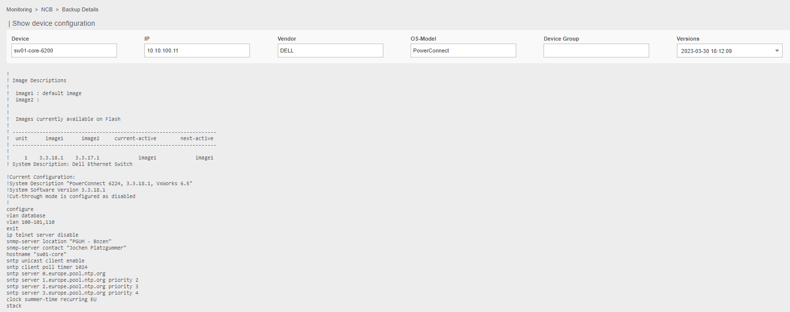
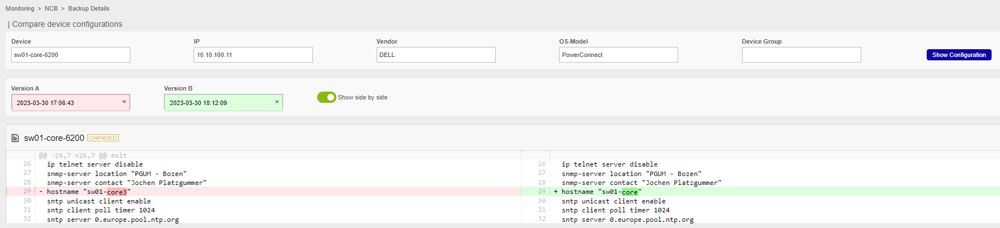

Go to **Monitoring > NCB > Backup Details

The view shows the list of connected devices where the configuration can be saved and not connected. In this section the available filters are: Device, Poller, Hostgroup, Devicegroup, Vendor, Status. Status can be: no Connectio, Success and Pending.

Click on the device or press the setting button  on the device to visualize the last backup version or 

Click on the button  to compare device configuration.

