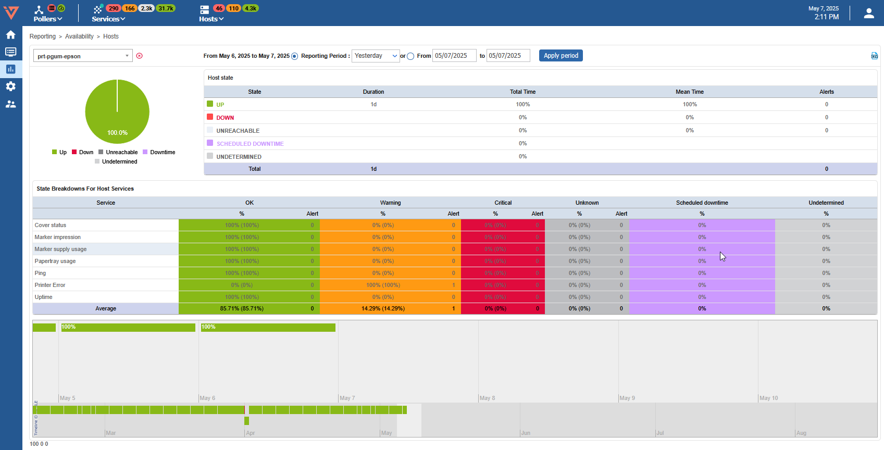
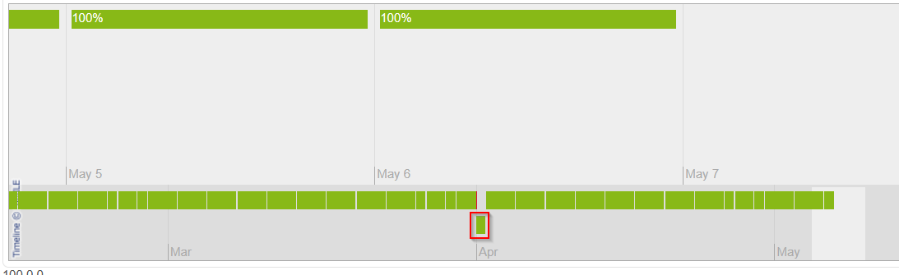
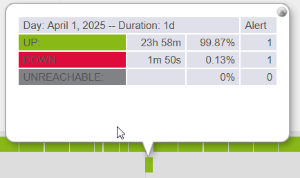
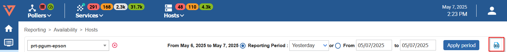

## Availability reports

The availability reports concerning objects monitored via the i-Vertix Web interface
can display the availability rates of hosts, a hostgroup, or a servicegroup over a selected period.

To access the availability reports:

- Go to **Reporting > Availability > Hosts**.
- Select a host from the **Host** list in the upper left.

- The **Reporting Period** lets you select a predefined period or define it manually using **From** to **to** fields.
- The **Host state** table displays the availability rates of objects.
- The **State Breakdowns For Host Services** table displays the availability of linked objects.
- The timeline provides a quick and intuitive overview of the status of the object.

Click a day in the timeline to obtain the report for that day:

It is also possible to view web reports:

* The groups of hosts: by clicking **Reporting > Availability > Hosts groups**.
* The groups of services: by clicking **Reporting > Availability > Service groups**.

The CSV icon in the upper right corner is used to export data as a CSV file.

> You can also see the availability of a service by clicking the service name in the host or servicegroup report.