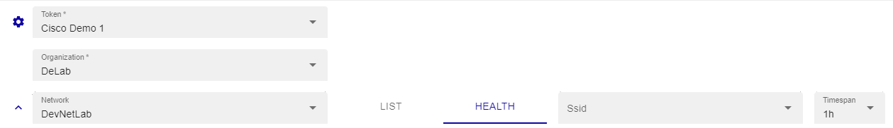
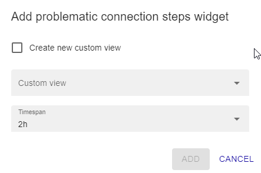

The Cisco Meraki Dashboard provides insights into your Cisco wireless devices using data collected via the Meraki API.
You can access the dashboard at:

**Reporting -> Meraki Dashboard -> Wireless**

## List tab

To view the list of devices, select the mandatory **Token** and **Organisation** fields in the filters. Other filters are available, including Networks, Search by Name, IP or Serial, Device Status.

The list tab displays the hosts that were detected by the discovery, along with the following information:

* **Device status**: status can be online, offline, alerting, dormant
* **Name**: Device name
* **Serial**: serial number
* **Model**: Host/device model 
* **Public ip**: Host IP Address
* **Local ip**: Host IP Address
* **Ethernet**:
* **Monitored**:
* **Status**: Host status

To see Host details, click on it:

## Health tab
Before selecting the tab, the function must select at least one available network.

New search filters based on SSID and Timespan are available.

i-Vertix IT Monitoring offers various dashboard:

**Problematic connection step**

A problematic connection step with the Cisco Meraki Dashboard refers to a specific stage or action in the process of connecting to and accessing the Dashboard that is encountering difficulties or issues. It indicates that there is a specific point in the connection flow where problems are arising, resulting in an inability to establish a successful connection or access the Dashboard's features and functionality.

When facing a problematic connection step with the Cisco Meraki Dashboard, it's important to identify the specific stage or action causing the issue in order to troubleshoot effectively.

**Connection issues by SSID**

Connection issues by SSID in the Cisco Meraki Dashboard refer to problems encountered when attempting to establish a wireless network connection using a specific Service Set Identifier (SSID). An SSID is a unique identifier assigned to a wireless network to distinguish it from other nearby networks.

**Connection issues by client or device type**

Connection issues by client in the Cisco Meraki Dashboard refer to problems encountered by specific devices or clients when attempting to establish a connection to the network. It means that certain devices or users are experiencing difficulties connecting to the network, while other devices may connect without any issues.

**Connection issues by AP**

Connection issues by Access Point (AP) in the Cisco Meraki Dashboard refer to problems encountered with a specific AP or group of APs in the network. It means that certain APs are experiencing difficulties in establishing and maintaining connections with client devices, resulting in poor or inconsistent network connectivity.

## Widgets
It is possible to add widgets to **Home > Custom Views**, for example a widget for a problematic connection.

1. Press on the button **Create widget on custom view**

2. Select a **Custom view** or click on **Create new custom view**

If you choose to create a new custom view select the number of column

3. Select the Timespan

4. Press ADD

The custom view now is ready, follow this path: **Home -> Custom Views**