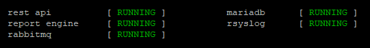
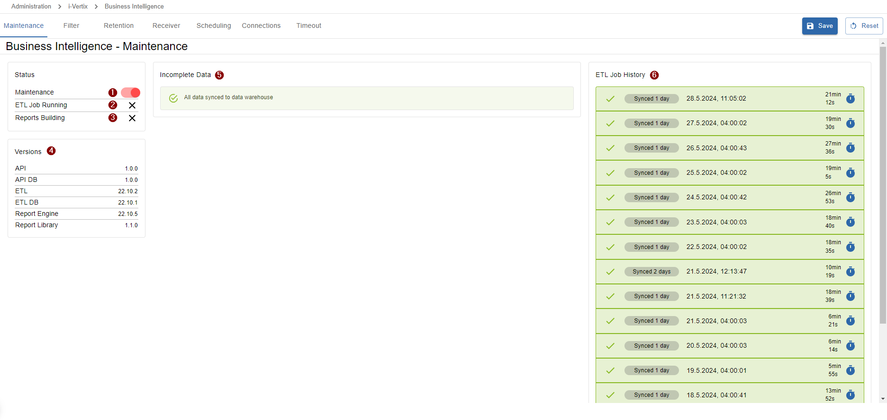

import ImageCounter from "../../../../src/components/ImageCounter";

## Troubleshooting

### Unable to connect

There could be several reasons which may lead to connection issues to your i-Vertix BI server:

Troubleshooting steps

1. Make sure the virtual machine is running
2. Make sure your firewall is not blocking requests to the server
3. Verify the current ip address and dns settings configured on the server (visible on the `menu`)
4. Check the system logs to find any problematic logs regarding connection
5. Verify if SSH is running (`systemctl status sshd`) - start/restart the ssh daemon with `systemctl restart sshd`
6. Restart the server (`menu` option `2) Reboot i-Vertix BI`)

### Unable to log in

If you are not able to log into your account using the correct password, your IP address may be blocked by fail2ban, a service we are running to block undesired authentication attempts (brute-force attempts).

Our [dedicated Fail2ban article](../../installation/security-aspects/fail2ban) may help you to check or unblock banned IP addresses.

### REST API not responding

If the i-Vertix BI REST API is not responding, verify if the `rest api` service is RUNNING in the `menu`.

Following steps may help you to re-activate the REST API:

Troubleshooting steps

1. Restart the REST API service from the `menu` by entering option `4) Restart i-Vertix BI services` and option `1) rest api`
2. Check the API logs from the `menu` by entering option `7) Logs` and option `2) i-VERTIX BI rest api`
    1. Make sure your the backend server is starting on **Port 3000** using **HTTPS**
        - if the server was not started on port 3000, set the port to `3000` in file `/usr/share/ivertix-bi/backend/.env`
        - if the server was not started using HTTPS, the local SSL certificate was probably not found.
        The local certificate named `bi-backend.crt` should be located in `/etc/pki/tls/certs`.
        If the certificate does not exist you can re-run the setup program from the `menu` by entering option `9) Setup i-Vertix BI services`.
        A new certificate should be generated.
    2. Check for other errors in the log - if any errors are display in the api log, please contact our [Support team](mailto:support@i-vertix.com) and
    provide all relevant information including the complete log file located in `/var/log/ivertix-bi/backend/ivertix-bi-backend.log`.

### Report generation is failing

Errors during report job executions can be caused by various problems:

Report parameters invalid or missing

It is possible that some newly added required report parameters are missing after an update of the used report template was performed in the `Report Store`.

:::tip[Solution]

Edit the failing report job and insert the newly added required report parameters to get your job up and running again

:::

System maintenance

Report jobs are suspended during a system maintenance. You can verify the current maintenance status under `Administration -> i-Vertix -> Business Intelligence` on the `Maintenance` tab.

<ImageCounter>1</ImageCounter> Maintenance status

A red power icon indicates that the maintenance is *not activated*, a green icon indicates that the maintenance mode is *activated*.

:::warning

Please beware that **deactivating** the maintenance status during an actual system update can lead to **inconsistent** or **suddenly aborted report job executions**
as well as a **severe data warehouse inconsistency**.

:::

:::tip[Solution]

*Deactivate* the system maintenance by clicking the green power button **after the system is no longer under maintenance. 

:::

ETL job still running

It is also possible that the daily etl sync-job is still running. You can verify the current etl job status under
`Administration -> i-Vertix -> Business Intelligence` on the `Maintenance` tab.

<ImageCounter>2</ImageCounter> ETL Job Running & <ImageCounter>6</ImageCounter> ETL Job History

If the ETL job is still running, you should also see a new, currently loading entry in the *ETL Job History* <ImageCounter>6</ImageCounter>,
indicating when the ETL job was started and how many days are synced.

:::note

Syncing one day of data takes approximately ~10-40 minutes. The execution time highly depends on the size of the
monitoring system and the hardware resources of the i-Vertix BI server.

:::

If the ETL job is taking longer as expected (*&lt;amount of days synced&gt;* x 30 (*estimated minutes for one day*)) you should check the ETL log files on the i-Vertix BI server.
You can open them from the `menu` when entering option `7) Logs` and option `4) i-VERTIX BI ETL (latest)`.

If you are encountering any errors in the log, please consider contacting our [Support team](mailto:support@i-vertix.com)
and provide all relevant information including the log files located in `/var/log/ivertix-bi/etl/`.

The BI server IP address has changed recently

If the i-Vertix BI server address has changed recently it is necessary to set the new IP address also in the monitoring module settings.
After the ip address was updated on the settings, it is also required to re-create the database connection profile to ensure that the daily
ETL job is able to sync data from the monitoring server to the data warehouse on the i-Vertix BI system.

You can find more information in our dedicated [Connection-Settings](./bi-settings#-re-create-connection-profile) documentation.

Other possible causes

If you expect reports to be generated by a scheduled job, but no reports were generated and you can find **no history item**
in the report history for the report, following problems could have occurred:

1. The i-Vertix BI API is not responding (indicated by errors containing `i-Vertix BI API: Idle timeout reached`)
2. The gorgone service is encountering a problem
3. The monitoring license is no longer valid
4. There is no space left on the i-Vertix BI server
5. The i-Vertix BI server's database is encountering a problem
6. The i-Vertix BI report engine is not running

:::note

Most of the above problems can be verified by checking the monitored services in your monitoring system.

:::

:::tip[Solution]

The following solutions can be applied to the above mentioned problems:

1. [Troubleshoot the i-Vertix BI API](./bi-troubleshooting#rest-api-not-responding)
2. Restart the gorgone service on the monitoring central server with `systemctl restart gorgoned`
3. Contact our [Sales Team](mailto:sales@i-vertix.com)
4. Allocate and mount more disk space to the i-Vertix BI server
5. Try to restart the mariadb service on the i-Vertix BI server by entering option `4) Restart i-Vertix BI services` and option `4) mariadb` from the `menu`.
If the problem still persists after the restart, consider contacting our [Support team](mailto:support@i-vertix.com) with all relevant information
6. Try to restart the report engine service on the i-Vertix BI server by entering option `4) Restart i-Vertix BI services` and option `4) report engine` from the `menu`.
If the problem still persists after the restart, consider contacting our [Support team](mailto:support@i-vertix.com) with all relevant information including the
log files located in `/var/log/ivertix-bi/report-engine/engine/`

:::

