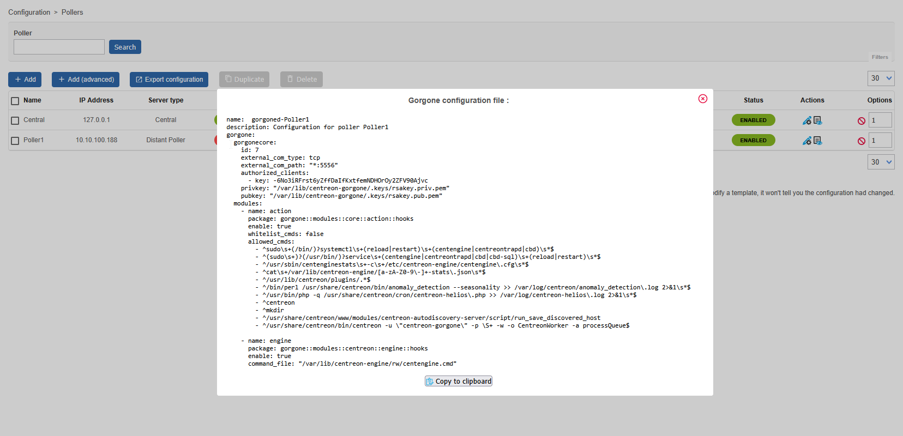

import ImageCounter from "../../../../src/components/ImageCounter";

## Poller configuration

To attach a Smart Poller **i-Vertix4** to a Central Management, please follow these instructions:

1. go to Configuration -> Pollers -> Pollers

    

2. Click on `Add`

    

3. Select *Add a Centreon Poller* and then `Next`
    

4. Fill in the Poller information  
    

- <ImageCounter num={1} /> The new Poller name
- <ImageCounter num={2} /> The Poller IP address
- <ImageCounter num={3} /> The i-Vertix Central IP address, please make sure the Poller is able to contact the Central with this IP address

5. Click on `Apply` to Add the new Poller and return to the Poller List
    


---

## Broker configuration

1. go to Configuration -> Pollers -> Broker configuration

    

2. Click on the module entry created for the new Poller, in this example **poller1-module**
    

4. Set the field **"Event queue max size"** to **250000**

    

5. Save this configuration by clicking `Save` at the top right corner

---

## Poller resources configuration

1. go to Configuration -> Pollers -> Resources

    

2. Click on the *$IVERTIXPLUGINS$* entry
    

3. Add the poller to the *Linked Instances* field.
   This setting is needed to configure the base directory for the commands on the Poller
    

4. Save this configuration by clicking `Save` at the top right corner

---

## Gorgone configuration export

1. logon on your i-Vertix Central GUI and go to **Configuration -> Pollers**

2. click on the ICON **“Gorgone configuration”** under **Actions**

    

3. following page should appear

    

4. click `Copy to clipboard`

5. Log on to the i-Vertix4 Poller through SSH.
   After login, run:

    ```bash
    sudo bash
    ```

   to become **root**

6. Paste the previously copied text in the terminal and submit, to create the new configuration file for the gorgone daemon

    

7. Restart the gorgone deamon on your Poller to use the new configuration

    ```bash
    systemctl restart gorgoned.service
    ```

    

---

## Poller restart

1. Go to Configuration -> Pollers -> Pollers

    

2. Select the Smart Poller that is being configured

    

3. Click on **Export configuration**

    

4. Select the first 4 options (at left) , then select **Method -> Restart** in the drop down menu

    

:::caution Mandatory

The following steps are mandatory to synchronize immediately the plugins with the new Poller. Otherwise, the Central Manager performs such a synchronization every 4 hours

:::

5. Log on to the Central Management (SSH) and launch

    ```bash
   sudo bash
   ```

   to become **root**

6. Launch the following command to syncronize the plugins with the Poller and start immediately the monitoring.

    ```bash
    sudo /opt/i-vertix/scripts/i-vertix/sync_poller.sh
    ```

7. Final check in the GUI under **Configuration -> Pollers -> Pollers**

    Check if the configuration is like the one shown in the picture.

    

<!---
:::note

If you want to start immediately with the monitoring, make sure to also manually synchronize the plugins from the central to the newly created poller!

:::

## Synchronize Plugins from Central to Poller

By default, syncing all plugins to the pollers is done every 4 hours on the Central server.

In case of adding a new poller where you want to start immediately with the monitoring,
you need to **execute following command** on the **Central Monitoring Server** to immediately sync the plugins:

```bash
sudo /opt/i-vertix/scripts/i-vertix/sync_poller.sh
```
--->
