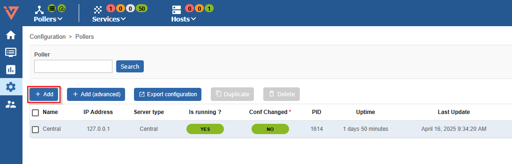

import ImageCounter from "../../../../src/components/ImageCounter";

## Add the new Poller

To attach a Smart Poller **i-Vertix4** to a Central Management, please follow these instructions:

1. go to Configuration -> Pollers -> Pollers

    

2. Click on `Add`

    

3. Select *Add a Centreon Poller* and then `Next`
    

4. Fill in the Poller information  
    

- <ImageCounter num={1} /> The new Poller name
- <ImageCounter num={2} /> The new Poller IP address
- <ImageCounter num={3} /> The i-Vertix Central IP address, please make sure the Poller is able to contact the Central with this IP address

5. Click on `Apply` to Add the new Poller and return to the Poller List
    

:::tip
When the Smart Poller is unable to directly contact the Central Server, due to specific network settings for example, it is possible to configure the Central to initiate the connection to the Poller's Broker instead.
In this case the `Advanced: reverse Centreon Broker communication flow` option should be enabled.
This option will automatically create a matching Input entry in the *central-broker-master* Broker configuration for the Central.
For more information refer the [Additional configuration](#additional-configuration) section.
:::
---

## Broker configuration

1. go to Configuration -> Pollers -> Broker configuration

    

2. Click on the entry created for the new Poller, in this example **poller1-module**
    

4. Set the field **"Event queue max size"** to **250000**

    

5. Save this configuration by clicking `Save` at the top right corner

---

## Poller resources configuration

1. go to Configuration -> Pollers -> Resources

    

2. Click on the *$IVERTIXPLUGINS$* entry
    

3. Add the poller to the *Linked Instances* field.
   This setting is needed to configure the base directory for the commands on the Poller
    

4. Save this configuration by clicking `Save` at the top right corner

---

## Gorgone configuration deploy

1. logon on your i-Vertix Central GUI and go to **Configuration -> Pollers**

2. click on the ICON **“Gorgone configuration”** under **Actions**

    

3. following page should appear

    

4. click `Copy to clipboard`

5. Log on to the i-Vertix4 Poller through SSH.
   After login, run:

    ```bash
    sudo bash
    ```

   to become **root**

6. Paste the previously copied text in the terminal and submit, to create the new configuration file for the gorgone daemon

    

7. Restart the gorgone daemon on your Poller to use the new configuration

    ```bash
    systemctl restart gorgoned.service
    ```

    

---

## Poller restart

1. Go to Configuration -> Pollers -> Pollers

    

2. Select the Smart Poller that is being configured

    

3. Click on **Export configuration**

    

4. Select the first 4 options (at left) , then select **Method -> Restart** in the drop down menu

    

:::caution Mandatory

The following steps are mandatory to synchronize immediately the plugins with the new Poller and start monitoring right away. Otherwise, the Central Manager performs the synchronization every 4 hours

:::

5. Log on to the Central Management (SSH) and launch

    ```bash
   sudo bash
   ```

   to become **root**

6. Launch the following command to synchronize the plugins with the Poller and start immediately the monitoring.

    ```bash
    sudo /opt/i-vertix/scripts/i-vertix/sync_poller.sh
    ```

7. Final check in the GUI under **Configuration -> Pollers -> Pollers**

    Check if the configuration is like the one shown in the picture.

    

<!---
:::note

If you want to start immediately with the monitoring, make sure to also manually synchronize the plugins from the central to the newly created poller!

:::

## Synchronize Plugins from Central to Poller

By default, syncing all plugins to the pollers is done every 4 hours on the Central server.

In case of adding a new poller where you want to start immediately with the monitoring,
you need to **execute following command** on the **Central Monitoring Server** to immediately sync the plugins:

```bash
sudo /opt/i-vertix/scripts/i-vertix/sync_poller.sh
```
--->

## Additional configuration

### Reverse Broker communication flow

In certain cases, the Poller might not be able to initialize the broker data flow to the Central or Remote Server—such as when a firewall blocks the connection.
To work around this limitation, it is possible to configure the Central Server to initiate the connection to the Poller's Broker instead, effectively circumventing the issue.

If the Poller was added with the option *Advanced: reverse Centreon Broker communication flow* everything is already set up, and the following steps are needed only to change the configuration.

Otherwise the following steps are needed:

1. Go to the **Configuration > Pollers > Broker configuration** menu and click on
**central-broker-master** configuration on the Central Server.

2. Go to the **Input** tab panel and add a new **TCP - IPv4** entry.

3. Enter the **Name** of the connection, the TCP **Connection port** where the Poller is listening, and the **Host to connect to** (IP address of the Poller). Then **Save** your configuration.


<!--- 
TODO: evaluate if next section should be included or not
--->

### Communication Protocol between Central Manager and Smart Poller

The Gorgone daemon installed on Pollers typically communicates with the Central server using a ZeroMQ-based messaging protocol. However, it is still possible to configure the daemon to use the legacy SSH-based communication method.

While SSH communication remains available, it is deprecated and no longer actively developed. It should only be used as a transitional option for migrating from older platforms that previously relied on Centcore.

> Pollers that will not use ZMQ as communication type
> between Central's Gorgone and theirs will not benefit from all i-Vertix
> and i-Vertix's extensions features.

<Tabs groupId="sync">
<TabItem value="Modern (recommended)" label="Modern (recommended)">

| Communications                         | Allowed actions                                                           |
| -------------------------------------- | ------------------------------------------------------------------------- |
| **Central** <-- *ZMQ* --\> **Poller** | Monitoring actions\*, Engine/Broker statistics collection, Host Discovery |

</TabItem>
<TabItem value="Legacy (ex-Centcore)" label="Legacy (ex-Centcore)">

| Communications                         | Allowed actions                                                           |
| -------------------------------------- | ------------------------------------------------------------------------- |
| **Central** <-- *SSH* --\> **Poller** | Monitoring actions\*, Engine/Broker statistics collection, Host Discovery |

</TabItem>
</Tabs>

\* Monitoring actions are all actions provided by Centreon UI like downtimes,
acknowledgements, etc and configuration export.
