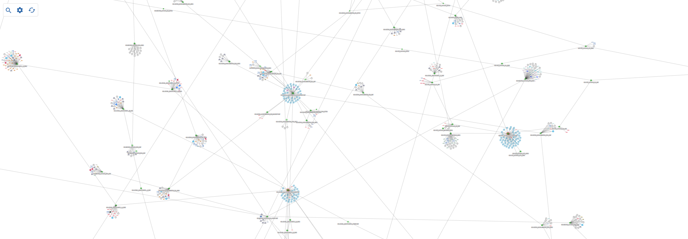
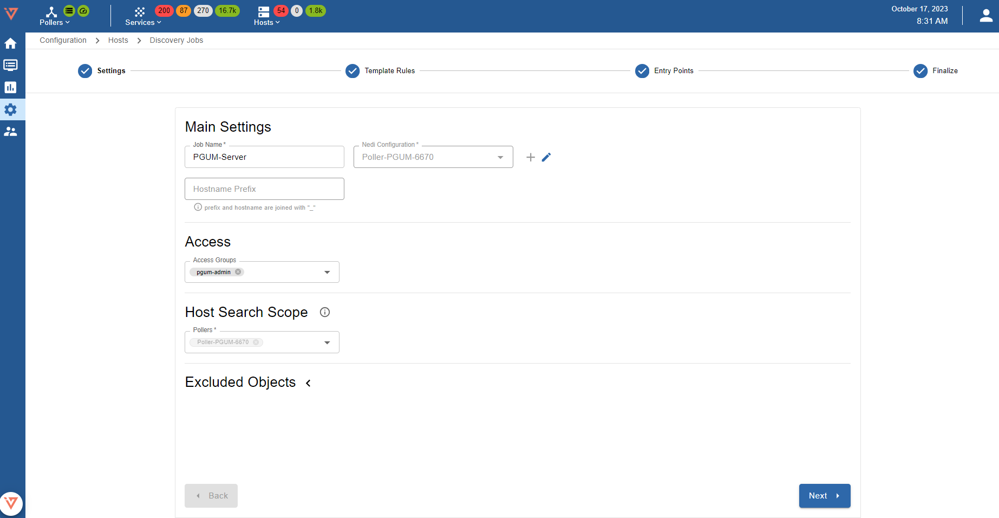
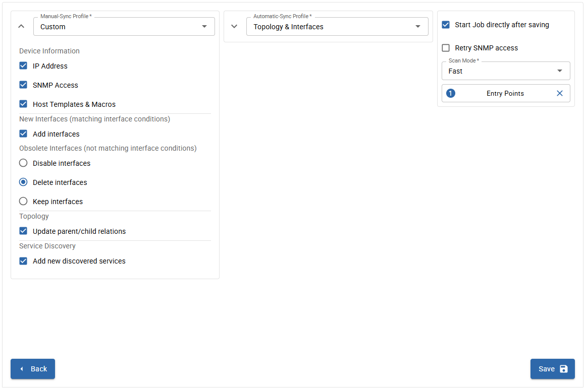

## Concepts and prerequisites

i-Vertix Network Topology Discovery can collect and interpret information produced by layer 2 network protocols such as LLDP (Link Layer Discovery Protocol), CDP (Cisco Discovery Protocol) and other standard and proprietary ones, to automatically detect which devices are in the network and how they are interconnected to each other (port-to-port connectivity among devices and their neighbors).

As a result, i-Vertix IT Monitoring can automatically configure monitoring dependencies and draw accurate network topology maps.

In order to run this discoveries, devices have to be properly configured in terms of L2 network discovery protocols (and SNMP, as i-Vertix uses it to collect network topology information).

If these prerequisites are not satisfied, i-Vertix Network Topology Discovery will still detect network devices, but port-to-port connectivity information won’t be detected and therefore maps won’t be drawn.

## Job settings

### Main settings

* **Job Name**: use a meaningful name 
* **Nedi Configuration**: select a configuration from the drop- down menu otherwise click on **+ ADD CONFIGURATION** to create a new one
* **Hostname Prefix**: optional prefix (it can be used for example to “tag” discovered hosts)

### Access

**Access Groups**: user group that can view and modify this job and all the hosts it will discover

### Excluded Object

List of hosts excluded from the discovery  

Click on **Next** to move to the next configuration settings page

## Add a new Nedi Configuration

* **Poller**: select the Smart Poller that will run the scan

* **SNMP info**: click on **+ ADD SNMP INFO** to enter the SNMP communities

* FILTERS (optional) 
    * **+ADD NET FILTER**: enter a regular expression to filter based on network settings
    * **+ADD NAME FILTER**: enter a regular expression to filter based on sysname
    * **+ADD BORDER**: enter a regular expression to specify the last host of the scan (neighbor name where the discovery should stop) 

* **Cron jobs**: a scan can be executed periodically (default scan interval is 4-hour). Click on **+ ADD CRON JOB** to add and schedule new jobs.

### Template Rules

Mapping rules are preconfigured by i-Vertix

**Note**: It can happen that some **Template Rules** are missing. In such a case:
* **Download the relevant plugin** from the Plugin Store and install it
* Click on **RESET** to add Template Rules included in the plugin you have just installed to the Template Rules list
* Contact support@i-vertix.com if the template rule is still not available

### Entry Points

Enter IP Address or IP Address range from which the discovery will have to start

### Finalize

Select **Start Job directly after saving** to run the scan as soon as it gets saved. Select the Entry Point added previously. 
Click on **Save** to save the discovery job.

The job will be run according to the configured schedule.

## Viewing the results of a discovery job

Once the scan completes, its **results are displayed**.

They depend on hosts reachability, template rules mapping, SNMP reachability and status filters that have been applied (Note: “new” and “existing (ip)” are applied by default).

Different filters are available: **Device Name, OS, Type, Vendor, Status, Hostgroups and Last Discovered** (which lets you select hosts discovered in the past; up to 30 days back in time).
If **Show SNMP Failed** is selected, the system will show all the devices on which SNMP requests have failed.

**Status** filters are:

* **new**: hosts are highlighted in green. SNMP connection was established and the proper templates were assigned to the hosts. To start monitoring new hosts, select them and click on **ADD TO MONITORING**.
* **existing (ip)**: an host with the **same IP address** had already been detected. The host is likely already being monitored.
* **existing**: an host with the **same IP address and hostname** had already been detected. The host is likely already being monitored.
* **conflict**: an host with the **same hostname** had already been detected, or **the host doesn’t have any hostname**. To resolve the conflict, hostname has to be entered or modified.
* **excluded**: the host was excluded from the discovery (**EXCLUDED HOST**).
* **no template assigned**: the host didn’t match any templates. Amend the discovery job and assign a new template rule, or add the host manually.

**LIST** tab displays the hosts that were detected by the discovery, along with the following information:

* **Device**: device name
* **Stack**: if the column/field is empty the device is not part of a stack. If it’s the member of a stack, this icon is displayed 
* **IP**: Host IP Address
* **Vendor**: Host brand/manufacturer
* **OS**: Host Operating System
* **Type**: Host/device type
* **First Discovered**: first time the host was detected/discovered
* **Last Discovered**: last time the host was detected/discovered
* **SNMP**: 
    * X SNMP request failed         - ✓ SNMP request succeeded
* **Templates**: Template(s) assigned to the Host
* **Root**: empty or ✓. Hosts that are flagged with the ✓ symbol are "**relation root**", i.e. the starting points from which the parent/child relation among hosts is automatically configured.  
* **Status**: Host status

To see Host details, click on it

### Device info

* Hostname: it can be changed if the host is not yet being  monitored
* Alias: optional description, it can always be changed 
* IP: Host IP Address

### Device

* Device Name
* Type: Device type/model 
* Vendor: Device brand/manufacturer
* Serial: Device serial number
* OS: Operating System
* Boot Image: Firmware version
* Stack: 
    * If empty the device is not a stack member
    * If the symbol ✓ is shown, the host is a stack member
* Location: device SNMP location
* First Discovery: first time the host was discovered
* Last Discovery: last time the host was discovered
* Description: Host description

### Host templates

* **Templates from rules** 

Host template associated with the host as per Template Rules match. To replace it or add another/others, click on **+ HOST TEMPLATE**

* **Templates on linked host** 

<u>If the Host is being monitored</u> this field shows Templates associated with it (linked to it). To replace or add other Templates (overriding the association coming from Templates from rules), configure the new association within the Host:

* Go to **Configuration -> Host -> Host**
* Click on the Host that is to be configured
* Under "**Templates**" select the new template(s) or click on **x** to remove the association with the current one
* **Create Services linked to the Template too**: select **Yes**
* Export the configuration to the Poller(s) 

### Uplinks

This tab shows device uplinks, that are device Interfaces linked/connected to neighbour network devices

In this section the available filters are: Name, Type, Neighbour. All the **uplinks** with status = **new** are selected by default.

Uplinks can be:
* **new**: newly discovered uplink
* **del**: uplink deselected (and therefore not being monitored)
* **m**: manually modified by the user

Uplinks have the following attributes:
* **Name**: uplink interface name
* **Type**: protocol used to identify host connectivity and to  map it
* **Neighbours**: devices directly connected to the host, and their connecting interface  

### Interfaces

**<u>This tab shows all device Interfaces: both uplinks and interfaces not linked/connected to neighbour network devices</u>**

In this section available filters are: **Name & Alias, Type, Duplex, Status**. Interface status is represented by a colored dot and can be **Active, Inactive, Disabled and Unknow**. 
All the interfaces that are uplinks and have status = **new** are selected by default, unless they were deselected in the UPLINKS tab. Interfaces can be:

* **new**: newly discovered interface
* **del**: interface deselected (and therefore not monitored)
* **m**: manually modified by the user

**Interfaces** have the following attributes:

* **Name**: Interface name
* **Alias**: Host alias (Note: this is not the Interface alias)
* **Desc**: Interface description
* **PVID**: Port VLAN ID
* **Speed**: Interface speed
* **Duplex**: FD, HD or Unknow
* **Type**: Ethernet, Virtual Interface, Other
* **Status**: represented by the color-coded dot

### Service discovery

Template Rules are used to associate templates with hosts. They can also associate additional services, detected during the scan/discovery, with the Hosts. New services are shown with status = **new**. Manual changes are applicable.

**Note**: SERVICE DISCOVERY tab is available if job discovery template rules are configured so that to detect additional services (in addition to the default ones). 

### Linked host

This section is enabled only when the network device  discovered by “Network Discovery“ is synchronized with “IT Monitoring” so that the device itself becomes a monitored Host. 

### Map tab

This tab displays the network infrastructure topology map: how network devices are interconnected to each other and the root device(s) (**RELATION ROOT(S)**).

To assign root role to a device, click on it and then select **RELATION ROOT**. A red circular border will appear. 
Multiple relation roots can be defined. 
You can replace the current one or add new ones. 

## How to monitor Hosts

Select the hosts you want to monitor and click on **SYNC WITH MONITORING**.

:::note

As previously stated, any changes will take effect only once they are exported to the **Smart Poller(s)**. 

:::

