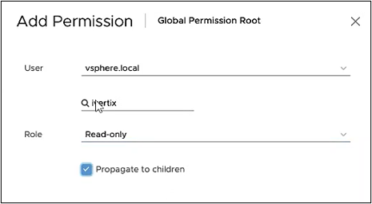
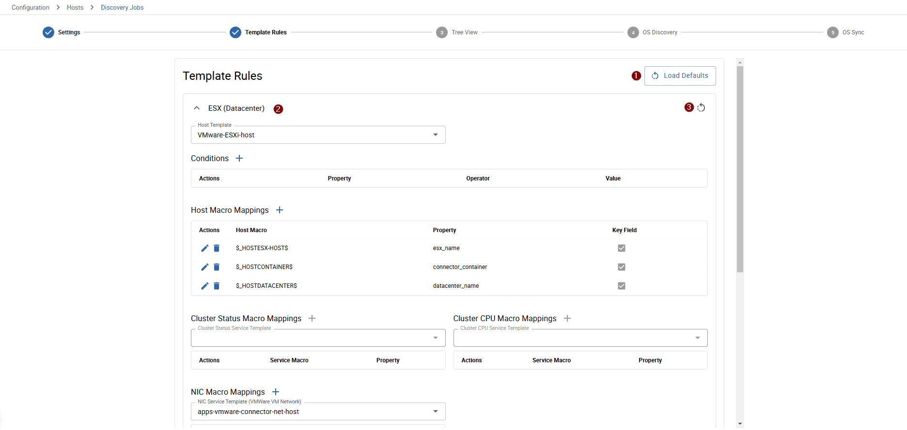
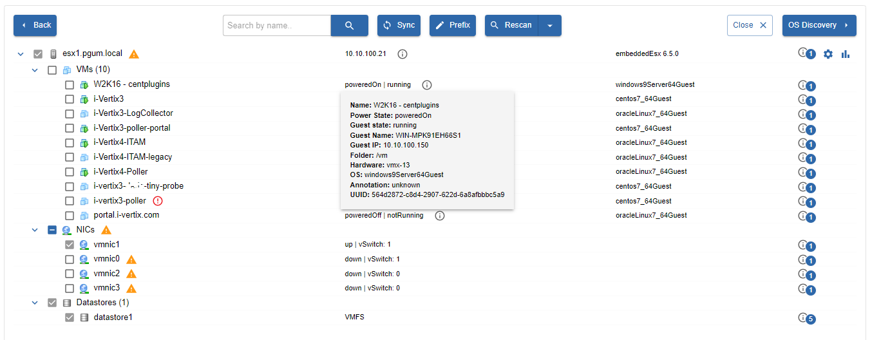

import ImageCounter from "../../../../src/components/ImageCounter";

## vCenter Prerequisites

Before performing a vmware discovery, you need to make sure that the statistic settings of your vCenter appliance are correctly configured.

1. Create a read only user who can access vCenter and select the option Propagate to children

    

2. Configure the statistic level for the 5 minute interval duration, increasing it from 1 to 3

    

    * In the vSphere Client, navigate to the vCenter Server instance
    * Select the Configure tab
    * On the lefthand menu, click on `Settings -> General`
    * Click `Edit` on the top right corner
    * In the `Statistics` table, only for `Interval Duration: 5 minutes`, change the statistics level from `1` to `3`

    

## Create a new VMware Discovery job

To create a new VMware discovery job, select `VMware Discovery` from the [job creation dialogue](./description#new-discovery-job).

### Main settings

*  <ImageCounter num={1} /> <strong>Job Name</strong>: choose a name to identify your job
*  <ImageCounter num={2} /> <strong>Poller</strong>: select the Smart Poller that will perform the scan
*  <ImageCounter num={3} /> <strong>Container</strong>: select a VMware Container which holds the information used to connect to the VMware appliance
*  <ImageCounter num={4} /> <strong>ESX Standalone</strong>: check this flag if the appliance to scan is an ESX standalone system
*  <ImageCounter num={5} /> choose entities to include in the scan (datastores, virtual machines, network interface cards)
*  <ImageCounter num={6} /> <strong>Hostname Prefix</strong>: choose a hostname prefix when needed which will be preceded to the final hostnames of the discovered items
*  <ImageCounter num={7} /> <strong>Access Groups</strong>: select access groups which will have access to the job

#### <ImageCounter num={3} /> Add a VMware Container

When you don't already have defined a VMware container you can easily add a new one by clicking on `Add Container` next to the `Container` select box.

A new popup will appear where you can insert the required information:

* **Container Name**: choose a name to identify your container (must be unique on poller)
* **Poller**: select the Poller that will issue the connection request (the poller must reach the VMware appliance)
* **Protocol**: choose the protocol used to access the VMware SDK (http or https)
* **IP / FQDN**: enter the vCenter appliance IP address
* **Username**: enter the username of the vCenter readonly user
* **Password**: enter the password of the vCenter readonly user 

### Template Rules

Template rules are used to map found datacenters, esx hosts or virtual machines to monitoring hosts.
A template rule consists of conditions which are checked against a found entity.
When all conditions of a rule match an entity, the template rule with it's host template and other mappings will be assigned to the device.

Some template rules are already preconfigured and maintained by the i-Vertix team.
They come along with the plugins installed from the [Plugin Store](../../quick-start-guide/how-to-configure-central-and-poller/plugin-update-installation.md#install-a-plugin).

:::note

It can happen that some **Template Rules** are missing. In such a case:

1. **Download the relevant plugin** from the [Plugin Store](../../quick-start-guide/how-to-configure-central-and-poller/plugin-update-installation.md#install-a-plugin) and install it
2. Click on <ImageCounter num={1} /> **Load Defaults** to add Template Rules included in the plugin you have just installed to the Template Rule list

Should the desired template rule still not be available, contact support@i-vertix.com.

:::

To synchronize the default job's template rules with the latest available version click on <ImageCounter num={1} disableMargin /> **Load Defaults**.

It is also possible to <ImageCounter num={2} disableMargin /> modify existing ones.
When a default tempalte rule is modified it will not be reset when <ImageCounter num={1} disableMargin /> reloading the default rules.
To reset a modified default template rule to match it's default configuration again, click the <ImageCounter num={3} disableMargin /> individual reset button.

## VMware Discovery Results (Tree View)

This view is available in the VMware job wizard and shows the VMware discovery results.

During the discovery, a popup will show the progress of the scan.

Once the scan finishes, the virtual environment topology/tree is displayed.

To start monitoring any discovered items, select them and click on **Sync**.

Remember to **export the configuration to the Smart Pollers**.

**Rescan**: click on it to perform a new scan.

**Change prefix**: it can be used to add a prefix before the name of the selected items.

You can change Datacenter and/or Virtual Machines names. Once the you have edited it, the page will display both the hostname detected during the scan and the one you configured.  

To exclude an item from next discoveries and stop monitoring it, right click on it and then select **Exclude**.

VMs can be monitored through VMware but if you want to go deeper into their status and performance you may want to monitor them directly. Easily you can start monitoring VMs in bulk directly at the operating system level in a more granular and accurate way.

If you want to use this feature after scanning, check out our [VMware OS Discovery](../discovery/vmware-os-discovery.md)!
 