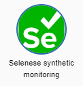
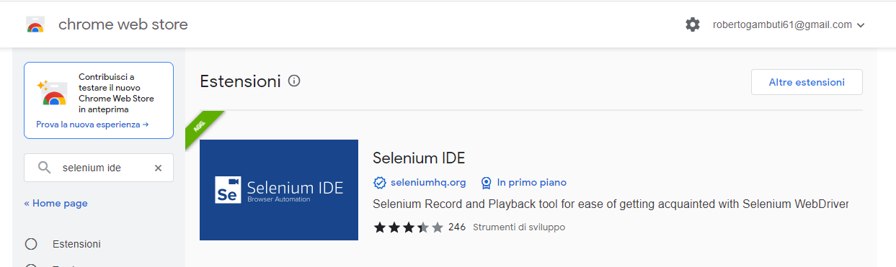
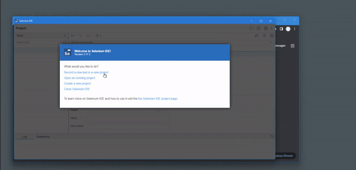
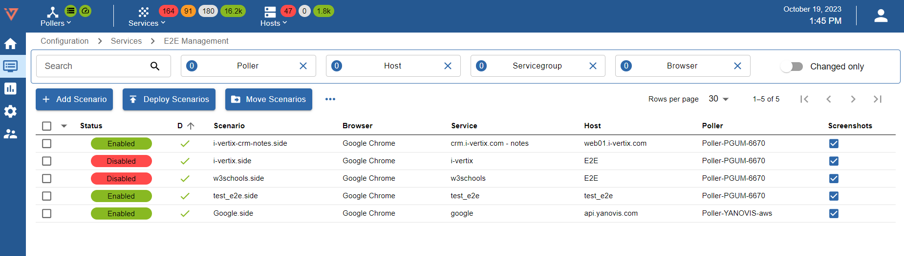
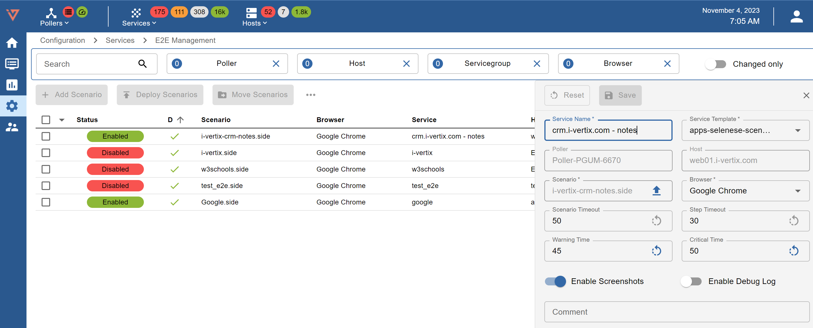
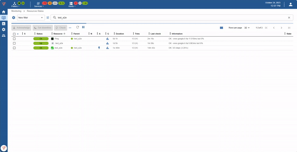
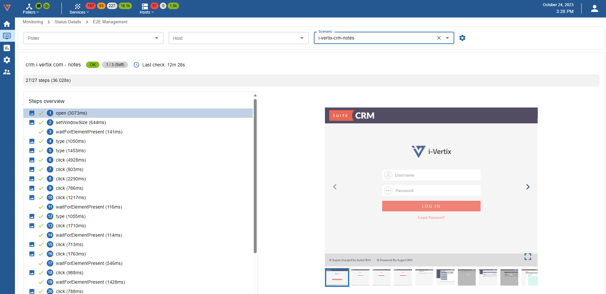

## Plugin Store

Go to Administration > i-Vertix > Plugin Store and install **Selenese synthetic monitoring** plugin.

## Create Host

You can create the E2E Monitoring Service on an existing host. Alternatively, you can create a new host.

See the following topic: [how to create a host manually](../monitoring-hosts/create-host-manually.md).

## Create a new scenario

### Add browser extension

Before recording the scenario, you need to install the Selenium browser extension.

Here an example of created scenario:

::: note

Please contact <support@i-vertix.com> for further assistance in creating scenarios.

:::

## E2E Management

Go to **Configuration > Services > E2E Management**

Different filters are available: **Search-text, Poller, Host, Servicegroup, Browser**.

Press the button + Add Scenario:

* **Service Name**: use a meaningful name
* **Service Template**: select apps-selenese-scenario
* **Poller**: select the Smart Poller that will run the scenario
* **Host**: select the E2E Host
* **Scenario**: upload the previously created scenario
* **Browser**: select the browser that will run the scenario
* **Scenario Timeout**: this is the maximum time Selenium will wait for a scenario to load completely
* **Step Timeout**: this is the maximum time for every single step
* **Warning Time**: set threshold to error or warning after a specific amount of time
* **Critical Time**: set threshold to error or critical after a specific amount of time
* **Enable Screenshots**: enable if you want to save screenshots per step
* **Enable Debug Log**: enable if you want to debug
* **Comment**: insert description or a comment

Press the button Save and then [export the configuration](../monitoring-hosts/export-configuration.md) to the Poller.

## Resource Status

Now your Synthetic End use Monitoring scenario is ready.

Go to **Monitoring > Resource Status** and search the **E2E Host**.

Here the result:

Clic to E2E scenario service to check every monitored step on tab Details.

If enabled, IT Monitoring allow to show the screenshoot per every step.

Go to **Monitoring > Status Detalis > E2E Management**

Different filters are available: **Poller, Host, Scenario**.

In the Step Overview tab it is now possible to select the individual steps of the scenario. A screenshot and performance information may be available for each step.
